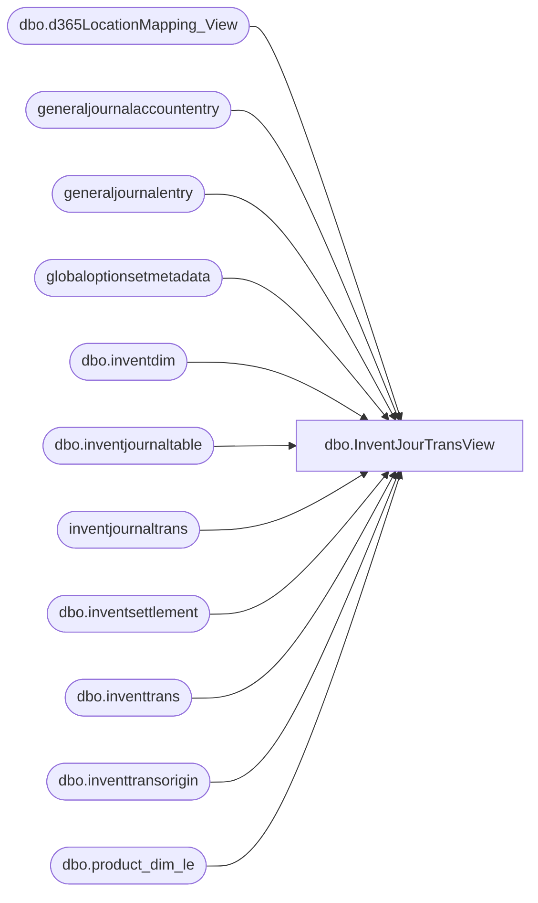

# dbo.InventJourTransView

**Database:** LH_D365  
**Server:** 4db76rlxaxcuvmuh5kw37wbnqq-oxjjwecel5tehm2dtna3lt5qia.datawarehouse.fabric.microsoft.com  

## Architecture Diagram



## Table Dependencies

| Referenced Table |
|---|
| dbo.d365LocationMapping_View |
| generaljournalaccountentry |
| generaljournalentry |
| globaloptionsetmetadata |
| dbo.inventdim |
| dbo.inventjournaltable |
| inventjournaltrans |
| dbo.inventsettlement |
| dbo.inventtrans |
| dbo.inventtransorigin |
| dbo.product_dim_le |

## View Code

```sql
CREATE   VIEW [dbo].[InventJourTransView]
AS
WITH InventJournal_GL AS
     (
         select distinct
             gje.subledgervoucher ,
             gje.subledgervoucherdataareaid,
			  SUM(gjae.accountingcurrencyamount) AS  accountingcurrencyamount
         from
             generaljournalentry gje
         join
             generaljournalaccountentry gjae
         on
             gjae.generaljournalentry = gje.recid
         where
             (
                 gje.subledgervoucher    LIKE 'ADJ%'
                 OR gje.subledgervoucher LIKE 'CNT%'
                 OR gje.subledgervoucher LIKE 'MOV%')
         and gjae.IsDelete is null
         and gje.IsDelete is null
         and (
                 gjae.ledgeraccount  LIKE '100500%')
		 GROUP BY        gje.subledgervoucher ,
             gje.subledgervoucherdataareaid
     ) ,
     InvSettlements AS
     (
         SELECT
             [balancesheetposting]                                                 ,
             GOSM_balanceSheetPosting.LocalizedLabel AS [balancesheetposting_label],
             [operationsposting]                                                   ,
             GOSM_operationsposting.LocalizedLabel   AS [operationsposting_label]  ,
             [settlemodel]                                                         ,
             GOSM_settlemodel.LocalizedLabel         AS [settlemodel_label]        ,
             [voucher]                                                             ,
             [dataareaid]                                                          ,
             [itemid]                                                              ,
             SUM([costamountadjustment])             AS [costamountadjustment]
         FROM
             [dbo].[inventsettlement] AS ism
         LEFT JOIN
             globaloptionsetmetadata AS GOSM_balanceSheetPosting
         ON
             ism.balancesheetposting                = GOSM_balanceSheetPosting.[Option]
         AND GOSM_balanceSheetPosting.EntityName    = 'inventsettlement'
         AND GOSM_balanceSheetPosting.OptionSetName = 'balancesheetposting'
         LEFT JOIN
             globaloptionsetmetadata AS GOSM_operationsposting
         ON
             ism.[operationsposting]              = GOSM_operationsposting.[Option]
         AND GOSM_operationsposting.EntityName    = 'inventsettlement'
         AND GOSM_operationsposting.OptionSetName = 'operationsposting'
         LEFT JOIN
             globaloptionsetmetadata AS GOSM_settlemodel
         ON
             ism.[settlemodel]              = GOSM_settlemodel.[Option]
         AND GOSM_settlemodel.EntityName    = 'inventsettlement'
         AND GOSM_settlemodel.OptionSetName = 'settlemodel'
         WHERE
             ism.IsDelete IS NULL
         GROUP BY
             [balancesheetposting]                  ,
             GOSM_balanceSheetPosting.LocalizedLabel,
             [operationsposting]                    ,
             GOSM_operationsposting.LocalizedLabel  ,
             [settlemodel]                          ,
             GOSM_settlemodel.LocalizedLabel        ,
             [voucher]                              ,
             [dataareaid]                           ,
             [itemid] ) ,
     report AS
     (
         SELECT
             pd.[department_code]                  AS [Department]                    ,
             pd.[subclass_code]                    AS [Subclass]                      ,
             ijt.[voucher]                         AS [IB Inventory ID]               ,
             ijt.journalid                         AS [Inventory Document Number]     ,
             id.inventstatusid                     AS [Inventory Status Description]  ,
             CASE
                 WHEN
                     LOWER(id.inventstatusid) LIKE '%avail%'
                 THEN '001'
                 WHEN
                     LOWER(i
```

