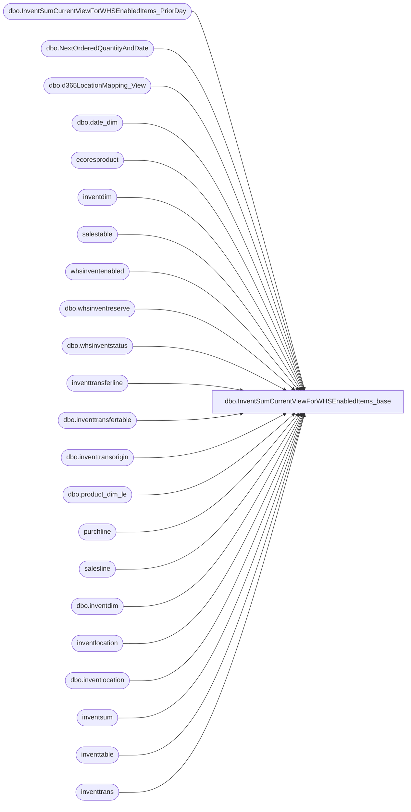

# dbo.InventSumCurrentViewForWHSEnabledItems_base

**Database:** LH_D365  
**Server:** 4db76rlxaxcuvmuh5kw37wbnqq-oxjjwecel5tehm2dtna3lt5qia.datawarehouse.fabric.microsoft.com  

## Architecture Diagram



## Table Dependencies

| Referenced Table |
|---|
| dbo.InventSumCurrentViewForWHSEnabledItems_PriorDay |
| dbo.NextOrderedQuantityAndDate |
| dbo.d365LocationMapping_View |
| dbo.date_dim |
| ecoresproduct |
| inventdim |
| salestable |
| whsinventenabled |
| dbo.whsinventreserve |
| dbo.whsinventstatus |
| inventtransferline |
| dbo.inventtransfertable |
| dbo.inventtransorigin |
| dbo.product_dim_le |
| purchline |
| salesline |
| dbo.inventdim |
| inventlocation |
| dbo.inventlocation |
| inventsum |
| inventtable |
| inventtrans |

## View Code

```sql
/****** Object:  View [dbo].[InventSumCurrentViewForWHSEnabledItems_base]    Script Date: 3/30/2026 1:26:40 PM ******/
/****** Object:  View [dbo].[InventSumCurrentViewForWHSEnabledItems_base]    Script Date: 3/27/2026 12:13:17 PM ******/

CREATE           VIEW [dbo].[InventSumCurrentViewForWHSEnabledItems_base]
AS
WITH ItemWHSEnabled AS
(
    SELECT
        [it].[dataareaid],
        [it].[itemid],
        CASE WHEN [whsenabled].[itemid] IS NOT NULL THEN 1 ELSE 0 END AS [IsWhsEnabled]
    FROM [inventtable] AS [it]
    LEFT JOIN [whsinventenabled] AS [whsenabled]
        ON [it].[itemid] = [whsenabled].[itemid]
        AND [it].[dataareaid] = [whsenabled].[dataareaid]
        AND [whsenabled].[IsDelete] IS NULL
    WHERE [it].[IsDelete] IS NULL
),
-- Pre-calculate current week date range once
CurrentWeekDates AS
(
    SELECT 
        MIN(actual_date) AS WeekStart,
        MAX(actual_date) AS WeekEnd,
        CONCAT(fiscal_year, fiscal_week) AS CurrentFiscalWeek
    FROM [LH_Mart].[dbo].[date_dim]
    WHERE actual_date = CAST(GETDATE() AS DATE)
    GROUP BY CONCAT(fiscal_year, fiscal_week)
),
/* -- TESTING ONLY: Filter entire query to a single PO and style
POItems AS
(
    SELECT DISTINCT
        itt.dataareaid,
        itt.itemid
    FROM inventtrans AS itt
    INNER JOIN inventtransorigin AS ito
        ON ito.recid = itt.inventtransorigin
        AND ito.dataareaid = itt.dataareaid
    WHERE ito.referencecategory = 3
        AND ito.referenceid = 'PO170012103' -- TESTING ONLY
        AND itt.itemid = '058380' -- TESTING ONLY
),
*/
SumInventSum AS
(
    SELECT
        [isum].[dataareaid],
        [isum].[inventsiteid],
        [isum].[inventlocationid],
        UPPER([isum].[inventstatusid]) as [inventstatusid],
        [isum].[itemid],
        SUM([isum].[postedqty] + [isum].[received] + [isum].[registered] - [isum].[deducted] - [isum].[picked] - [isum].[reservphysical]) AS [AvailablePhysicalCalculated],
        SUM([isum].[onorder]) AS [onorder],
        MAX([lastupddateexpected]) AS [lastupddateexpected],
        SUM([isum].[arrived]) AS [arrived],
        SUM([isum].[availordered]) AS [availordered],
        SUM([isum].[availphysical]) AS [availphysical],
        SUM([deducted]) AS [deducted],
        SUM([ordered]) AS [ordered],
        SUM([physicalinvent]) AS [physicalinvent],
        SUM([picked]) AS [picked],
        SUM([postedqty]) AS [postedqty],
        SUM([quotationissue]) AS [quotationissue],
        SUM([quotationreceipt]) AS [quotationreceipt],
        SUM([received]) AS [received],
        SUM([registered]) AS [registered],
        SUM([isum].[reservordered]) AS [reservordered],
        SUM([isum].[reservphysical]) AS [reservphysical],
		sum(isum.postedvalue)   as postedvalue,
        sum(isum.physicalvalue) as physicalvalue
    FROM [inventsum] AS [isum]
    WHERE [isum].[closed] = 0
        AND [isum].[IsDelete] IS NULL
    GROUP BY
        [isum].[dataareaid],
        [isum].[inventsiteid],
        [isum].[inventlocationid],
        UPPER([isum].[inventstatusid]),
        [isum].[itemid]
)
,
OnhandCost AS (
  SELECT
    isum.dataareaid,
    isum.itemid,
    isum.inventlocationid,
    p.producttype,
    it.propertyid,

    ROUND(
      coalesce(
        SUM(isum.postedvalue + isum.physicalvalue)
        / nullif(
            (SUM(isum.postedqty + isum.received) - SUM(abs(isum.deducted))),
            0
          ),
        0
      ),
      2
    ) AS on_hand_unit_cost,

    ROUND(
      coalesce(
        SUM(isum.postedvalue + isum.physicalvalue)
        / nullif(
            (SUM(isum.postedqty + isum.received) - SUM(abs(isum.deducted))),
            0
          ),
        0
      )
      * (
        (SUM(isum.postedqty + isum.received + isum.registered) - SUM(isum.deducted - isum.picked))
      ),
      2
    ) AS on_hand_cost

  FROM SumInventSum isum
  INNER JOIN inventtable it
    O
```

