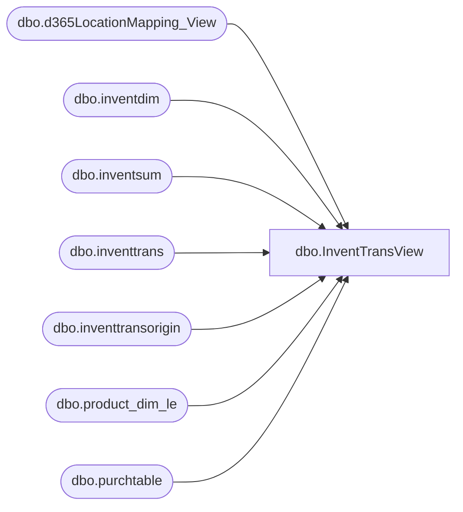

# dbo.InventTransView

**Database:** LH_D365  
**Server:** 4db76rlxaxcuvmuh5kw37wbnqq-oxjjwecel5tehm2dtna3lt5qia.datawarehouse.fabric.microsoft.com  

## Architecture Diagram



## Table Dependencies

| Referenced Table |
|---|
| dbo.d365LocationMapping_View |
| dbo.inventdim |
| dbo.inventsum |
| dbo.inventtrans |
| dbo.inventtransorigin |
| dbo.product_dim_le |
| dbo.purchtable |

## View Code

```sql
--Select count(*) from InventTransView
CREATE   VIEW [dbo].[InventTransView]
AS
SELECT --top 100
    pd.product_key,
    itt.itemid AS [Style Code],
    pd.style_desc AS [Style Short Desc],
    itt.dataareaid,
    idd.inventlocationid AS [Location Code],
    idd.inventlocationid + '-' + itt.dataareaid AS [LocationKey],
    itl.name AS [Location Name],
    ito.referenceid AS [Inventory Document Number],
    ISNULL(ptt.babaptosporefnum, '') AS [Aptos PO Number],
    CASE
        WHEN ito.referenceid LIKE 'TO%' THEN 'Transfer'
        WHEN ito.referenceid LIKE 'SO%' THEN 'Sales'
        WHEN ito.referenceid LIKE 'PO%' THEN 'Purchase'
		WHEN ito.referenceid LIKE 'WK%' THEN 'Work'
        ELSE 'Other'
    END AS [Trans Type Description],
    itt.statusissue,
    itt.statusreceipt,
    CASE
        WHEN itt.statusissue = 0 THEN ''
        WHEN itt.statusissue = 1 THEN 'Sold'
        WHEN itt.statusissue = 2 THEN 'Deducted'
        WHEN itt.statusissue = 3 THEN 'Picked'
        WHEN itt.statusissue = 4 THEN 'Reserved Physical'
        WHEN itt.statusissue = 5 THEN 'Reserved Ordered'
        WHEN itt.statusissue = 6 THEN 'On Order'
        WHEN itt.statusissue = 7 THEN 'Quotation Issue'
        ELSE ''
    END AS [Inventory Status Issue],
    CASE
        WHEN itt.statusreceipt = 0 THEN ''
        WHEN itt.statusreceipt = 1 THEN 'Purchased'
        WHEN itt.statusreceipt = 2 THEN 'Received'
        WHEN itt.statusreceipt = 3 THEN 'Registered'
        WHEN itt.statusreceipt = 4 THEN 'Arrived'
        WHEN itt.statusreceipt = 5 THEN 'Ordered'
        WHEN itt.statusreceipt = 6 THEN 'Quotation Receipt'
        ELSE ''
    END AS [Inventory Status Receipt],
    iss.inventstatusid AS [Inventory Status],
    SUM(itt.qty) AS [Inventory Trans Units],
    SUM(itt.costamountstd) AS [Transaction Cost],
    CASE
        WHEN SUM(itt.qty) <> 0 THEN SUM(itt.costamountstd) / SUM(itt.qty)
        ELSE 0
    END AS [Transaction Cost Avg],
    CAST(itt.datephysical AS DATE) AS [Date Physical]
FROM
    dbo.inventtrans AS itt
    INNER JOIN dbo.inventtransorigin AS ito
        ON ito.recid = itt.inventtransorigin AND ito.dataareaid = itt.dataareaid
    INNER JOIN dbo.inventdim AS idd
        ON idd.inventdimid = itt.inventdimid AND idd.dataareaid = itt.dataareaid
    INNER JOIN dbo.d365LocationMapping_View AS itl -- replaced inventlocation with d365LocationMapping_View to get jurisdiction code
        ON itl.inventlocationid = idd.inventlocationid AND itl.legalentity = itt.dataareaid
    INNER JOIN dbo.product_dim_le AS pd
        --Why was this join on SKU implemented
        --ON RIGHT(REPLICATE('0', 6) + CAST(pd.sku AS varchar(50)), 6) = itt.itemid
        
        ON pd.style_code = itt.itemid
        AND pd.LegalEntity = itl.legalentity
        AND pd.jurisdiction_code = itl.JurisidictionCode -- added jurisdiction code to join
    LEFT JOIN dbo.purchtable AS ptt
        ON ptt.purchid = ito.referenceid AND ptt.dataareaid = itt.dataareaid
    LEFT JOIN dbo.inventsum AS iss
        ON iss.itemid = itt.itemid 
        AND iss.inventdimid = itt.inventdimid 
        AND iss.inventlocationid = idd.inventlocationid 
        AND iss.dataareaid = itt.dataareaid
WHERE
    itt.datephysical >= DATEADD(MONTH, -12, GETDATE())
    --AND pd.style_code like '420529' AND idd.inventlocationid = '2054' --159 after joining with d365LocationMapping_View  --318 record before change -- Filter for specific Style Code
GROUP BY
    pd.product_key,
    itt.itemid,
    pd.style_desc,
    itt.dataareaid,
    idd.inventlocationid,
    idd.inventlocationid + '-' + itt.dataareaid,
    itl.name,
    ito.referenceid,
    ISNULL(ptt.babaptosporefnum, ''),
    CASE
        WHEN ito.referenceid LIKE 'TO%' THEN 'Transfer'
        WHEN ito.referenceid LIKE 'SO%' THEN 'Sales'
        WHEN ito.referenceid LIKE 'PO%' THEN 'Purchase'
        ELSE ''
    END,
    itt.statusissue,
    itt.statusrece
```

