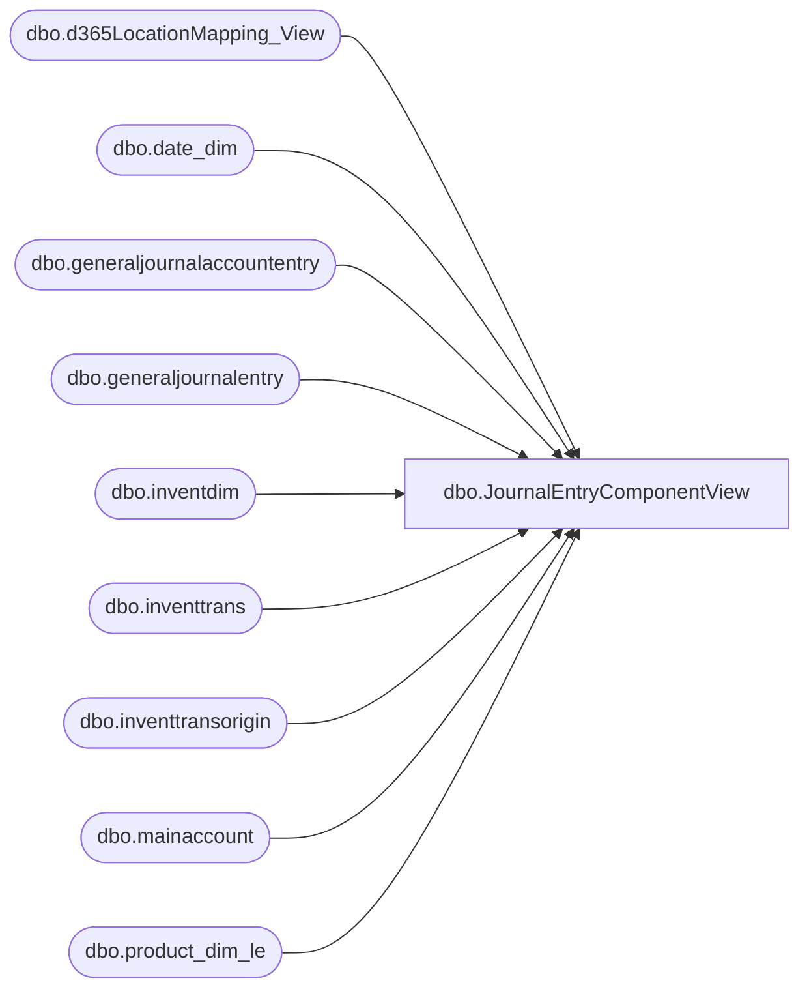

# dbo.JournalEntryComponentView

**Database:** LH_D365  
**Server:** 4db76rlxaxcuvmuh5kw37wbnqq-oxjjwecel5tehm2dtna3lt5qia.datawarehouse.fabric.microsoft.com  

## Architecture Diagram



## Table Dependencies

| Referenced Table |
|---|
| dbo.d365LocationMapping_View |
| dbo.date_dim |
| dbo.generaljournalaccountentry |
| dbo.generaljournalentry |
| dbo.inventdim |
| dbo.inventtrans |
| dbo.inventtransorigin |
| dbo.mainaccount |
| dbo.product_dim_le |

## View Code

```sql
CREATE   VIEW [dbo].JournalEntryComponentView
AS
WITH DatePeriods AS (
    -- Defines the date range and calculates the week-ending Saturday for each actual date
    SELECT
        d.actual_date,
        MAX(CASE WHEN d.day_of_week = 7 THEN d.actual_date END) OVER (PARTITION BY d.fiscal_year, d.fiscal_week) AS WeekEndingDate
    FROM
        LH_Mart.dbo.[date_dim] d
    WHERE
        d.actual_date >= DATEADD(MONTH, -12, CAST(GETDATE() AS DATE))
        AND d.actual_date <= GETDATE()
),
JournalEntryBase AS (
    -- Pre-filters the general journal tables by the required accounts and date range
    -- **** THIS CTE IS UPDATED to include ledgeraccount and the new mainaccountid ****
    SELECT 
        dp.WeekEndingDate,
        ma.mainaccountid,
        LEFT(j.subledgervoucher, 3) as subledgervoucherinitial,
		j.subledgervoucher,
        ge.reportingcurrencyamount,
        j.subledgervoucherdataareaid,
        ge.ledgeraccount -- Added for ActivationFeesComponents
    FROM
        dbo.generaljournalentry j
    INNER JOIN DatePeriods dp ON dp.actual_date = j.accountingdate
    INNER JOIN dbo.generaljournalaccountentry ge ON j.recid = ge.generaljournalentry
    INNER JOIN dbo.mainaccount ma ON ma.recid = ge.mainaccount
    WHERE 
        ma.mainaccountid IN ('100500', '200570', '200050', '601040') -- Added '60104A0'
     AND (
            j.subledgervoucher LIKE 'API%'
            OR j.subledgervoucher LIKE 'IPR%'            
            OR j.subledgervoucher LIKE 'PACK%'
			OR ISNUMERIC(j.subledgervoucher) = 1
        )
),
JournalEntryComponents AS (
    -- This CTE handles components based on the 'voucher' column
    SELECT
        j.WeekEndingDate,
        CONCAT(idim.inventlocationid, '-', j.subledgervoucherdataareaid) AS LocationKey,
        CAST(pd.product_key AS VARCHAR(50)) AS ProductKey,
        
        SUM(CASE WHEN j.subledgervoucherinitial = 'API' AND j.mainaccountid = '100500' THEN j.reportingcurrencyamount ELSE 0 END) AS POCost,
        SUM(CASE WHEN LEFT(ito.referenceid, 2) = 'SO' AND j.mainaccountid = '100500' THEN j.reportingcurrencyamount * -1 ELSE 0 END) AS TotalSalesCost,
        SUM(CASE WHEN j.subledgervoucherinitial = 'API' AND j.mainaccountid = '200570' THEN j.reportingcurrencyamount * -1 ELSE 0 END) AS FobRoyaltyCost,
        SUM(CASE WHEN j.subledgervoucherinitial = 'API' AND j.mainaccountid = '200050' THEN j.reportingcurrencyamount * -1 ELSE 0 END) AS FreightMdseCost,
        SUM(CASE WHEN ito.referencecategory = 4 /*InventTransfer*/ AND j.mainaccountid = '100500' AND j.reportingcurrencyamount < 0 THEN j.reportingcurrencyamount ELSE 0 END) AS ShipmentOutCost,
        SUM(CASE WHEN ito.referencecategory = 4 /*InventTransfer*/ AND j.mainaccountid = '100500' AND j.reportingcurrencyamount > 0 THEN j.reportingcurrencyamount ELSE 0 END) AS ShipmentInCost
    FROM
        JournalEntryBase j
    INNER JOIN dbo.inventtrans itran ON itran.voucher = j.subledgervoucher AND itran.dataareaid = j.subledgervoucherdataareaid -- **** JOIN ON VOUCHER ****
    INNER JOIN dbo.inventdim idim ON idim.inventdimid = itran.inventdimid AND idim.dataareaid = itran.dataareaid
    INNER JOIN dbo.product_dim_le pd ON pd.style_code = itran.itemid AND pd.LegalEntity = itran.dataareaid
        INNER JOIN dbo.d365LocationMapping_View locationMapping -- Ensures location mapping exists
        ON locationMapping.inventlocationid = idim.inventlocationid
        AND locationMapping.legalentity = itran.dataareaid
        AND locationMapping.JurisidictionCode = pd.jurisdiction_code    
    INNER JOIN dbo.inventtransorigin ito ON ito.recid = itran.inventtransorigin AND ito.dataareaid = itran.dataareaid
        AND ito.dataareaid = itran.dataareaid
	WHERE ito.referencecategory in (0,3,4) AND j.mainaccountid IN ('100500', '200570', '200050')
    GROUP BY
        j.WeekEndingDate,
        CONCAT(idim.inventlocationid, '-', j.subledgervoucherdataareaid),
        pd.product_key
),
```

