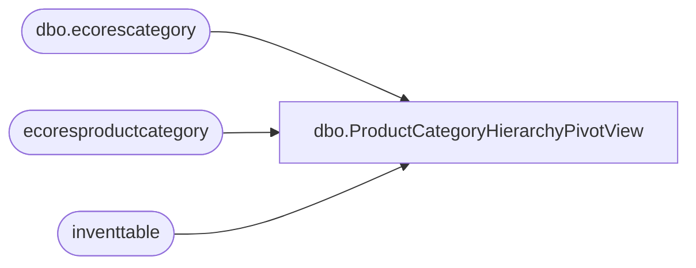

# dbo.ProductCategoryHierarchyPivotView

**Database:** LH_D365  
**Server:** 4db76rlxaxcuvmuh5kw37wbnqq-oxjjwecel5tehm2dtna3lt5qia.datawarehouse.fabric.microsoft.com  

## Architecture Diagram



## Table Dependencies

| Referenced Table |
|---|
| dbo.ecorescategory |
| ecoresproductcategory |
| inventtable |

## View Code

```sql
CREATE VIEW [dbo].[ProductCategoryHierarchyPivotView]
AS
WITH CategoryPaths
AS (
    -- A Common Table Expression (CTE) to build the full hierarchy path for each category.
    SELECT
        c1.[categoryhierarchy],
        c1.[code] AS leafcode,
        c1.[name] AS leafname,
        c1.[recid] AS leafrecid,
        c1.[nestedsetleft] AS leafleft,
        c2.[level] AS parentlevel,
        c2.[name] AS parentname,
        c2.[code] AS parentcode
    FROM
        [dbo].[ecorescategory] c1
        JOIN [dbo].[ecorescategory] c2
            ON c1.[nestedsetleft] BETWEEN c2.[nestedsetleft] AND c2.[nestedsetright]
    WHERE
        c1.[categoryhierarchy] = 5637145326 AND c2.[categoryhierarchy] = 5637145326
)
-- Main query to pivot the paths from the CTE.
SELECT DISTINCT
    it.itemid,
    cp.[categoryhierarchy],
    --CONCAT(pd.style_code,jm.LegalEntity,pd.jurisdiction_code) as product_key,
    --pd.style_code,    
    --CAST(pd.product_key AS VARCHAR(50)) AS product_key,
    leafcode,
    leafname,
    leafrecid,
    leafleft,
    MAX(CASE WHEN parentlevel = 1 THEN parentname END) AS [level_1_name],
    MAX(CASE WHEN parentlevel = 1 THEN parentcode END) AS [level_1_code],
    MAX(CASE WHEN parentlevel = 2 THEN parentname END) AS [level_2_name],
    MAX(CASE WHEN parentlevel = 2 THEN parentcode END) AS [level_2_code],
    MAX(CASE WHEN parentlevel = 3 THEN parentname END) AS [level_3_name],
    MAX(CASE WHEN parentlevel = 3 THEN parentcode END) AS [level_3_code],
    MAX(CASE WHEN parentlevel = 4 THEN parentname END) AS [level_4_name],
    MAX(CASE WHEN parentlevel = 4 THEN parentcode END) AS [level_4_code],
    MAX(CASE WHEN parentlevel = 5 THEN parentname END) AS [level_5_name],
    MAX(CASE WHEN parentlevel = 5 THEN parentcode END) AS [level_5_code],
    MAX(CASE WHEN parentlevel = 6 THEN parentname END) AS [level_6_name],
    MAX(CASE WHEN parentlevel = 6 THEN parentcode END) AS [level_6_code],
    MAX(CASE WHEN parentlevel = 7 THEN parentname END) AS [level_7_name],
    MAX(CASE WHEN parentlevel = 7 THEN parentcode END) AS [level_7_code]
FROM
    CategoryPaths cp
    INNER JOIN ecoresproductcategory pc
        ON pc.categoryhierarchy = cp.[categoryhierarchy] AND pc.category = cp.leafrecid
    INNER JOIN inventtable it
        ON it.product = pc.product
    -- INNER JOIN LH_Mart.[dbo].[product_dim] pd
    --     ON pd.style_code = it.itemid    
GROUP BY
    it.itemid,
    cp.[categoryhierarchy],
    --pd.style_code,
    leafcode,
    leafname,
    leafrecid,
    leafleft;
```

