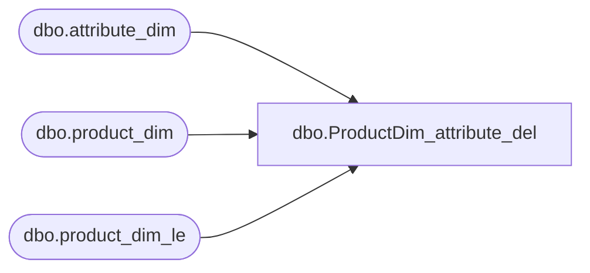

# dbo.ProductDim_attribute_del

**Database:** LH_D365  
**Server:** 4db76rlxaxcuvmuh5kw37wbnqq-oxjjwecel5tehm2dtna3lt5qia.datawarehouse.fabric.microsoft.com  

## Architecture Diagram



## Table Dependencies

| Referenced Table |
|---|
| dbo.attribute_dim |
| dbo.product_dim |
| dbo.product_dim_le |

## View Code

```sql
CREATE VIEW [dbo].[ProductDim_attribute]
AS
(
    SELECT
        (
            case
                when attr.AttributeName = 'USTRF'
                    then (select top 1
                            US_HTS_Code
                        from
                            LH_Mart.dbo.product_dim proddim
                        where
                            proddim.style_code = product_dim.style_code and US_HTS_Code <> '')
                when attr.AttributeName = 'CATRF'
                    then (select top 1
                            CAN_HTS_Code
                        from
                            LH_Mart.dbo.product_dim proddim
                        where
                            proddim.style_code = product_dim.style_code and CAN_HTS_Code <> '')
                when attr.AttributeName = 'UKTRF'
                    then (select top 1
                            UK_HTS_Code
                        from
                            LH_Mart.dbo.product_dim proddim
                        where
                            proddim.style_code = product_dim.style_code and UK_HTS_Code <> '')
                when attr.AttributeName = 'COO'
                    then (select top 1
                            COO_Desc
                        from
                            LH_Mart.dbo.product_dim proddim
                        where
                            proddim.style_code = product_dim.style_code and COO_Desc <> '')
            end
        ) as AttributeLabel,
        product_dim.product_key,
        attr.*
    FROM
        LH_Mart.dbo.attribute_dim AS attr
        INNER JOIN LH_D365.dbo.product_dim_le AS product_dim
            ON attr.style_code_txt = product_dim.style_code
);
```

