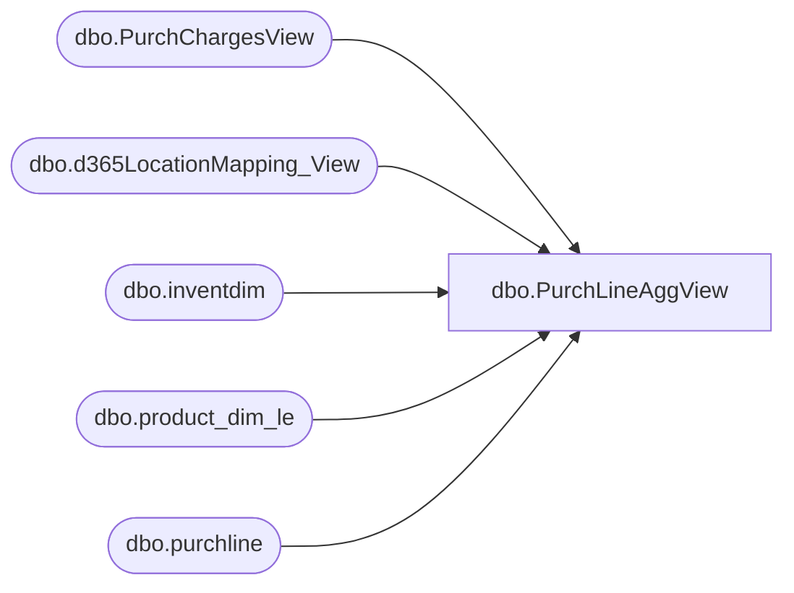

# dbo.PurchLineAggView

**Database:** LH_D365  
**Server:** 4db76rlxaxcuvmuh5kw37wbnqq-oxjjwecel5tehm2dtna3lt5qia.datawarehouse.fabric.microsoft.com  

## Architecture Diagram



## Table Dependencies

| Referenced Table |
|---|
| dbo.PurchChargesView |
| dbo.d365LocationMapping_View |
| dbo.inventdim |
| dbo.product_dim_le |
| dbo.purchline |

## View Code

```sql
-- Make as a VIEW or the query for your DirectQuery/Import table
-- 1 row per PurchLineRecID
CREATE   VIEW [dbo].[PurchLineAggView] AS
WITH Charges AS (
    SELECT
        PurchLineRecId,
        dataareaid,
        SUM(ChargeAmount) AS TotalCharge,
		SUM(LineChargeAmount) /
            CASE 
                WHEN COUNT(DISTINCT packingslipid) = 0 THEN 1
                ELSE COUNT(DISTINCT packingslipid)
            END AS LineChargeAmount
    FROM LH_D365.dbo.PurchChargesView
    GROUP BY PurchLineRecId, dataareaid
),
Retail AS (
    SELECT
        style_code,
        jurisdiction_code,
        LegalEntity,
        current_retail
    FROM LH_D365.dbo.product_dim_le
)
SELECT
    pl.recid AS PurchLineRecID,

    /* Max per line (handles duplicates at source) */
    MAX(pl.purchqty)                                                   AS UnitsPerLine,
    MAX(ISNULL(pd.current_retail, 0) * pl.purchqty)                    AS RetailPerLine,
    MAX(pl.lineamount + ISNULL(pc.TotalCharge, 0))                     AS TotalCostPerLine,
	MAX(ISNULL(pc.LineChargeAmount, 0))						           AS TotalLineChargeAmount,
    MAX(pl.lineamount)                                                 AS TotalCostNoChargePerLine
FROM LH_D365.dbo.purchline                 AS pl
/* Jurisdiction needed only for retail; keep join path tight */
LEFT JOIN dbo.inventdim                    AS idm
       ON idm.inventdimid = pl.inventdimid
      AND idm.dataareaid  = pl.dataareaid
LEFT JOIN dbo.d365LocationMapping_View     AS lm
       ON lm.inventlocationid = idm.inventlocationid
      AND lm.legalentity      = pl.dataareaid
LEFT JOIN Retail                           AS pd
       ON pd.style_code        = pl.itemid
      AND pd.jurisdiction_code = lm.JurisidictionCode
      AND pd.LegalEntity       = pl.dataareaid
LEFT JOIN Charges                          AS pc
       ON pc.PurchLineRecId = pl.recid
      AND pc.dataareaid      = pl.dataareaid
WHERE
    pl.purchstatus <> 4
    AND pl.modifieddatetime >= DATEADD(MONTH, -36, GETDATE())   -- optional window
	--AND pl.purchid = 'PO110030525'
GROUP BY
    pl.recid;
```

