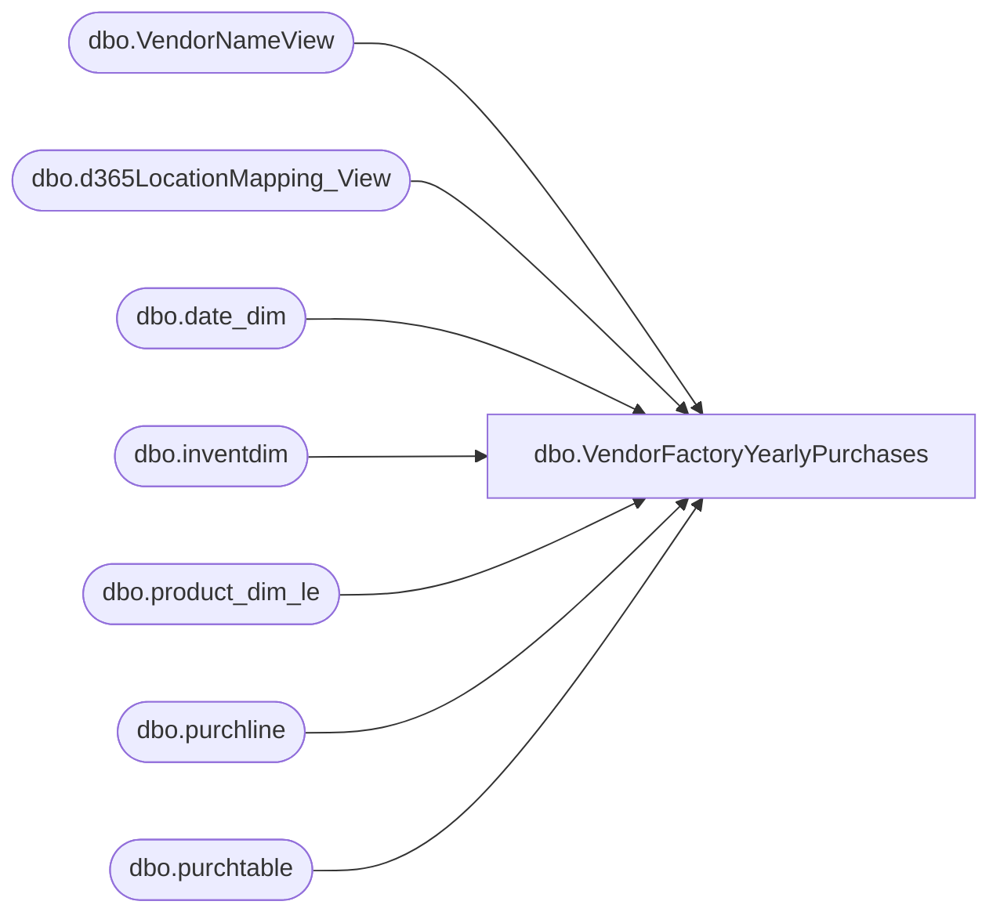

# dbo.VendorFactoryYearlyPurchases

**Database:** LH_D365  
**Server:** 4db76rlxaxcuvmuh5kw37wbnqq-oxjjwecel5tehm2dtna3lt5qia.datawarehouse.fabric.microsoft.com  

## Architecture Diagram



## Table Dependencies

| Referenced Table |
|---|
| dbo.VendorNameView |
| dbo.d365LocationMapping_View |
| dbo.date_dim |
| dbo.inventdim |
| dbo.product_dim_le |
| dbo.purchline |
| dbo.purchtable |

## View Code

```sql
CREATE VIEW dbo.VendorFactoryYearlyPurchases
AS
SELECT  
    vendorName.babvendorcode AS Vendor,
    vendorName.name AS VendorName,
    vendorName.babfactorycode AS Factory,
    LEFT(pd.department, CHARINDEX('(', pd.department) - 2) AS DepartmentName,
    'Dept - ' + SUBSTRING(REVERSE(pd.department),2,2) AS DepartmentNumber,
    pd.style_code AS Style,
    pd.style_desc AS Description,
    YEAR(purchline.babshipdate) AS SalesYear,
    SUM(purchline.purchqty) AS TotalUnits
FROM LH_D365.dbo.purchline purchline
INNER JOIN LH_D365.dbo.purchtable purchtable 
ON purchtable.purchid = purchline.purchid 
AND purchtable.dataareaid = purchline.dataareaid
INNER JOIN LH_MART.dbo.date_dim dd 
ON dd.actual_date = purchline.babshipdate
INNER JOIN dbo.inventdim idm 
ON purchline.inventdimid = idm.inventdimid 
AND purchline.dataareaid = idm.dataareaid
INNER JOIN LH_D365.dbo.VendorNameView vendorName 
ON vendorName.accountnum = purchline.vendaccount 
AND vendorName.dataareaid = purchline.dataareaid
LEFT JOIN dbo.d365LocationMapping_View locationMapping 
ON idm.inventlocationid = locationMapping.inventlocationid 
AND locationMapping.legalentity = purchline.dataareaid
LEFT JOIN LH_D365.dbo.product_dim_le pd 
ON pd.style_code = purchline.itemid 
AND pd.jurisdiction_code = locationMapping.JurisidictionCode 
AND purchline.dataareaid = pd.LegalEntity
WHERE
    purchline.babshipdate >= DATEFROMPARTS(YEAR(GETDATE()) - 2, 1, 1)
    AND purchline.babshipdate < DATEFROMPARTS(YEAR(GETDATE()) + 1, 1, 1)
    AND pd.department IS NOT NULL
    AND purchline.babshipdate IS NOT NULL
    AND purchline.babshipdate != '1900-01-01 00:00:00.000000'
    AND dd.date_key NOT IN ('0','-99')	
    AND purchtable.babfactorycode IS NOT NULL
    AND purchline.purchstatus <> 4
GROUP BY 
    vendorName.babvendorcode,
    vendorName.name,
    vendorName.babfactorycode,
    LEFT(pd.department, CHARINDEX('(', pd.department) - 2),
    SUBSTRING(REVERSE(pd.department),2,2),
    pd.style_code,
    pd.style_desc,
    YEAR(purchline.babshipdate);
```

