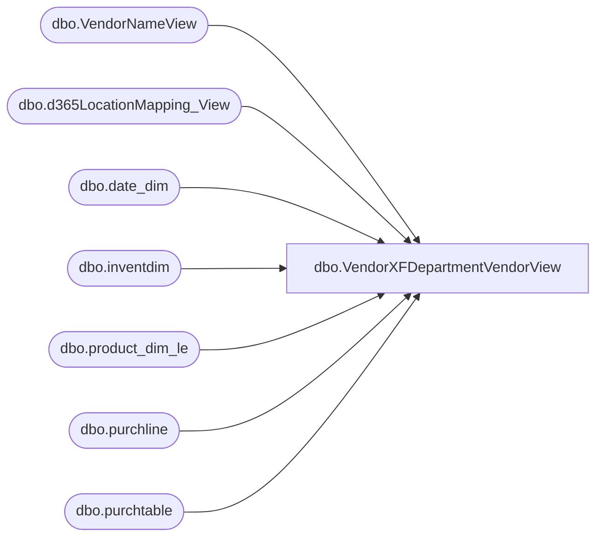

# dbo.VendorXFDepartmentVendorView

**Database:** LH_D365  
**Server:** 4db76rlxaxcuvmuh5kw37wbnqq-oxjjwecel5tehm2dtna3lt5qia.datawarehouse.fabric.microsoft.com  

## Architecture Diagram



## Table Dependencies

| Referenced Table |
|---|
| dbo.VendorNameView |
| dbo.d365LocationMapping_View |
| dbo.date_dim |
| dbo.inventdim |
| dbo.product_dim_le |
| dbo.purchline |
| dbo.purchtable |

## View Code

```sql
/****** Object:  View [dbo].[VendorXFDepartmentVendorView]    Script Date: 2/27/2026 2:54:00 PM ******/
/****** Object:  View [dbo].[VendorXFDepartmentVendorView]    Script Date: 2/27/2026 2:46:03 PM ******/
/****** Object:  View [dbo].[VendorXFDepartmentVendorView]    Script Date: 2/25/2026 10:39:49 PM ******/


CREATE         VIEW [dbo].[VendorXFDepartmentVendorView]
AS
WITH src AS (
    SELECT 
        YEAR(purchline.babshipdate) AS [Year],
		vn.vendgroup AS VendorInvoiceGroup,
        pd.departmentLabel AS DepartmentLabel,   -- e.g. Accessories
        CASE 
            WHEN vn.name = 'INNOFLOW KOREA COMPANY LIMITED' THEN 'IFKIDS CO., LTD'
            WHEN vn.name = 'DREAM INTERNATIONAL USA INC'  THEN 'J.Y. INTERNATIONAL COMPANY LIMITED'
			WHEN vn.name = 'IFKIDS CO.,LTD' THEN 'IFKIDS CO., LTD'
            ELSE vn.name
        END AS Vendor,
        LTRIM(RTRIM(pd.departmentLabel)) + ' ' +
        LEFT(
            SUBSTRING(pd.department, CHARINDEX('(', pd.department) + 1, LEN(pd.department)),
            CHARINDEX('-', SUBSTRING(pd.department, CHARINDEX('(', pd.department) + 1, LEN(pd.department)) + '-') - 1
        ) AS DepartmentName,
        MONTH(purchline.babshipdate) AS [Month],
        purchline.purchqty AS PurchQty,
        purchline.lineamount AS TotalCost,
        pd.current_retail * purchline.purchqty AS TotalRetail
    FROM LH_D365.dbo.purchline purchline
    JOIN LH_D365.dbo.purchtable purchtable
      ON purchtable.purchid = purchline.purchid 
     AND purchtable.dataareaid = purchline.dataareaid
    JOIN LH_MART.dbo.date_dim dd
      ON dd.actual_date = purchline.babshipdate
    JOIN dbo.inventdim idm
      ON purchline.inventdimid = idm.inventdimid 
     AND purchline.dataareaid = idm.dataareaid
    JOIN LH_D365.dbo.VendorNameView vn
      ON vn.accountnum = purchtable.invoiceaccount 
     AND vn.dataareaid = purchline.dataareaid
    LEFT JOIN dbo.d365LocationMapping_View locationMapping
      ON idm.inventlocationid = locationMapping.inventlocationid 
     AND locationMapping.legalentity = purchline.dataareaid
    LEFT JOIN LH_D365.dbo.product_dim_le pd
      ON pd.style_code = purchline.itemid 
     AND pd.jurisdiction_code = locationMapping.JurisidictionCode 
     AND purchline.dataareaid = pd.LegalEntity
    WHERE
        purchline.createddatetime >= DATEADD(MONTH, -48, GETDATE()) 
        AND pd.department IS NOT NULL
        AND purchline.babshipdate IS NOT NULL
        AND purchline.babshipdate <> '1900-01-01 00:00:00.000000'
		and purchline.babshipdate >= DATEADD(MONTH, -48, GETDATE())
        AND dd.date_key NOT IN ('0','-99')
        AND purchline.purchstatus <> 4
        AND purchtable.intercompanyorder = 0 -- only non-intercompany orders
)
--Top summary: All Departments / All Vendors / Year
SELECT
    'All Departments' AS DepartmentLabel,
    'All Vendors'     AS VendorLabel,
    b.[Year]          AS [Year],
    NULL              AS DepartmentName,
	NULL			  AS VendorInvoiceGroup,
    0                 AS DeptSortKey,
    0                 AS VendorSortKey,

    FLOOR(SUM(CASE WHEN b.[Month]=1  THEN b.PurchQty ELSE 0 END)) AS Jan,
    FLOOR(SUM(CASE WHEN b.[Month]=2  THEN b.PurchQty ELSE 0 END)) AS Feb,
    FLOOR(SUM(CASE WHEN b.[Month]=3  THEN b.PurchQty ELSE 0 END)) AS Mar,
    FLOOR(SUM(CASE WHEN b.[Month]=4  THEN b.PurchQty ELSE 0 END)) AS Apr,
    FLOOR(SUM(CASE WHEN b.[Month]=5  THEN b.PurchQty ELSE 0 END)) AS May,
    FLOOR(SUM(CASE WHEN b.[Month]=6  THEN b.PurchQty ELSE 0 END)) AS Jun,
    FLOOR(SUM(CASE WHEN b.[Month]=7  THEN b.PurchQty ELSE 0 END)) AS Jul,
    FLOOR(SUM(CASE WHEN b.[Month]=8  THEN b.PurchQty ELSE 0 END)) AS Aug,
    FLOOR(SUM(CASE WHEN b.[Month]=9  THEN b.PurchQty ELSE 0 END)) AS Sep,
    FLOOR(SUM(CASE WHEN b.[Month]=10 THEN b.PurchQty ELSE 0 END)) AS Oct,
    FLOOR(SUM(CASE WHEN b.[Month]=11 THEN b.PurchQty ELSE 0 END)) AS Nov,
    FLOOR(SUM(CASE WHEN b.[Month]=12 THEN b.PurchQty ELSE 0 EN
```

