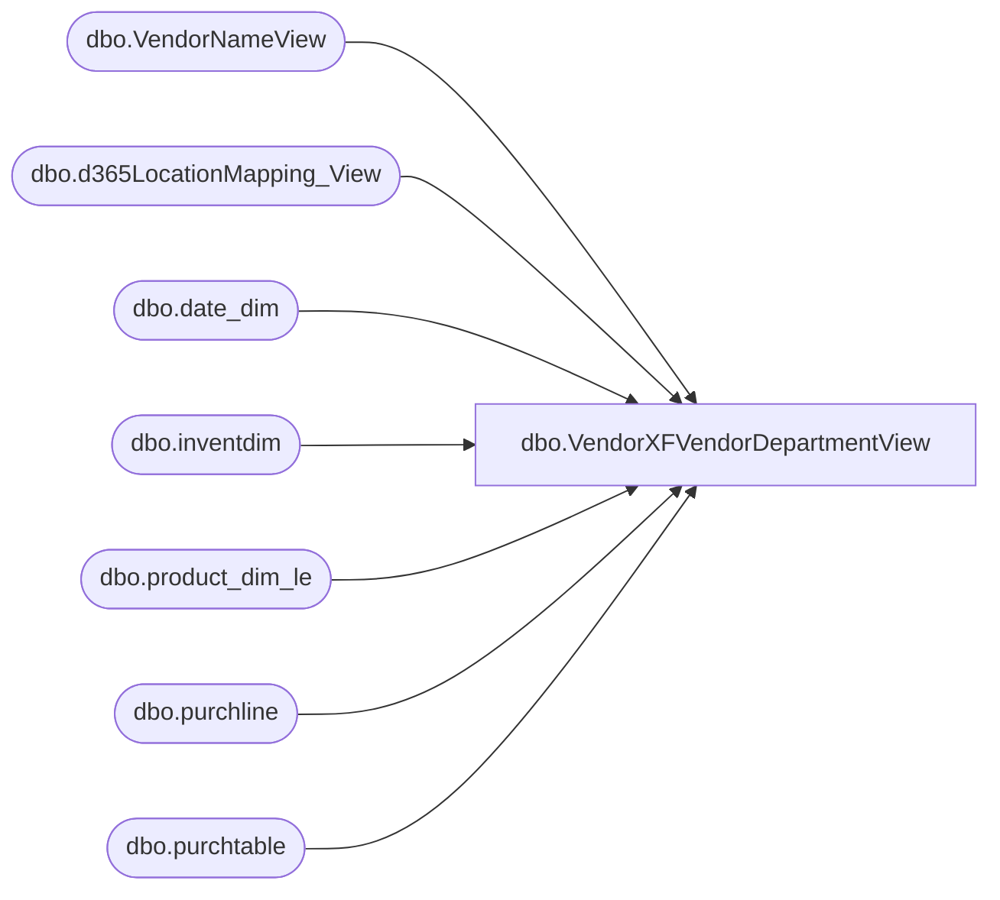

# dbo.VendorXFVendorDepartmentView

**Database:** LH_D365  
**Server:** 4db76rlxaxcuvmuh5kw37wbnqq-oxjjwecel5tehm2dtna3lt5qia.datawarehouse.fabric.microsoft.com  

## Architecture Diagram



## Table Dependencies

| Referenced Table |
|---|
| dbo.VendorNameView |
| dbo.d365LocationMapping_View |
| dbo.date_dim |
| dbo.inventdim |
| dbo.product_dim_le |
| dbo.purchline |
| dbo.purchtable |

## View Code

```sql
/****** Object:  View [dbo].[VendorXFVendorDepartmentView]    Script Date: 2/27/2026 2:47:59 PM ******/
/****** Object:  View [dbo].[VendorXFVendorDepartmentView]    Script Date: 2/25/2026 10:53:06 PM ******/
/****** Object:  View [dbo].[VendorXFVendorDepartmentView]    Script Date: 2/12/2026 3:39:47 PM ******/

CREATE       VIEW [dbo].[VendorXFVendorDepartmentView]
AS
WITH src AS (
    SELECT 
        YEAR(pl.babshipdate) AS [Year],
		vn.vendgroup AS VendorInvoiceGroup,
        pd.departmentLabel     AS DepartmentLabel,
        CASE 
            WHEN vn.name = 'INNOFLOW KOREA COMPANY LIMITED' THEN 'IFKIDS CO., LTD'
            WHEN vn.name = 'DREAM INTERNATIONAL USA INC'  THEN 'J.Y. INTERNATIONAL COMPANY LIMITED'
			WHEN vn.name = 'IFKIDS CO.,LTD' THEN 'IFKIDS CO., LTD'
            ELSE vn.name
        END AS Vendor,
        -- DepartmentName = DeptFormatted, e.g. "Accessories R"
        LTRIM(RTRIM(pd.departmentLabel)) + ' ' +
        LEFT(
            SUBSTRING(pd.department, CHARINDEX('(', pd.department) + 1, LEN(pd.department)),
            CHARINDEX('-', SUBSTRING(pd.department, CHARINDEX('(', pd.department) + 1, LEN(pd.department)) + '-') - 1
        ) AS DepartmentName,
        MONTH(pl.babshipdate)  AS [Month],
        pl.purchqty            AS PurchQty,
        pl.lineamount          AS TotalCost,
        pd.current_retail * pl.purchqty AS TotalRetail
    FROM LH_D365.dbo.purchline pl
    JOIN LH_D365.dbo.purchtable pt
      ON pt.purchid = pl.purchid AND pt.dataareaid = pl.dataareaid
    JOIN LH_MART.dbo.date_dim dd
      ON dd.actual_date = pl.babshipdate
    JOIN dbo.inventdim idm
      ON pl.inventdimid = idm.inventdimid AND pl.dataareaid = idm.dataareaid
    JOIN LH_D365.dbo.VendorNameView vn
      ON vn.accountnum = pt.invoiceaccount AND vn.dataareaid = pl.dataareaid
    LEFT JOIN dbo.d365LocationMapping_View lm
      ON idm.inventlocationid = lm.inventlocationid AND lm.legalentity = pl.dataareaid
    LEFT JOIN LH_D365.dbo.product_dim_le pd
      ON pd.style_code = pl.itemid
     AND pd.jurisdiction_code = lm.JurisidictionCode
     AND pl.dataareaid = pd.LegalEntity
    WHERE
        pl.createddatetime >= DATEADD(MONTH, -48, GETDATE()) 
        AND pd.department IS NOT NULL
        AND pl.babshipdate IS NOT NULL
        AND pl.babshipdate <> '1900-01-01 00:00:00.000000'
		and pl.babshipdate >= DATEADD(MONTH, -48, GETDATE())
        AND dd.date_key NOT IN ('0','-99')
        AND pl.purchstatus <> 4
        AND pt.intercompanyorder = 0 --only non-intercompany orders
)
SELECT 
    -- Labels (emit readable names at rollup levels)
    CASE WHEN GROUPING(b.Vendor)=1 THEN 'All Vendors' ELSE b.Vendor END              AS VendorLabel,
    CASE WHEN GROUPING(b.DepartmentLabel)=1 THEN 'All Departments' ELSE b.DepartmentLabel END AS DepartmentLabel,
    b.Year                                                                           AS [Year],   -- kept only when Year is NOT grouped
    CASE WHEN GROUPING(b.DepartmentName)=0 THEN b.DepartmentName END                 AS DepartmentName,
	CASE 
        WHEN GROUPING(b.Vendor)=1 
          OR GROUPING(b.DepartmentLabel)=1 
          OR GROUPING(b.DepartmentName)=1
        THEN NULL
        ELSE MIN(b.VendorInvoiceGroup)
    END AS VendorInvoiceGroup,
    -- (optional) sort helpers for Power BI
    CAST(CASE WHEN GROUPING(b.Vendor)=1 THEN 0 ELSE 1 END AS INT)        AS VendorSortKey,
    CAST(CASE WHEN GROUPING(b.DepartmentLabel)=1 THEN 0 ELSE 1 END AS INT) AS DeptSortKey,

    -- Aggregations
    FLOOR(SUM(CASE WHEN b.[Month]=1  THEN b.PurchQty ELSE 0 END)) AS Jan,
    FLOOR(SUM(CASE WHEN b.[Month]=2  THEN b.PurchQty ELSE 0 END)) AS Feb,
    FLOOR(SUM(CASE WHEN b.[Month]=3  THEN b.PurchQty ELSE 0 END)) AS Mar,
    FLOOR(SUM(CASE WHEN b.[Month]=4  THEN b.PurchQty ELSE 0 END)) AS Apr,
    FLOOR(SUM(CASE WHEN b.[Month]=5  THEN b.PurchQty ELSE 0 END)) AS May,
    FLOOR(SUM(CASE WHEN b.[Month]=6  THEN b.Purch
```

