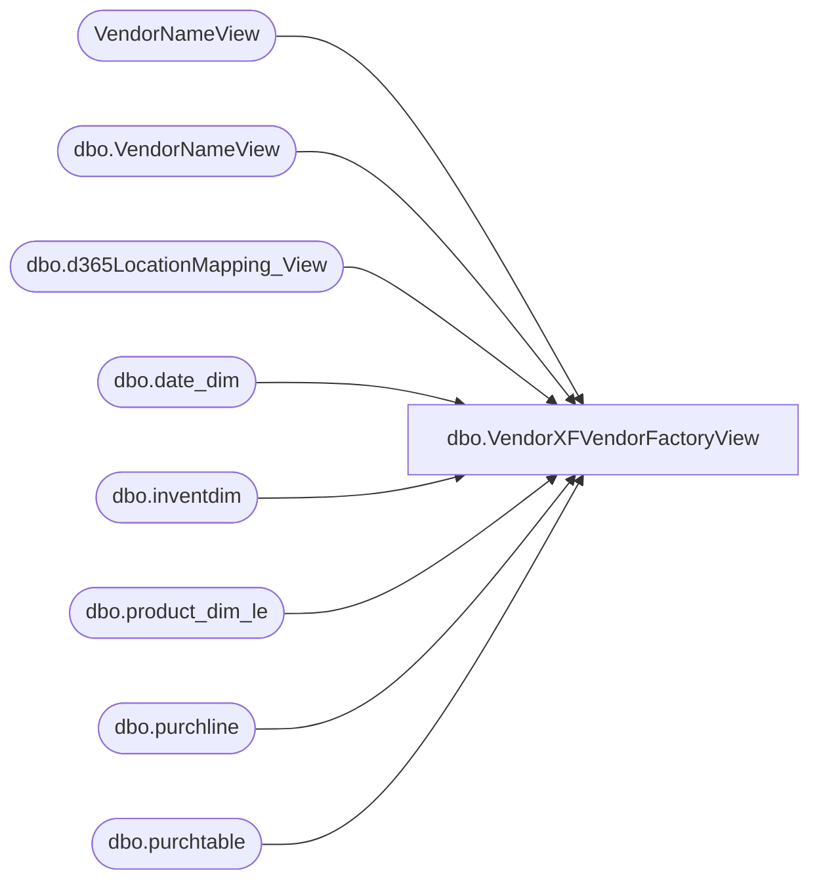

# dbo.VendorXFVendorFactoryView

**Database:** LH_D365  
**Server:** 4db76rlxaxcuvmuh5kw37wbnqq-oxjjwecel5tehm2dtna3lt5qia.datawarehouse.fabric.microsoft.com  

## Architecture Diagram



## Table Dependencies

| Referenced Table |
|---|
| VendorNameView |
| dbo.VendorNameView |
| dbo.d365LocationMapping_View |
| dbo.date_dim |
| dbo.inventdim |
| dbo.product_dim_le |
| dbo.purchline |
| dbo.purchtable |

## View Code

```sql
/****** Object:  View [dbo].[VendorXFVendorFactoryView]    Script Date: 2/27/2026 2:48:28 PM ******/
/****** Object:  View [dbo].[VendorXFVendorFactoryView]    Script Date: 2/25/2026 10:54:54 PM ******/


CREATE       VIEW [dbo].[VendorXFVendorFactoryView]
AS
with src as (
select YEAR(purchline.babshipdate) as 'Year',
		vendorName.accountnum as 'VendorAccount',
		vendorName.dataareaid as 'LegalEntity',
		vName.vendgroup as 'VendorInvoiceGroup',
		case when vendorName.babvendorcode = 'INNOFLW' then 'IFKDSCN' 
			 when vendorName.babvendorcode = 'INNOVIN' then 'IFKDSHP'
			 when vendorName.babvendorcode = 'INNONTR' then 'IFKDSHM'
			 when vendorName.babvendorcode = 'DREAMVT' then 'JYINTVT'
				else vendorName.babvendorcode end as 'Vendor',        
		case 
            when vName.name = 'INNOFLOW KOREA COMPANY LIMITED' then 'IFKIDS CO., LTD'
            when vName.name = 'DREAM INTERNATIONAL USA INC'  then 'J.Y. INTERNATIONAL COMPANY LIMITED'
			when vName.name = 'IFKIDS CO.,LTD' then 'IFKIDS CO., LTD'
            else vName.name
        end as InvoiceAccountName,
		case when vendorName.babvendorcode = 'INNOFLW' and vendorName.babfactorycode = 'INFEVE' then 'IFKEVE'
			 when vendorName.babvendorcode = 'INNOVIN' and vendorName.babfactorycode = 'INFVIN' then 'IFKVIN'
			 when vendorName.babvendorcode = 'INNONTR' and vendorName.babfactorycode = 'INFNTR' then 'IFKNTR'
			 when vendorName.babvendorcode = 'DREAMVT' and vendorName.babfactorycode = 'DREJY2' then 'JYIJY2'
			 when vendorName.babvendorcode = 'DREAMVT' and vendorName.babfactorycode = 'DREPLA' then 'JYIPLA' 
				else vendorName.babfactorycode end as 'Factory',
		isnull(vendorName.babfobport,'NONE') as 'Port',
		MONTH(purchline.babshipdate) as 'Month',
		purchline.purchqty as 'PurchQty',
		purchline.lineamount as 'TotalCost',
		pd.current_retail * purchline.purchqty as 'TotalRetail'
    FROM
        LH_D365.dbo.purchline purchline
        INNER JOIN LH_D365.dbo.purchtable purchtable ON purchtable.purchid = purchline.purchid AND purchtable.dataareaid = purchline.dataareaid
		INNER JOIN LH_MART.dbo.date_dim  dd on dd.actual_date = purchline.babshipdate
        INNER JOIN dbo.inventdim idm ON purchline.inventdimid = idm.inventdimid And purchline.dataareaid = idm.dataareaid
        INNER JOIN LH_D365.dbo.VendorNameView vendorName ON vendorName.accountnum = purchline.vendaccount AND vendorName.dataareaid = purchline.dataareaid
        LEFT JOIN dbo.d365LocationMapping_View locationMapping ON idm.inventlocationid = locationMapping.inventlocationid AND locationMapping.legalentity = purchline.dataareaid
        LEFT JOIN LH_D365.dbo.product_dim_le pd ON pd.style_code = purchline.itemid AND pd.jurisdiction_code = locationMapping.JurisidictionCode And purchline.dataareaid = pd.LegalEntity
		LEFT JOIN (select name,accountnum,dataareaid,vendgroup from VendorNameView v) vName on vName.accountnum = purchtable.invoiceaccount and vName.dataareaid = purchline.dataareaid

    WHERE
        purchline.createddatetime >= DATEADD(MONTH, -48, GETDATE()) 
		and purchline.babshipdate is not null
		and purchline.babshipdate != '1900-01-01 00:00:00.000000'
		and purchline.babshipdate >= DATEADD(MONTH, -48, GETDATE()) 
		and dd.date_key != '0'
		and dd.date_key != '-99'	
		and purchline.purchstatus <> 4 -- exclude cancelled POs
		and purchtable.intercompanyorder = 0 -- only non-intercompany orders
		)
		--Top summary: All Vendors / All Factories / per Year
SELECT
    s.[Year], 
	 CAST(NULL AS varchar(10)) AS VendorInvoiceGroupLabel,
    'All Factories'       AS FactoryLabel,
    'All Vendors'         AS VendorLabel,
    CAST(0 AS INT)        AS FactorySortKey,
    CAST(0 AS INT)        AS VendorSortKey,

    FLOOR(SUM(CASE WHEN s.[Month]=1  THEN s.PurchQty ELSE 0 END)) AS Jan,
    FLOOR(SUM(CASE WHEN s.[Month]=2  THEN s.PurchQty ELSE 0 END)) AS Feb,
    FLOOR(SUM(CASE WHEN s.[Month]=3  THEN s.PurchQty ELSE 0 END)) AS Mar,
    FLOOR(SUM(CASE
```

