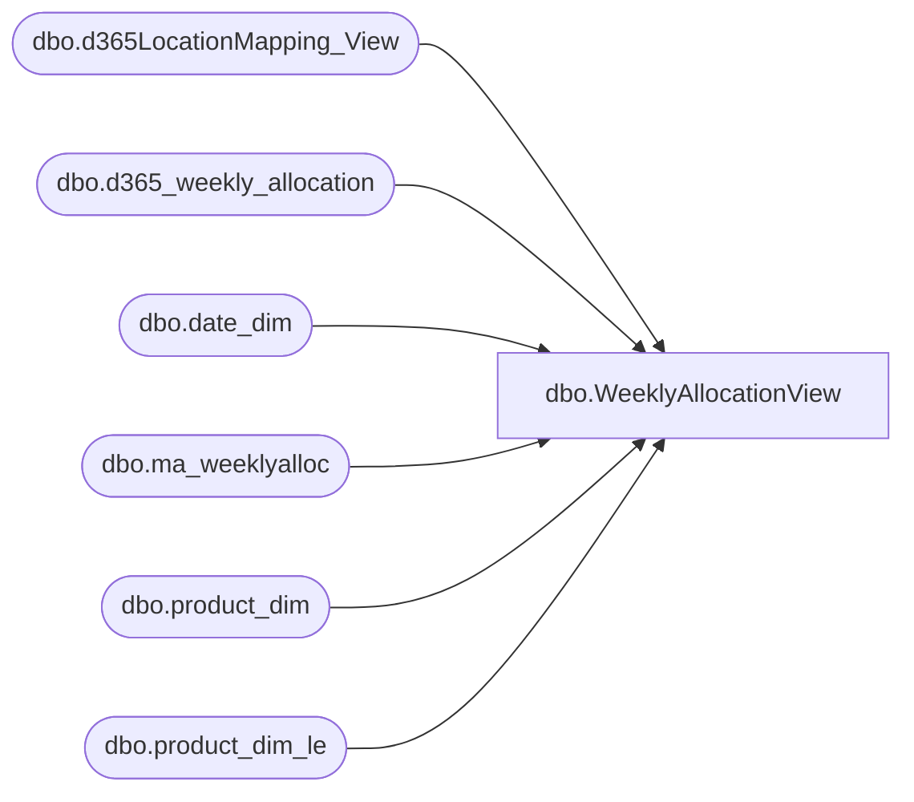

# dbo.WeeklyAllocationView

**Database:** LH_D365  
**Server:** 4db76rlxaxcuvmuh5kw37wbnqq-oxjjwecel5tehm2dtna3lt5qia.datawarehouse.fabric.microsoft.com  

## Architecture Diagram



## Table Dependencies

| Referenced Table |
|---|
| dbo.d365LocationMapping_View |
| dbo.d365_weekly_allocation |
| dbo.date_dim |
| dbo.ma_weeklyalloc |
| dbo.product_dim |
| dbo.product_dim_le |

## View Code

```sql
CREATE             VIEW [dbo].[WeeklyAllocationView]
AS 
WITH weeklyallocation
AS (
     SELECT
         le.[style_code],
         le.[color_code],
         locMapping.[LocationCode],
         CAST(CONCAT(alloc.STYLE_CODE,alloc.LegalEntity,alloc.jurisdiction_code) as varchar(50)) AS [product_key],
         alloc.[store_key],
         alloc.[date_key],
         alloc.[merch_year_wk],
         alloc.[allocation_units],
         locMapping.LocationKey
     FROM
         [LH_Source].[dbo].[ma_weeklyalloc] alloc
         INNER JOIN [LH_Mart].[dbo].[date_dim] dd
             ON alloc.[merch_year_wk] = CONCAT(CAST(dd.fiscal_year AS varchar(4)), RIGHT('0' + CAST(dd.fiscal_week AS varchar(2)), 2))

		INNER JOIN LH_D365.dbo.product_dim_le le
			ON le.style_code = alloc.[STYLE_CODE]
			AND le.jurisdiction_code = alloc.[jurisdiction_code]
			AND le.LegalEntity = alloc.LegalEntity


		INNER JOIN [LH_D365].[dbo].[d365LocationMapping_View] AS locMapping
			ON locMapping.[JurisidictionCode] = le.[jurisdiction_code]
			AND locMapping.legalentity = le.LegalEntity
			AND locMapping.[store_key] = alloc.[store_key] 

     WHERE
         dd.actual_date >= DATEADD(MONTH, -36, GETDATE())
	 	and alloc.merch_year_wk < '202539'
		AND alloc.INS_DT = (SELECT MAX(INS_DT) FROM [LH_Source].[dbo].[ma_weeklyalloc])

     UNION ALL
    SELECT
        alloc.[style_code],
        alloc.[color_code],
        alloc.[location_code] as LocationCode,
        CAST(CONCAT(le.style_code,locMapping.legalentity,locMapping.JurisidictionCode) as varchar(50)) as product_key,    
        alloc.[store_key],
        dd.[date_key],
        alloc.[merch_year_wk],
        alloc.[allocation_units],
        locMapping.LocationKey
    FROM
        [LH_Mart].[dbo].[d365_weekly_allocation] alloc
        INNER JOIN
        (
            SELECT
                MIN(dd.date_key) AS date_key,
                MIN(dd.actual_date) AS actual_date,
                CONCAT(CAST(dd.fiscal_year AS varchar(4)), RIGHT('0' + CAST(dd.fiscal_week AS varchar(2)), 2))  AS [merch_year_wk]
            FROM
                [LH_Mart].[dbo].[date_dim] dd
            GROUP BY
                dd.fiscal_year,
                dd.fiscal_week
        ) AS dd
            ON alloc.[merch_year_wk] = dd.merch_year_wk

     	INNER JOIN [LH_Mart].dbo.product_dim le
			ON CAST(le.product_key as varchar(50))= CAST(alloc.product_key as varchar(50))

		INNER JOIN [LH_D365].[dbo].[d365LocationMapping_View] AS locMapping
			ON locMapping.store_key = alloc.store_key 
			AND locMapping.JurisidictionCode IS NOT NULL
    WHERE
        dd.actual_date >= DATEADD(MONTH, -36, GETDATE())
		and alloc.merch_year_wk >= '202539'
	    AND alloc.INS_DT = (SELECT MAX(INS_DT) FROM [LH_Mart].[dbo].[d365_weekly_allocation])
)
SELECT
    alloc.*
FROM
    weeklyallocation alloc;
```

