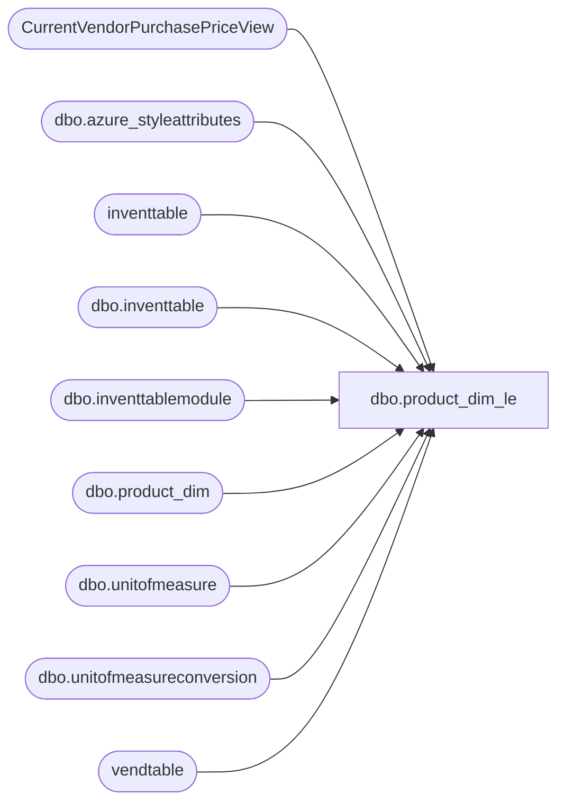

# dbo.product_dim_le

**Database:** LH_D365  
**Server:** 4db76rlxaxcuvmuh5kw37wbnqq-oxjjwecel5tehm2dtna3lt5qia.datawarehouse.fabric.microsoft.com  

## Architecture Diagram



## Table Dependencies

| Referenced Table |
|---|
| CurrentVendorPurchasePriceView |
| dbo.azure_styleattributes |
| inventtable |
| dbo.inventtable |
| dbo.inventtablemodule |
| dbo.product_dim |
| dbo.unitofmeasure |
| dbo.unitofmeasureconversion |
| vendtable |

## View Code

```sql
/****** Object:  View [dbo].[product_dim_le]    Script Date: 2/6/2026 12:00:24 PM ******/
CREATE   VIEW [dbo].[product_dim_le]
AS
--101,801 rows with just product_dim, 100,798 with where clause
WITH UnitConversions
AS (
    -- 2. Consolidate the two unit conversion subqueries into one
    SELECT
        it.itemid,
        it.dataareaid,
        MAX(CASE WHEN umfrom.symbol = 'ip' THEN uc.factor END) AS innerpack,
        MAX(CASE WHEN umfrom.symbol = 'cs' THEN uc.factor END) AS masterpack
    FROM
        dbo.unitofmeasureconversion uc
        INNER JOIN dbo.inventtable it
            ON it.product = uc.product
        INNER JOIN dbo.unitofmeasure umfrom
            ON umfrom.recid = uc.fromunitofmeasure
        INNER JOIN dbo.unitofmeasure umto
            ON umto.recid = uc.tounitofmeasure
    WHERE
        umfrom.symbol IN ('ip', 'cs') AND umto.symbol = 'ea'
    GROUP BY
        it.itemid,
        it.dataareaid
),
JurisdictionMapping
AS (
    SELECT
        jurisdiction_code,
        LegalEntity
    FROM
    (
        VALUES
            ('US', '1100'),
            ('US', '1200'),
            --('US', '1700'), -- removing US 1700 b/c it's not needed
            ('CA', '1700'),
            ('UK', '2110'),
            ('IE', '2110'), -- The IN ('UK', 'IE') becomes two separate rows
            ('CN', '3001')
    ) AS v (jurisdiction_code, LegalEntity)
)
, ProductDimData AS
(
    SELECT * 
    FROM LH_Mart.[dbo].[product_dim]
    WHERE style_code IS NOT NULL
    AND style_code <> 'N/A'
    AND sku = CAST(style_code AS INT)
)
, ProductDimDataSingleJurisdiction AS
(
    SELECT 
    it.itemid as 'style_code'
    ,jm.LegalEntity
    ,jm.jurisdiction_code    
    ,pd.[sku]
      ,pd.[activation_date]      
      ,pd.[style_desc]
      ,pd.[color_code]
      ,pd.[color_desc]
      ,pd.[product_desc]
      ,pd.[subclass]
      ,pd.[class]
      ,pd.[department]
      ,pd.[department_code]
      ,pd.[division]
      ,pd.[chain]
      ,pd.[concept]	  
      ,pd.[priceline_code]
      ,pd.[subclass_code]
      ,pd.[class_code]
      ,pd.[primary_vendor_code]
      ,pd.[primary_vendor_name]
      ,pd.[alt_primary_vendor_code]
      ,pd.[current_retail]
      ,pd.[original_retail]
      ,pd.[price_with_vat]
      ,pd.[reorder_flag]
      ,pd.[euro_value]
      ,pd.[merch_status]
      ,pd.[wss_reportable]      
      ,pd.[color_id]
      ,pd.[current_selling_retail_home]      
      ,pd.[jurisdiction_id]
      ,pd.[cdn_value]      
      ,pd.[GENDER]
      ,pd.[CORE_FASH_CD]
      ,pd.[INLINE_CD]
      ,pd.[ScorecardCategory]
      ,pd.[BaseID]
      ,pd.[UPC]
      ,pd.[ItemType]
      ,pd.[KeyStory]
      ,pd.[RoyaltyType]
      ,pd.[RoyaltyAmount]
      ,pd.[RoyaltyPercent]
      ,pd.[TotalFOB]
      ,pd.[CNDescription]
      ,pd.[SellingStatus]
      ,pd.[giftCardType]
      ,pd.[AccessoryType]
      ,pd.[LicensedCollection]
      ,pd.[LICEN]
      ,pd.[LICEN2]
      ,pd.[Licensor]
      ,pd.[DepartmentSortOrder]
      ,pd.[PlushEyeColor]
      ,pd.[PlushFurColor]
      ,pd.[PlushHeight]
      ,pd.[PlushWeight]
      ,pd.[WebExclusive]
      ,pd.[Silhouette]
      ,pd.[Outfits]
      ,pd.[ItemGroupID]
      ,pd.[Category1]
      ,pd.[Category2]
      ,pd.[ProductCategory]
      ,pd.[FloorSet]
      ,pd.[COO]
      ,pd.[COO_Desc]
      ,pd.[InDate]
      ,pd.[OutDate]
      ,pd.[WarningHangtag]
      ,pd.[SportsTeams]
      ,pd.[ModelGroupID]
      ,pd.[BarcodeType]
      ,pd.[isEndlessAisleEligible]
      ,pd.[HTSCode]
      ,pd.[HTSCodeDesc]
      ,pd.[US_HTS_Code]
      ,pd.[CAN_HTS_Code]
      ,pd.[UK_HTS_Code]
      ,pd.[TaxItemGroupCode]
      ,pd.[availb]
      ,pd.[InDateComment]
      ,pd.[OutDateComment]
      ,pd.[babDistribMultiple]    
      ,it.primaryvendorid
      ,it.propertyid
	  ,[division_code]
      ,[chain_code]
      ,[concept_code]	
	  ,pd.[babOrderMultiple]
    FROM inve
```

