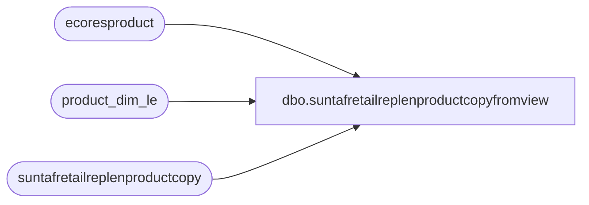

# dbo.suntafretailreplenproductcopyfromview

**Database:** LH_D365  
**Server:** 4db76rlxaxcuvmuh5kw37wbnqq-oxjjwecel5tehm2dtna3lt5qia.datawarehouse.fabric.microsoft.com  

## Architecture Diagram



## Table Dependencies

| Referenced Table |
|---|
| ecoresproduct |
| product_dim_le |
| suntafretailreplenproductcopy |

## View Code

```sql
CREATE   VIEW [dbo].[suntafretailreplenproductcopyfromview]
AS
WITH DistinctProducts AS (
SELECT DISTINCT style_code, style_desc
FROM product_dim_le
)
SELECT
    distinct 
	NULL AS product_key,
    NULL AS 'Jurisdiction Code',
    efrom.displayproductnumber AS 'Copy From',
    UPPER(p.style_desc) AS 'Product From Name',
    eTo.displayproductnumber AS 'Copy To',
    UPPER(p2.style_desc) AS 'Product To Name',
    CASE WHEN usehistory = 1 THEN 'Yes' ELSE 'No' END AS 'Use History',
    CASE WHEN useinventory = 1 THEN 'Yes' ELSE 'No' END AS 'Use Inventory',
    CASE WHEN processed = 1 THEN 'Yes' ELSE 'No' END AS 'Processed',
	CASE WHEN babusestoreopenreplenishment = 1 THEN 'Yes' ELSE 'No' END AS 'Use Store Open Replenishment'
FROM
    suntafretailreplenproductcopy productcopy
    INNER JOIN ecoresproduct efrom
        ON efrom.recid = productcopy.copyfrom
    INNER JOIN ecoresproduct eTo
        ON eTo.recid = productcopy.copyto
    INNER JOIN  DistinctProducts p
        ON p.style_code = efrom.displayproductnumber
    INNER JOIN DistinctProducts p2
        ON p2.style_code = eTo.displayproductnumber
```

