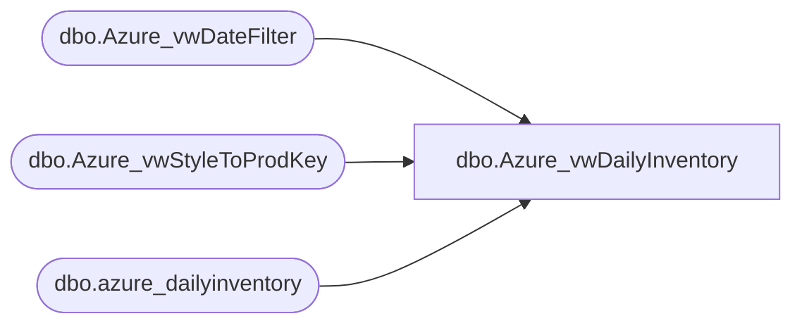

# dbo.Azure_vwDailyInventory

**Database:** LH_Mart  
**Server:** 4db76rlxaxcuvmuh5kw37wbnqq-oxjjwecel5tehm2dtna3lt5qia.datawarehouse.fabric.microsoft.com  

## Architecture Diagram



## Table Dependencies

| Referenced Table |
|---|
| dbo.Azure_vwDateFilter |
| dbo.Azure_vwStyleToProdKey |
| dbo.azure_dailyinventory |

## View Code

```sql
CREATE view dbo.Azure_vwDailyInventory
as
Select 
	ProductKey,
	d.DateKey,
	d.StyleCode,
	EffectiveInv,
	AvailToDist,
	OnHand,
	Purchased,
	Allocated,
	OrderMultiple,
	InventoryBuffer,
	InTransit
from [dbo].[azure_dailyinventory] d 
Left join dbo.Azure_vwStyleToProdKey K on d.StyleCode = K.Style
join dbo.Azure_vwDateFilter df on d.DateKey=cast(df.actual_date as date)
where ProductKey is not null
```

