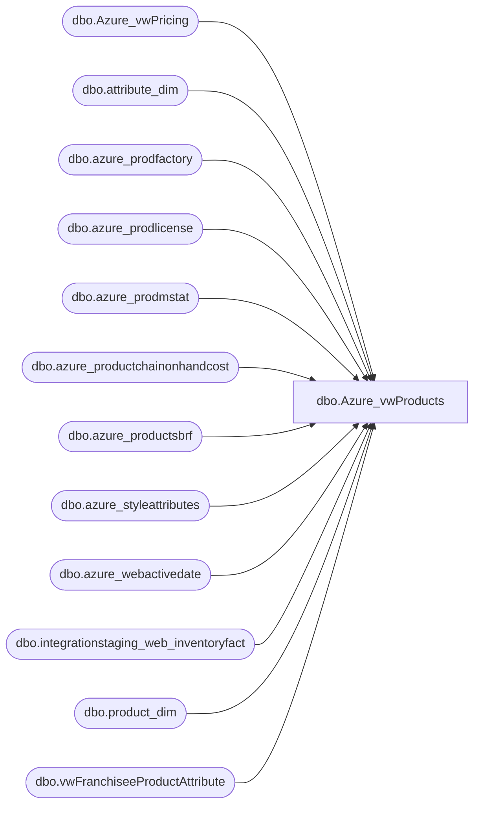

# dbo.Azure_vwProducts

**Database:** LH_Mart  
**Server:** 4db76rlxaxcuvmuh5kw37wbnqq-oxjjwecel5tehm2dtna3lt5qia.datawarehouse.fabric.microsoft.com  

## Architecture Diagram



## Table Dependencies

| Referenced Table |
|---|
| dbo.Azure_vwPricing |
| dbo.attribute_dim |
| dbo.azure_prodfactory |
| dbo.azure_prodlicense |
| dbo.azure_prodmstat |
| dbo.azure_productchainonhandcost |
| dbo.azure_productsbrf |
| dbo.azure_styleattributes |
| dbo.azure_webactivedate |
| dbo.integrationstaging_web_inventoryfact |
| dbo.product_dim |
| dbo.vwFranchiseeProductAttribute |

## View Code

```sql
CREATE VIEW dbo.Azure_vwProducts
AS
WITH 
Attibutes AS 
	(
		SELECT        
			RIGHT(CAST('000000' AS varchar(6)) + CAST(style_code AS varchar(6)), 6) AS Style_Code, 
			AttributeName, 
			AttributeValue
        FROM  dbo.attribute_dim 
        WHERE  
			AttributeName IN ('IDATE', 'ODATE', 'ONOTE', 'OUTLET', 'OMSTAT')
	), 
AttrPivot AS
    (
		SELECT        
			RIGHT(CAST('000000' AS varchar(6)) + CAST(Style_Code AS varchar(6)), 6) AS style_code, 
			CASE 
				WHEN AttributeName = 'IDATE' 
					THEN --AttributeValue 
						MIN(cast(
								case
									when isdate(replace(replace(replace(replace(AttributeValue, '\', '-'), '/', '-'), '.', '-'), ' ', '')) = 1
									then cast( replace(replace(replace(replace(AttributeValue, '\', '-'), '/', '-'), '.', '-'), ' ', '') as date)
									--else '1999-12-31'
									else NULL
								end
						as date))
				ELSE NULL 
			END AS IDATE, 
            CASE 
				WHEN AttributeName = 'ODATE' 
					THEN --AttributeValue 
					MAX(cast(
								case
									when isdate(replace(replace(replace(replace(AttributeValue, '\', '-'), '/', '-'), '.', '-'), ' ', '')) = 1
									then cast( replace(replace(replace(replace(AttributeValue, '\', '-'), '/', '-'), '.', '-'), ' ', '') as date)
									--else '1999-12-31'
									else NULL
								end
						as date))
				ELSE NULL 
			END AS ODATE, 
			CASE 
				WHEN AttributeName = 'ONOTE' 
					THEN AttributeValue 
				ELSE NULL 
			END AS ONOTE, 
            CASE 
				WHEN AttributeName = 'OUTLET' 
					THEN AttributeValue 
				ELSE NULL 
			END AS OUTLET, 
			CASE 
				WHEN AttributeName = 'OMSTAT' 
					THEN AttributeValue 
				ELSE NULL 
			END AS OMSTAT
		FROM Attibutes
		group by 
			RIGHT(CAST('000000' AS varchar(6)) + CAST(Style_Code AS varchar(6)), 6),
			AttributeName,
			AttributeValue
	), 
MaxAttr AS
    (
		SELECT        
			RIGHT(CAST('000000' AS varchar(6)) + CAST(style_code AS varchar(6)), 6) AS style_code, 
			MIN(IDATE) AS IDATE, 
			MAX(ODATE) AS ODATE, 
			MAX(ONOTE) AS ONOTE, 
			MAX(OUTLET) AS OUTLET, 
			MAX(OMSTAT) AS OMSTAT
		FROM  AttrPivot
		--where isnull(ODATE, getdate()) <= getdate()
		GROUP BY style_code
	), 
FilteredKeystories AS
    (
		SELECT
			CAST(style_code AS varchar(10)) AS Style_Code, 
			MIN(AttributeValue) AS KeyStory
		FROM  dbo.attribute_dim
		WHERE  AttributeName = 'KEYSTY'
		GROUP BY style_code
	), 
KeyStories AS
    (
		SELECT        
			s.style_code, 
			MAX(s.KeyStory) AS KeyStory
      FROM            
		dbo.product_dim AS s 
		--WHERE 
		--	 ecp.parent_type = 1 
		--		AND ecp.custom_property_id = 60
      GROUP BY s.style_code
	 ),
unitCost as
	(
		select 
			ProductKey,
			ChainAverageOnHandCost,
			ChainAverageOnHandCostGBP
		from [dbo].[azure_productchainonhandcost] -->> this table is loaded nightly at 1am via stl-ssis-p-01 sql agent UKLoyaltyLoad --> job does other ETLs then loads this table via [Azure].[spProductChainAverageOnHandCost]
	),
webInventory as
	(
	select 
			  StyleCode,
			  max(UnbufferedQty) as 'UnbufferedQty'
		from LH_Source.dbo.integrationstaging_web_inventoryfact
		where LocationCode in ( '0013', '2013')
		group by StyleCode
    )
SELECT        
	pd.product_key AS ProductKey, 
	pd.style_code AS Style, 
	ISNULL(pd.style_desc, pd.product_desc) AS StyleDescription, 
	pd.color_desc AS Color, 
	pd.concept, 
	pd.chain, 
	pd.division, 
	pd.department, 
	pd.class, 
	pd.subclass, 
    pd.department_code AS DeptCode, 
	pd.subclass_code AS SubClassCode, 
	pd.ScorecardCategory, 
	pd.primary_vendor_code AS PrimaryVendorCode, 
	pd.primary_vendor_name AS PrimaryVendorName, 
    pd.alt_primary_vendor_code AS AltPrimaryVendorCode, 
	pd.current_retail AS CurrentRetail, 
	pd.original_retail AS OriginalRetail, 
	pd.current_selling_retail_home AS CurrentSellingRetailHome, 
	pd.price_with_vat AS PriceWithVat, 
    pd.euro_value AS EuroValue, 
	pd.cdn_value A
```

