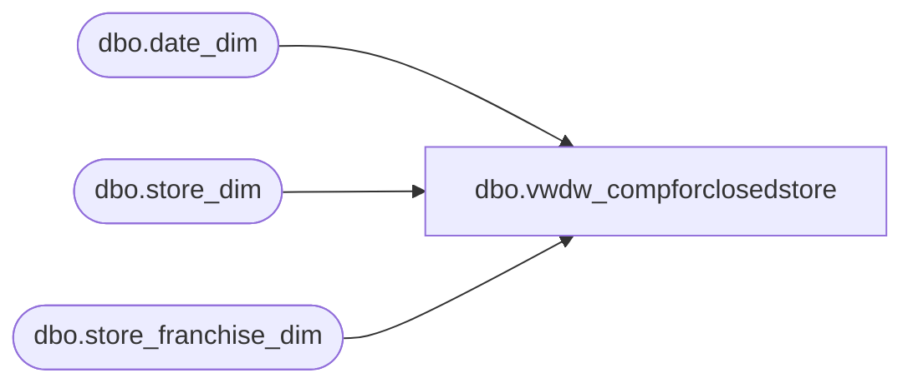

# dbo.vwdw_compforclosedstore

**Database:** LH_Mart  
**Server:** 4db76rlxaxcuvmuh5kw37wbnqq-oxjjwecel5tehm2dtna3lt5qia.datawarehouse.fabric.microsoft.com  

## Architecture Diagram



## Table Dependencies

| Referenced Table |
|---|
| dbo.date_dim |
| dbo.store_dim |
| dbo.store_franchise_dim |

## View Code

```sql
CREATE VIEW dbo.vwdw_compforclosedstore 
AS SELECT
    cd3.store_key
   ,cd3.store_id
   ,cd3.store_name
   ,cd3.bearritory
   ,cd3.IsClosed
   ,cd3.closing_date_key
   ,cd3.closing_date
   ,cd3.closing_max_comp_date_key
   ,cd3.closing_max_comp_date
   ,cd3.closing_max_ly_comp_fiscal_year		
--,cd3.closing_max_comp_fiscal_period
   ,cd3.closing_max_comp_fiscal_week
   ,max(d.actual_date) closing_max_ly_comp_date
   ,max(d.date_key) closing_max_ly_comp_date_key
FROM
    dbo.date_dim d
RIGHT JOIN (
    SELECT
                cd2.store_key
               ,cd2.store_id
               ,cd2.store_name
               ,cd2.bearritory
               ,cd2.IsClosed
               ,cd2.closing_date_key
               ,cd2.closing_date
               ,cd2.closing_max_comp_date_key
               ,cd2.closing_max_comp_date
               ,d.fiscal_year - 1 closing_max_ly_comp_fiscal_year		
               --,d.fiscal_period  closing_max_comp_fiscal_period
               ,d.fiscal_week closing_max_comp_fiscal_week

            FROM
                dbo.date_dim d
            RIGHT JOIN (
                 SELECT
                            cd1.store_key
                           ,cd1.store_id
                           ,cd1.store_name
                           ,cd1.bearritory
                           ,CAST(cd1.IsClosed AS bit) IsClosed
                           ,cd1.closing_date_key
                           ,cd1.closing_date
                           ,CASE
                                 WHEN cd1.closing_date_key = max(d.date_key) THEN cd1.closing_date_key
                                 ELSE (min(d.date_key) - 1)
                            END AS closing_max_comp_date_key --closing_max_ly_comp_date_key
                           ,CASE
                                 WHEN cd1.closing_date_key = max(d.date_key) THEN cd1.closing_date
                                 ELSE DATEADD(DAY, -1, min(d.actual_date))
                            END AS closing_max_comp_date
                            FROM
                            dbo.date_dim d
                        RIGHT JOIN (
                            SELECT
                                        s.store_key
                                       ,CAST(s.store_id AS varchar(50)) store_id
                                       ,s.store_name
                                       ,s.closing_date
                                       ,d.date_key closing_date_key
                                       ,d.fiscal_year closing_fiscal_year
                                       ,d.fiscal_period closing_fiscal_period
                                       ,s.bearritory
                                       ,CASE
                                             WHEN s.closing_date IS NOT NULL
                                             OR s.bearritory LIKE '%Closed%' THEN 1
                                             ELSE 0
                                        END AS IsClosed
                                    FROM
                                        dbo.date_dim d
                                    RIGHT JOIN dbo.store_dim s
                                        --store_franchise_dim s  
 ON                                     d.actual_date = s.closing_date
                                    UNION
                                    SELECT
                                        s.store_key
                                       ,CAST(s.store_id AS varchar) store_id
                                       ,s.store_name
                                       ,s.closing_date
                                       ,d.date_key closing_date_key
                                       ,d.fiscal_year closing_fiscal_year
                                       ,d.fiscal_period closing_fiscal_period
                                       ,s.bearritory
                                       ,CASE
```

