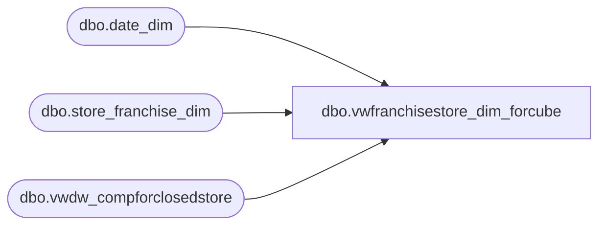

# dbo.vwfranchisestore_dim_forcube

**Database:** LH_Mart  
**Server:** 4db76rlxaxcuvmuh5kw37wbnqq-oxjjwecel5tehm2dtna3lt5qia.datawarehouse.fabric.microsoft.com  

## Architecture Diagram



## Table Dependencies

| Referenced Table |
|---|
| dbo.date_dim |
| dbo.store_franchise_dim |
| dbo.vwdw_compforclosedstore |

## View Code

```sql
CREATE VIEW dbo.vwfranchisestore_dim_forcube 
AS SELECT

				f.store_key
				,CAST(f.store_id AS varchar) AS store_id
				,'Unranked' as StoreRanking
				,f.store_name
				,CONCAT(f.store_id,' ',f.store_name) AS storeNameNum
				,f.bearea
				,f.bearritory
				,f.region
				,f.region AS GeographyRegion
				,f.country_name AS ParentCountry --FA 9/29/2009
				,f.country_name AS ChildCountry --FA 9/29/2009
				,f.country
				,f.country_name
				,f.country_name as country_display
			    ,f.state_province
				,NULLIF(f.country,'') + '-' + NULLIF(f.state_province, '') AS state_province_key
				,f.city
				,f.postal_code
				,f.latitude
				,f.longitude
				,'Other' AS dma_name
				,f.opening_date
				,dd.day_id AS opening_date_id
--				,f.closing_date
				,f.comp_week_id
				,dd.period_id AS open_fp_id
				,dd.week_id AS open_week_id
				,cd.date_key AS comp_date_key
				,1 AS ReportFlag
				,0 AS ClubMaxFlag
				,f.BearRange
				,'Franchisees' AS CompanyLevel

--			new fields added 02/16/2010
				,clsd.IsClosed
				,clsd.closing_date_key
				,f.closing_date 
				,clsd.closing_max_comp_date_key
				,clsd.closing_max_comp_date
				,clsd.closing_max_ly_comp_date_key
				,clsd.closing_max_ly_comp_date

				, 'Franchisees' AS MerchCompanyLevel
				,f.BearRange AS MerchBearRange
				,f.country_name AS MerchCountry 
				,f.region AS MerchStrCntRegion
				,f.region AS MerchRegion
				,f.bearritory AS Merchbearritory
			FROM dbo.store_franchise_dim f
			LEFT JOIN dbo.date_dim dd ON f.opening_date = dd.actual_date
			LEFT JOIN [dbo].[vwdw_compforclosedstore] clsd ON f.store_key = clsd.store_key
            LEFT JOIN dbo.date_dim cd ON f.comp_date = cd.actual_date
```

