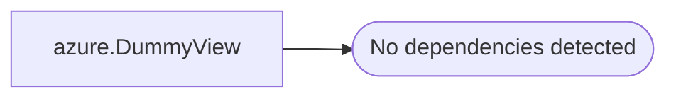

# azure.DummyView

**Database:** LH_Reporting  
**Server:** 4db76rlxaxcuvmuh5kw37wbnqq-oxjjwecel5tehm2dtna3lt5qia.datawarehouse.fabric.microsoft.com  

## Architecture Diagram



## Table Dependencies

_No table dependencies detected._

## View Code

```sql
CREATE VIEW azure.DummyView
AS
SELECT 1 AS ID
```

