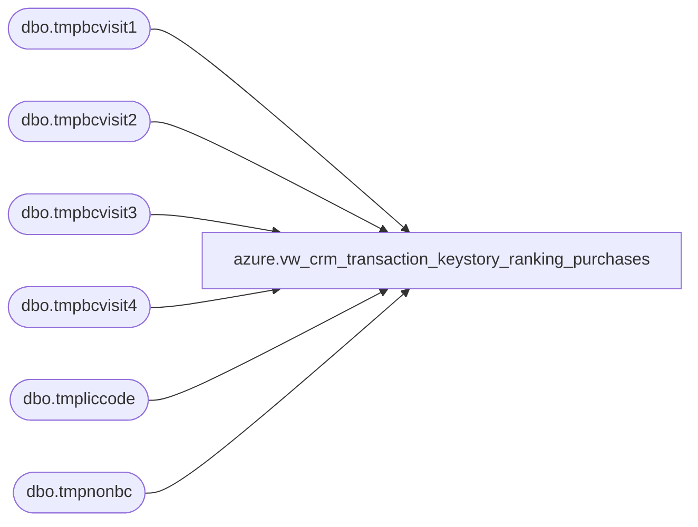

# azure.vw_crm_transaction_keystory_ranking_purchases

**Database:** LH_Reporting  
**Server:** 4db76rlxaxcuvmuh5kw37wbnqq-oxjjwecel5tehm2dtna3lt5qia.datawarehouse.fabric.microsoft.com  

## Architecture Diagram



## Table Dependencies

| Referenced Table |
|---|
| dbo.tmpbcvisit1 |
| dbo.tmpbcvisit2 |
| dbo.tmpbcvisit3 |
| dbo.tmpbcvisit4 |
| dbo.tmpliccode |
| dbo.tmpnonbc |

## View Code

```sql
CREATE VIEW [azure].[vw_crm_transaction_keystory_ranking_purchases]

AS

SELECT n.country AS country
	,n.PurchaseChannel AS purchase_channel
	,'' AS customer_number 
	,n.transaction_ID AS transaction_id
	,n.TransactionDate AS transaction_date
	,n.KeyStory AS key_story
	,n.GaapUnits AS gaap_units
	,n.GaapSales AS gaap_sales
	,n.[isWeb] AS is_web
	,n.[isRetail] AS is_retail
	,n.[2ndPurchase] AS [2nd_purchase]
	,n.[3rdPurchase] AS [3rd_purchase]
	,n.[4thPurchase] AS [4th_purchase]
	,0 AS [is_new_customer]
	,0 AS [is_repeat_customer]
	,CASE 
		WHEN ISNUMERIC(l.licenseCode) = 1
			THEN 'Non-licensed'
		ELSE 'Licensed'
		END AS license_status
	,CASE 
		WHEN n.[isWeb] = 1
			THEN 'Web'
		ELSE 'Retail'
		END AS web_or_retail
FROM LH_Mart.dbo.tmpnonbc n
LEFT JOIN LH_Mart.dbo.tmpliccode l ON n.KeyStory = l.KeyStory

UNION

SELECT v1.Country AS country
	,v1.PurchaseChannel
	,v1.customerNumber
	,v1.transactionID
	,v1.TransactionDate
	,v1.keyStory
	,v1.KeyStoryUnits
	,v1.KeyStorySales
	,v1.isWeb
	,v1.isRetail
	,isnull(v2.keyStory, '') AS '2ndPurchase'
	,isnull(v3.keyStory, '') AS '3rdPurchase'
	,isnull(v4.keyStory, '') AS '4thPurchase'
	,CASE 
		WHEN v2.[ParentTransactionID] IS NULL
			THEN 1
		ELSE 0
		END AS [isNewCustomer]
	,CASE 
		WHEN v2.[ParentTransactionID] IS NULL
			THEN 0
		ELSE 1
		END AS [isRepeatCustomer]
	,CASE 
		WHEN ISNUMERIC(l.licenseCode) = 1
			THEN 'Non-licensed'
		ELSE 'Licensed'
		END AS licenseStatus
	,CASE 
		WHEN v1.isWeb = 1
			THEN 'Web'
		ELSE 'Retail'
		END AS webOrRetail
FROM LH_Mart.dbo.tmpbcvisit1 v1
LEFT JOIN LH_Mart.dbo.tmpbcvisit2 v2 ON v2.ParentTransactionID = v1.transactionID
LEFT JOIN LH_Mart.dbo.tmpbcvisit3 v3 ON v3.ParentTransactionID = v2.transactionID
LEFT JOIN LH_Mart.dbo.tmpbcvisit4 v4 ON v4.ParentTransactionID = v3.transactionID
LEFT JOIN LH_Mart.dbo.tmpliccode l ON v1.keyStory = l.KeyStory
```

