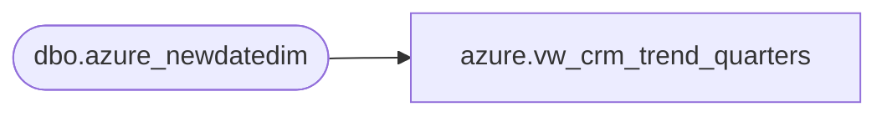

# azure.vw_crm_trend_quarters

**Database:** LH_Reporting  
**Server:** 4db76rlxaxcuvmuh5kw37wbnqq-oxjjwecel5tehm2dtna3lt5qia.datawarehouse.fabric.microsoft.com  

## Architecture Diagram



## Table Dependencies

| Referenced Table |
|---|
| dbo.azure_newdatedim |

## View Code

```sql
CREATE VIEW [azure].[vw_crm_trend_quarters]
AS
WITH trendQuarters
AS (
	SELECT TOP 8 ROW_NUMBER() OVER (
			ORDER BY Fiscal_Quarter_key
			) AS [q_sequence]
		,Fiscal_Quarter AS fiscal_quarter
		,Fiscal_Quarter_key AS fiscal_quarter_key
		,Fiscal_Year AS fiscal_year
	FROM LH_Mart.dbo.azure_newdatedim
	WHERE getdate() - 730 < Fiscal_Quarter_key
	GROUP BY Fiscal_Quarter
		,Fiscal_Quarter_key
		,Fiscal_Year
	)
SELECT q.q_sequence
	,q.fiscal_quarter
	,q.fiscal_quarter_key
	,q.fiscal_year
FROM trendQuarters q
```

