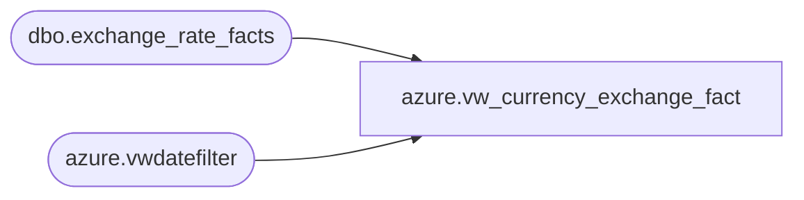

# azure.vw_currency_exchange_fact

**Database:** LH_Reporting  
**Server:** 4db76rlxaxcuvmuh5kw37wbnqq-oxjjwecel5tehm2dtna3lt5qia.datawarehouse.fabric.microsoft.com  

## Architecture Diagram



## Table Dependencies

| Referenced Table |
|---|
| dbo.exchange_rate_facts |
| azure.vwdatefilter |

## View Code

```sql
CREATE view [azure].[vw_currency_exchange_fact]

AS


-- Franchise rates are fiscal month end
SELECT d.fiscal_year
	,d.fiscal_period
	,e.from_currency_code
	,e.to_currency_code
	,Max(e.fiscal_month_end_rate) AS exchange_rate
	,MIN(d.actual_date) AS fiscal_month_key
FROM LH_Mart.dbo.exchange_rate_facts e
INNER JOIN [azure].[vwdatefilter] d ON d.date_key = e.date_key
WHERE (
		(
			e.from_currency_code IN (
				'AUD'
				,'BHD'
				,'OMR'
				,'QAR'
				,'AED'
				,'BRL'
				,'KWD'
				,'MXN'
				,'RUB'
				,'SEK'
				,'SGD'
				,'THB'
				,'TRL'
				,'INR'
				,'TRY'
				,'ZAR'
				,'ZDK'
				,'ZUR'
				,'CLP'
				)
			OR e.to_currency_code IN (
				'AUD'
				,'BHD'
				,'OMR'
				,'QAR'
				,'AED'
				,'BRL'
				,'KWD'
				,'MXN'
				,'RUB'
				,'SEK'
				,'SGD'
				,'THB'
				,'TRL'
				,'INR'
				,'TRY'
				,'ZAR'
				,'ZDK'
				,'ZUR'
				,'CLP'
				)
			)
		)
	AND e.to_currency_code = 'USD'
GROUP BY d.fiscal_year
	,d.fiscal_period
	,e.from_currency_code
	,e.to_currency_code

UNION ALL

-- Corporate rates are fiscal month average
SELECT d.fiscal_year AS FiscalYear
	,d.fiscal_period AS FiscalMonth
	,e.from_currency_code AS FromCurrencyCode
	,e.to_currency_code AS ToCurrencyCode
	,MAX(e.fiscal_month_ave_rate) AS ExchangeRate
	,MIN(d.actual_date) AS Fiscal_Month_key
FROM LH_Mart.dbo.exchange_rate_facts e
INNER JOIN azure.vwdatefilter d ON d.date_key = e.date_key
WHERE (
		(
			e.from_currency_code IN (
				'EUR'
				,'CNY'
				,'DKK'
				,'CAD'
				,'GBP'
				)
			AND e.to_currency_code NOT IN (
				'AUD'
				,'BHD'
				,'OMR'
				,'INR'
				,'QAR'
				,'AED'
				,'BRL'
				,'KWD'
				,'MXN'
				,'RUB'
				,'SEK'
				,'SGD'
				,'THB'
				,'TRL'
				,'TRY'
				,'ZAR'
				,'ZDK'
				,'ZUR'
				,'CLP'
				)
			)
		OR (
			e.to_currency_code IN (
				'EUR'
				,'CNY'
				,'DKK'
				,'CAD'
				,'GBP'
				)
			AND e.from_currency_code NOT IN (
				'AUD'
				,'BHD'
				,'OMR'
				,'QAR'
				,'INR'
				,'AED'
				,'BRL'
				,'KWD'
				,'MXN'
				,'RUB'
				,'SEK'
				,'SGD'
				,'THB'
				,'TRL'
				,'TRY'
				,'ZAR'
				,'ZDK'
				,'ZUR'
				,'CLP'
				)
			)
		OR (
			e.to_currency_code IN ('USD')
			AND e.from_currency_code IN ('USD')
			)
		)
	AND e.to_currency_code = 'USD'
GROUP BY d.fiscal_year
	,d.fiscal_period
	,e.from_currency_code
	,e.to_currency_code
```

