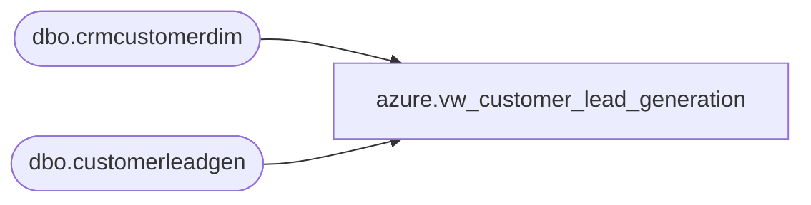

# azure.vw_customer_lead_generation

**Database:** LH_Reporting  
**Server:** 4db76rlxaxcuvmuh5kw37wbnqq-oxjjwecel5tehm2dtna3lt5qia.datawarehouse.fabric.microsoft.com  

## Architecture Diagram



## Table Dependencies

| Referenced Table |
|---|
| dbo.crmcustomerdim |
| dbo.customerleadgen |

## View Code

```sql
CREATE VIEW [azure].[vw_customer_lead_generation]
AS
WITH minDate
AS (
	SELECT EmailAddress
		,MIN(EntryDate) MinDate
	FROM LH_Mart.dbo.customerleadgen
	GROUP BY EmailAddress
	)
SELECT l.EntryDate AS entry_date
	,l.CountryCode AS country_code
	,l.Campaign AS campaign 
	,l.Source AS source
	,--l.EmailAddress,
	l.FileDate AS file_Date
	,l.FileName AS file_name
	,l.InsertDate AS insert_date
	,l.UpdateDate AS update_date
	,
	--c.CustomerNumber
	CASE 
		WHEN c.CustomerNumber IS NULL
			THEN 'N/A'
		ELSE c.CustomerNumber
		END AS customer_number
	,c.MembershipDate AS membership_date
	,c.StoreKey AS store_key
	,c.MembershipType AS membership_type
	,CASE 
		WHEN md.EmailAddress IS NULL
			THEN 0
		ELSE 1
		END AS is_first_email
FROM LH_Mart.dbo.[customerleadgen] l
LEFT JOIN LH_Mart.dbo.crmcustomerdim c ON l.EmailAddress = c.EmailAddress
LEFT JOIN minDate md ON l.EmailAddress = md.EmailAddress
	AND l.EntryDate = md.MinDate
WHERE l.EmailAddress <> 'hgfcchfgcfg@gmail.com'
	-- excluding records with this email as it appears to be an invalid record merged in the past due to an issue with the file
```

