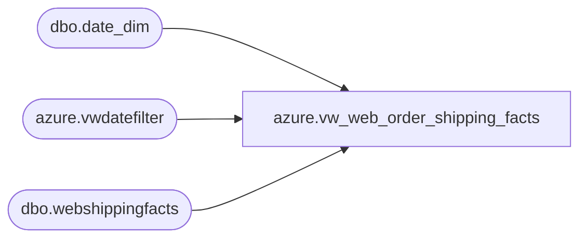

# azure.vw_web_order_shipping_facts

**Database:** LH_Reporting  
**Server:** 4db76rlxaxcuvmuh5kw37wbnqq-oxjjwecel5tehm2dtna3lt5qia.datawarehouse.fabric.microsoft.com  

## Architecture Diagram



## Table Dependencies

| Referenced Table |
|---|
| dbo.date_dim |
| azure.vwdatefilter |
| dbo.webshippingfacts |

## View Code

```sql
CREATE VIEW [azure].[vw_web_order_shipping_facts]
AS
SELECT RIGHT(w.SiteCode, 2) AS site_code
	,w.CreateDate AS created_date
	,w.ShipDate AS ship_date
	,w.OrderNumber AS order_number
	,w.ShipToState AS ship_to_state
	,w.ShipToCountry AS ship_to_country
	,w.TrackingNumber AS tracking_number
	,w.Shipping AS shipping
	,w.ShipmentTrackingNumber AS shipment_tracking_number
	,w.ServiceType AS service_type
	,w.ShipmentDeliveryDate AS shipment_delivery_date
	,w.NetChargeAmountUSD AS net_charge_amount_usd
	,w.Invoicedate AS invoice_date
	,w.MasterTrackingNumber AS master_tracking_number
	,min(w.transaction_id) transaction_id
	,---8 orders had multiple transaction_ids...
	CASE right(w.SiteCode, 2)
		WHEN 'US'
			THEN 13
		ELSE 2013
		END AS store_key
FROM LH_Mart.dbo.webshippingfacts w
JOIN LH_Mart.dbo.date_dim dd ON w.CreateDate = cast(dd.actual_date AS DATE)
JOIN [azure].[vwdatefilter] df ON dd.date_key = df.date_key
WHERE ISNULL(w.TrackingNumber, 'x') <> 'NoShippableContent'
GROUP BY RIGHT(w.SiteCode, 2)
	,w.CreateDate
	,w.ShipDate
	,w.OrderNumber
	,w.ShipToState
	,w.ShipToCountry
	,w.TrackingNumber
	,w.Shipping
	,w.ShipmentTrackingNumber
	,w.ServiceType
	,w.ShipmentDeliveryDate
	,w.NetChargeAmountUSD
	,w.Invoicedate
	,w.MasterTrackingNumber
	,CASE RIGHT(w.SiteCode, 2)
		WHEN 'US'
			THEN 13
		ELSE 2013
		END
```

