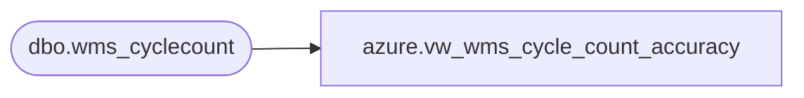

# azure.vw_wms_cycle_count_accuracy

**Database:** LH_Reporting  
**Server:** 4db76rlxaxcuvmuh5kw37wbnqq-oxjjwecel5tehm2dtna3lt5qia.datawarehouse.fabric.microsoft.com  

## Architecture Diagram



## Table Dependencies

| Referenced Table |
|---|
| dbo.wms_cyclecount |

## View Code

```sql
CREATE   view [azure].[vw_wms_cycle_count_accuracy]
AS
SELECT [AcceptReject] AS accept_reject
	,[AmtBeforeCount] AS amt_before_count
	,cast([ApprovedDate] AS DATE) AS approved_date
	,[ApproverId] AS approver_id
	,[CostPerUnit] AS cost_per_unit
	,[CostPrice] AS cost_price
	,[CounterId] AS counter_id
	,[dataAreaId] AS data_area_id
	,cast([DateOfCount] AS DATE) AS date_of_count
	,[FinalCountAmt] AS final_count_amt
	,[InventDimId] AS invent_dim_id
	,[InventJournalNum] AS invent_journam_num
	,[LicensePlate] AS license_plate
	,[LineNum] AS line_num
	,[Location] AS location
	,[SKU] AS sku
	,[Tolerance] AS tolerance
	,[UnitDifference] AS unit_difference

	,CASE 
		WHEN ([AmtBeforeCount] = [FinalCountAmt])
			THEN [UnitDifference] * [CostPerUnit]
		ELSE [UnitDifference] * [CostPrice]
		END AS dollar_difference

	,CASE 
		WHEN ([AmtBeforeCount] = [FinalCountAmt])
			THEN [AmtBeforeCount] * [CostPerUnit]
		ELSE [AmtBeforeCount] * [CostPrice]
		END AS perpetual_dollar_amt
	,CASE 
		WHEN AmtBeforeCount = 0
			THEN 1
		ELSE ([UnitDifference]) / AmtBeforeCount
		END AS unit_difference_perc
	,CASE 
		WHEN [InventJournalNum] LIKE 'INVJ%'
			THEN ABS([UnitDifference])
		ELSE 0
		END AS total_unit_adjustments
	,CASE 
		WHEN [InventJournalNum] LIKE 'INVJ%'
			THEN [UnitDifference] * [CostPerUnit]
		ELSE 0
		END AS dollar_adjustments

	,[Warehouse] AS warehouse
	,[WorkId] AS work_id
	,[WorkStatus] AS work_status
	,[InsertDate] AS insert_date
	,[UpdateDate] AS update_date
FROM LH_Mart.[dbo].wms_cyclecount
WHERE [AcceptReject] = 'Accept'
```

