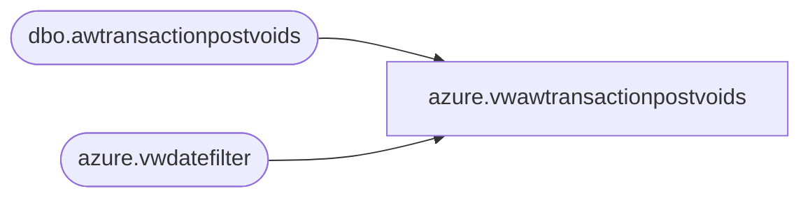

# azure.vwawtransactionpostvoids

**Database:** LH_Reporting  
**Server:** 4db76rlxaxcuvmuh5kw37wbnqq-oxjjwecel5tehm2dtna3lt5qia.datawarehouse.fabric.microsoft.com  

## Architecture Diagram



## Table Dependencies

| Referenced Table |
|---|
| dbo.awtransactionpostvoids |
| azure.vwdatefilter |

## View Code

```sql
CREATE view [azure].[vwawtransactionpostvoids]

as 

select 
	pv.TransactionDate, 
	pv.StoreNo as StoreNumber, 
	pv.PostVoidUGA, 
	pv.PostVoidUnits 
from LH_Mart.dbo.awtransactionpostvoids pv
join azure.vwdatefilter df on cast(pv.TransactionDate as date)=cast(df.actual_date as date)
```

