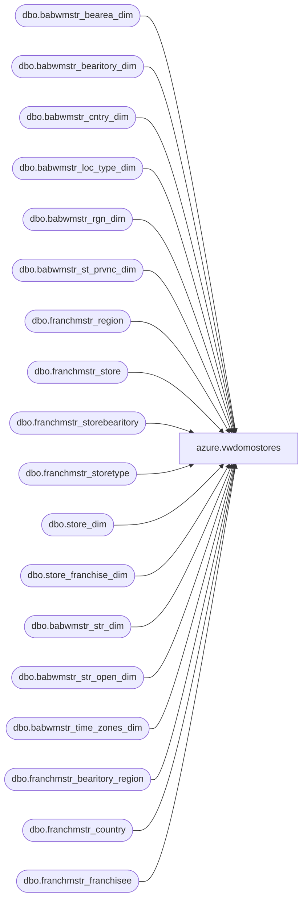

# azure.vwdomostores

**Database:** LH_Reporting  
**Server:** 4db76rlxaxcuvmuh5kw37wbnqq-oxjjwecel5tehm2dtna3lt5qia.datawarehouse.fabric.microsoft.com  

## Architecture Diagram



## Table Dependencies

| Referenced Table |
|---|
| dbo.babwmstr_bearea_dim |
| dbo.babwmstr_bearitory_dim |
| dbo.babwmstr_cntry_dim |
| dbo.babwmstr_loc_type_dim |
| dbo.babwmstr_rgn_dim |
| dbo.babwmstr_st_prvnc_dim |
| dbo.franchmstr_region |
| dbo.franchmstr_store |
| dbo.franchmstr_storebearitory |
| dbo.franchmstr_storetype |
| dbo.store_dim |
| dbo.store_franchise_dim |
| dbo.babwmstr_str_dim |
| dbo.babwmstr_str_open_dim |
| dbo.babwmstr_time_zones_dim |
| dbo.franchmstr_bearitory_region |
| dbo.franchmstr_country |
| dbo.franchmstr_franchisee |

## View Code

```sql
CREATE VIEW [azure].[vwdomostores] AS
WITH PermCloseStores (StoreKey) AS (
	SELECT	DISTINCT STR_KEY
	FROM	LH_Source.dbo.babwmstr_str_open_dim
	WHERE	PERM_CLOSE=1
	)
SELECT	TOP 10 CAST(dsd.store_id AS VARCHAR) AS StoreID
		,right(('0000' + CAST(sd.STR_NUM AS VARCHAR)), 4) AS StoreNumber
		,CAST(dsd.store_key AS VARCHAR) AS StoreKey
		,CASE WHEN pc.StoreKey IS NOT NULL THEN 1 ELSE 0 END AS PermCloseStatus
		,sd.NM_ABBRV AS StoreNameAbbr
		,sd.NM_FULL AS StoreNameFull
		,sd.PHN_NBR AS StorePhoneNumber
		,sd.FAX_NBR AS StoreFaxNumber
		,sd.EMAIL AS StoreEmail
		,td.DESCR AS TimeZoneDesc
		,spd.NM_ABBRV AS StateProvinceNameAbbr
		,spd.NM_FULL AS StateProvinceNameFull
		,sd.LCTR AS StoreLocator
		,sd.MALL_WEBSITE_URL AS StoreMallWebsiteURL
		,sd.LONGITUDE AS StoreLongitude
		,sd.LATITUDE AS StoreLatitude
		,sd.LGL_DESC AS StoreLegalDescription
		,'Direct' AS Channel
		,CASE WHEN cd.NM_ABBRV IN ('US','CA') THEN 'North America'
	          WHEN cd.NM_ABBRV IN ('UK','DK','IE','CN') THEN 'Europe'
		 END AS [TradingGroup]
		,cd.NM_ABBRV AS CountryNameAbbr
		,cd.NM_FULL AS CountryNameFull
		,CASE WHEN sd.STR_NUM IN (013, 2013) THEN 'Web'
		      ELSE 'Retail'
		 END AS [SubChannel]
		,ISNULL(rd.NM,'No Zone') AS Zone
		,ISNULL(bd.NM, 'No Area') AS Area
		,ISNULL(btd.NM, 'No District') AS District
FROM LH_Source.dbo.babwmstr_str_dim sd
INNER JOIN LH_Mart.dbo.store_dim dsd
	ON dsd.store_id=sd.STR_NUM
LEFT OUTER JOIN LH_Source.dbo.babwmstr_loc_type_dim ld
	ON ld.LOC_TYPE_KEY=sd.LOC_TYPE_KEY
LEFT OUTER JOIN LH_Source.dbo.babwmstr_rgn_dim rd
	ON rd.RGN_ID=sd.RGN_ID
LEFT OUTER JOIN LH_Source.dbo.babwmstr_bearea_dim bd
	ON bd.BEAREA_ID=sd.BEAREA_ID
LEFT OUTER JOIN LH_Source.dbo.babwmstr_bearitory_dim btd
	ON btd.BEARITORY_ID=sd.BEARITORY_ID
LEFT OUTER JOIN LH_Source.dbo.babwmstr_time_zones_dim td
	ON td.TM_ZN_ID=sd.TM_ZN_ID
LEFT OUTER JOIN LH_Source.dbo.babwmstr_cntry_dim cd
	ON cd.CNTRY_ID=sd.CNTRY_ID
LEFT OUTER JOIN LH_Source.dbo.babwmstr_st_prvnc_dim spd
	ON spd.ST_PRVNC_ID=sd.ST_PRVNC_ID
LEFT OUTER JOIN PermCloseStores pc
	ON pc.StoreKey=sd.STR_ID
WHERE sd.CMPNY_ID=1 AND sd.STR_ID > 0
AND (dsd.closing_date>=DATEADD(day, -7, DATEADD(year, -2, DATEADD(yy, DATEDIFF(yy, 0, GETDATE()), 0)))
	OR dsd.closing_date IS NULL)
AND sd.STR_NUM not between 501 and 599 -- Labs
AND sd.STR_NUM NOT BETWEEN 9001 AND 9100 -- Test Stores
AND sd.STR_NUM NOT IN (473) 

UNION ALL
SELECT	CAST(store_id AS VARCHAR), right(('0000' + CAST(store_id AS VARCHAR)), 4), store_key, 0, store_name_abbrv, store_name, phone, fax, email, NULL, state_province, state_province_name, NULL, NULL, latitude, longitude,
		NULL, 'Indirect', 'North America', country, country_name, 'Corporate Sales', 'No Zone', 'No Area', 'No District'
FROM LH_Mart.dbo.store_dim
WHERE store_id=470

UNION ALL

SELECT
	 s.Code
	,s.Code
	,sfd.store_key
	,0
	,s.store_name
	,s.store_name
	,NULL--StorePhoneNumber
	,NULL--StoreFaxNumber
	,NULL--StoreEmail
	,NULL--TimeZoneDesc
	,NULL--StateProvinceNameAbbr
	,NULL--StateProvinceNameFull
	,NULL--StoreLocator
	,NULL--StoreMallWebsiteURL
	,NULL--StoreLongitude
	,NULL--StoreLatitude
	,NULL--StoreLegalDescription
	,'Indirect' AS [Channel]
	,'Franchise - ' + f.Name AS [TradingGroup]
	,c.CountryName AS [CountryNameAbbr]
	,c.FullName As [CountryNameFull]
	,CASE WHEN st.Descrip='Store' THEN c.CountryName + ' Retail'
		  WHEN st.Descrip='Web' THEN c.CountryName + ' Web'
	 END AS [SubChannel]
	,ISNULL(r.name, 'No Zone')
	,ISNULL(NULL,'No Area')					
	,ISNULL(br.name, 'No District')
FROM LH_Source.dbo.franchmstr_store s
INNER JOIN LH_Mart.dbo.store_franchise_dim sfd
	ON sfd.store_id=s.Code
LEFT OUTER JOIN LH_Source.dbo.franchmstr_country c
	ON c.CountryID=s.CountryID
LEFT OUTER JOIN LH_Source.dbo.franchmstr_storebearitory sb
	ON sb.storeID=s.storeID
	AND GETDATE() BETWEEN sb.startDate and sb.endDate
LEFT OUTER JOIN LH_Source.dbo.franchmstr_bearitory_region br
	ON br.bearitoryID
```

