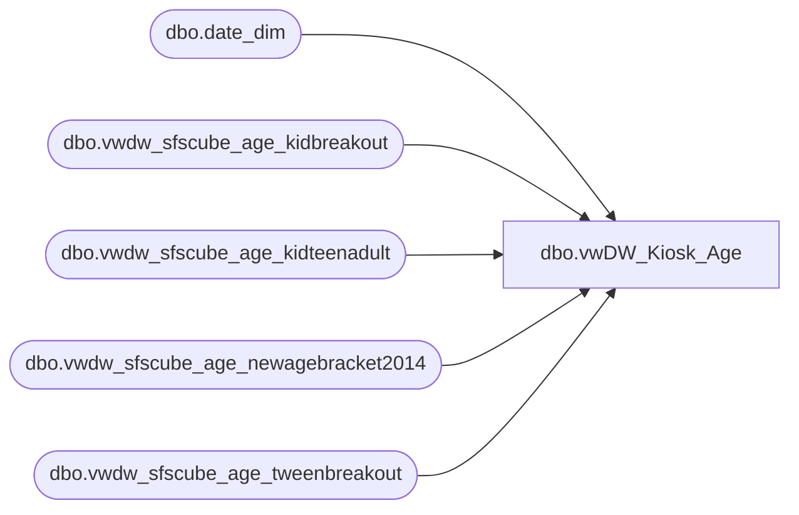

# dbo.vwDW_Kiosk_Age

**Database:** LH_Reporting  
**Server:** 4db76rlxaxcuvmuh5kw37wbnqq-oxjjwecel5tehm2dtna3lt5qia.datawarehouse.fabric.microsoft.com  

## Architecture Diagram



## Table Dependencies

| Referenced Table |
|---|
| dbo.date_dim |
| dbo.vwdw_sfscube_age_kidbreakout |
| dbo.vwdw_sfscube_age_kidteenadult |
| dbo.vwdw_sfscube_age_newagebracket2014 |
| dbo.vwdw_sfscube_age_tweenbreakout |

## View Code

```sql
CREATE VIEW [dbo].[vwDW_Kiosk_Age]
AS 
SELECT TOP (100) PERCENT
      Number AS Age
      , CAST(Number AS INT) AS DiscreetAge
      ,CASE
            WHEN x.Number < 0 THEN 'Unknown'
            WHEN x.Number < 10 THEN '0-10 Yrs'
            WHEN x.Number < 20 THEN '10-20 Yrs'
            WHEN x.Number < 50 THEN '30-50 Yrs'
            WHEN x.Number < 100 THEN '50-100 Yrs'
            ELSE '100 + Yrs'
       END AS BandDecadeDescr
      ,CASE
            WHEN x.Number < 0 THEN 900
            WHEN x.Number < 10 THEN 10
            WHEN x.Number < 20 THEN 20
            WHEN x.Number < 50 THEN 30
            WHEN x.Number < 100 THEN 40
            ELSE 50
       END AS BandDecadeSeq
       , KB.relseq AS BandKidSeq
       , KB.descr AS BandKidDescr
       , KT.relseq AS BandKidTeenSeq
       , KT.descr AS BandKidTeenDescr
       , TW.relseq AS BandTweenSeq
       , TW.descr AS BandTweenDescr
       , NAB.relseq AS NewAgeBracket2014Seq
       , NAB.descr AS NewAgeBracket2014Descr
      ,CASE
            WHEN x.Number < 0 THEN 'Unknown'
            WHEN x.Number BETWEEN 7 AND 8 THEN '7-8 Yrs'
			else 'Other'
       END AS Band7_8Descr
      ,CASE
            WHEN x.Number < 0 THEN 900
            WHEN x.Number BETWEEN 7 AND 8 THEN 10
			else 20       
		END AS Band7_8Seq
	  ,CASE
            WHEN x.Number < 0 THEN 'Unknown'
            WHEN x.Number BETWEEN 0 AND 2.9 THEN '0-2 Yrs'
            WHEN x.Number BETWEEN 3 AND 6.9 THEN '3-6 Yrs'
            WHEN x.Number BETWEEN 7 AND 8.9 THEN '7-8 Yrs'
            WHEN x.Number BETWEEN 9 AND 12.9 THEN '9-12 Yrs'
			else 'Teen +'
       END AS Band2012_Descr
      ,CASE
            WHEN x.Number < 0 THEN 900
            WHEN x.Number BETWEEN 0 AND 2.9 THEN 10
            WHEN x.Number BETWEEN 3 AND 6.9 THEN 20
            WHEN x.Number BETWEEN 7 AND 8.9 THEN 30
            WHEN x.Number BETWEEN 9 AND 12.9 THEN 40
			else 50
		END AS Band2012_Seq		
   FROM

	   (select date_key as Number
		from LH_Mart.dbo.date_dim 
		where date_key between 0 and 101
        UNION ALL
        SELECT
            -1 AS Expr1 
            ) AS x
		INNER JOIN [dbo].[vwdw_sfscube_age_kidbreakout] KB
			ON x.Number BETWEEN KB.minage AND KB.maxage     
		INNER JOIN [dbo].[vwdw_sfscube_age_kidteenadult] KT
			ON x.Number BETWEEN KT.minage AND KT.maxage  
		INNER JOIN [dbo].[vwdw_sfscube_age_tweenbreakout] TW
			ON x.Number BETWEEN TW.minage AND TW.maxage 
		INNER JOIN [dbo].[vwdw_sfscube_age_newagebracket2014] NAB
			ON x.Number BETWEEN NAB.minage AND NAB.maxage     
ORDER BY
       Number
```

