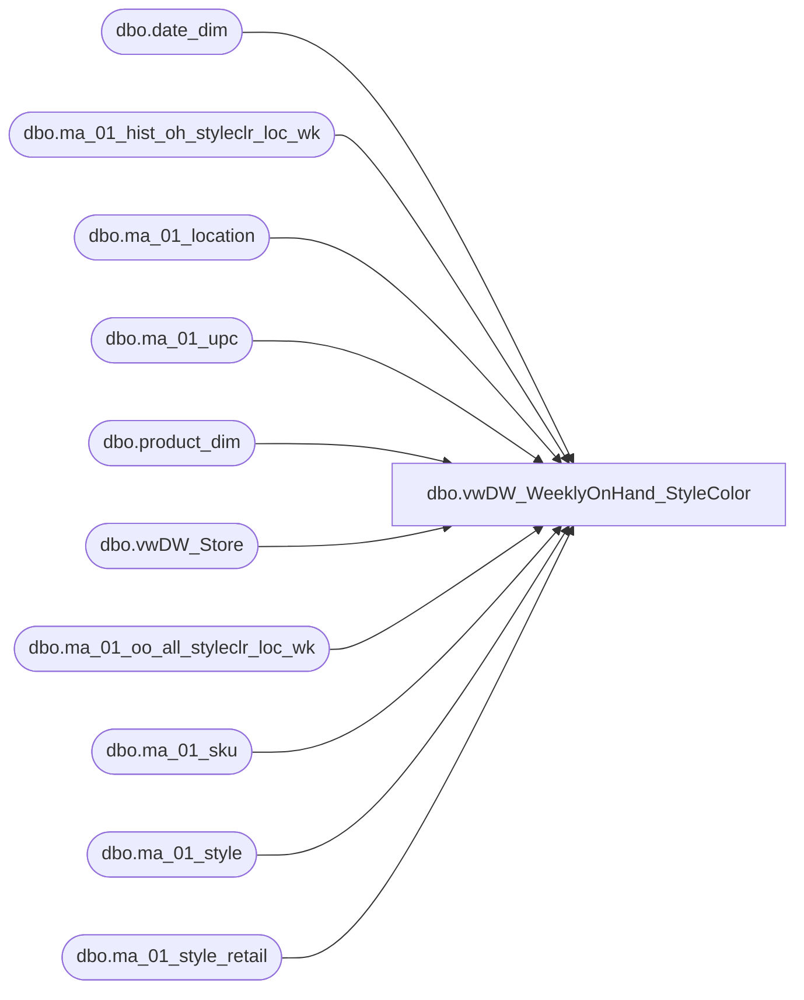

# dbo.vwDW_WeeklyOnHand_StyleColor

**Database:** LH_Reporting  
**Server:** 4db76rlxaxcuvmuh5kw37wbnqq-oxjjwecel5tehm2dtna3lt5qia.datawarehouse.fabric.microsoft.com  

## Architecture Diagram



## Table Dependencies

| Referenced Table |
|---|
| dbo.date_dim |
| dbo.ma_01_hist_oh_styleclr_loc_wk |
| dbo.ma_01_location |
| dbo.ma_01_upc |
| dbo.product_dim |
| dbo.vwDW_Store |
| dbo.ma_01_oo_all_styleclr_loc_wk |
| dbo.ma_01_sku |
| dbo.ma_01_style |
| dbo.ma_01_style_retail |

## View Code

```sql
CREATE VIEW [dbo].[vwDW_WeeklyOnHand_StyleColor]
AS
SELECT
		CAST(p.product_key AS varchar) AS product_key
		,s.store_key
		,d.date_key
		,oh.inventory_status_id
		,oh.price_status_id

		,oh.merch_year_wk
		,oh.style_id
		,oh.color_id
		,oh.location_id
		,oh.on_hand_units
			, oh.on_hand_units as on_hand_units_woa
			, oo.allocation_units  as allocation_units
			, oh.on_hand_retail as on_hand_retail
			, oh.on_hand_retail_te as on_hand_retail_te

		,case when (p.division = 'Uk' OR p.jurisdiction_code = 'Uk') then null  
			else (oh.on_hand_units) * isnull(sr.current_sellcurr_retail,0) 
		  end as on_hand_retail_old
			, sr.current_sellcurr_retail as current_retail_native
			, sr.current_retail
			, l.location_code
	FROM dbo.ma_01_hist_oh_styleclr_loc_wk oh  
	INNER JOIN dbo.ma_01_style  style
		ON style.style_id = oh.style_id
	INNER JOIN dbo.ma_01_sku  sku  
		ON sku.style_id = oh.style_id AND sku.color_id = oh.color_id
	LEFT JOIN dbo.ma_01_upc upc  ON upc_id = (SELECT TOP 1 u2.upc_id
											FROM dbo.ma_01_upc u2 
											WHERE u2.sku_id = sku.sku_id
												AND u2.upc_number < '000001000000')
	INNER JOIN LH_Source.dbo.ma_01_location l 
		ON l.location_id = oh.location_id
	INNER JOIN dbo.vwDW_Store s 
		ON s.store_id = CAST(CAST(l.location_code AS int) AS varchar)
	left JOIN LH_Mart.dbo.product_dim p 
		ON p.style_id = oh.style_id
		AND p.color_id = oh.color_id
		AND ((upc.upc_number IS NULL AND p.sku IS NULL) OR (p.sku = CAST(upc.upc_number AS int)))
	LEFT JOIN LH_Mart.dbo.date_dim d 
		ON d.fiscal_year = CAST(SUBSTRING(CAST(oh.merch_year_wk AS varchar), 1, 4) AS int)
		AND fiscal_week = CAST(SUBSTRING(CAST(oh.merch_year_wk AS varchar), 5, 2) AS int)
		AND day_of_week = 7

	inner join dbo.ma_01_style_retail sr 
		on sr.style_id = oh.style_id
			and sr.jurisdiction_id = l.jurisdiction_id

	left join dbo.ma_01_oo_all_styleclr_loc_wk oo  
        on oo.style_id = oh.style_id
            and oo.color_id = oh.color_id
            and oo.location_id = oh.location_id
            and oo.merch_year_wk = oh.merch_year_wk
```

