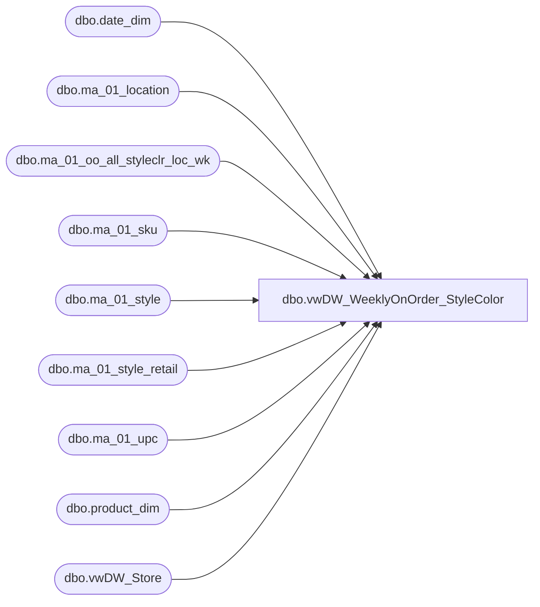

# dbo.vwDW_WeeklyOnOrder_StyleColor

**Database:** LH_Reporting  
**Server:** 4db76rlxaxcuvmuh5kw37wbnqq-oxjjwecel5tehm2dtna3lt5qia.datawarehouse.fabric.microsoft.com  

## Architecture Diagram



## Table Dependencies

| Referenced Table |
|---|
| dbo.date_dim |
| dbo.ma_01_location |
| dbo.ma_01_oo_all_styleclr_loc_wk |
| dbo.ma_01_sku |
| dbo.ma_01_style |
| dbo.ma_01_style_retail |
| dbo.ma_01_upc |
| dbo.product_dim |
| dbo.vwDW_Store |

## View Code

```sql
CREATE VIEW [dbo].[vwDW_WeeklyOnOrder_StyleColor]
AS
	SELECT
		CAST(p.product_key AS varchar) AS product_key
		,s.store_key
		,d.date_key
		,oo.merch_year_wk
		,oo.on_order_units
		,case when (p.jurisdiction_code = 'Uk' OR p.division = 'Uk') then null  
			else oo.on_order_units * isnull(sr.current_sellcurr_retail,0)
		  end as on_order_retail
			,oo.on_order_retail as on_order_retail_old
			,oo.style_id
			,sku.sku_id
		,oo.allocation_units
		,oo.on_order_retail_te  as on_order_retail_us_te
		,oo.on_order_units * isnull(oo.on_order_retail_te,0) as on_order_retail_us_te_OOUnitsCalc
	FROM dbo.ma_01_oo_all_styleclr_loc_wk oo  
	INNER JOIN LH_Source.dbo.ma_01_location l   ON l.location_id = oo.location_id
	INNER JOIN dbo.ma_01_style style ON style.style_id = oo.style_id
	INNER JOIN dbo.ma_01_sku sku  ON sku.style_id = oo.style_id AND sku.color_id = oo.color_id
	LEFT JOIN dbo.ma_01_upc upc ON upc_id =
		(SELECT TOP 1 u2.upc_id
		FROM dbo.ma_01_upc u2 
		WHERE u2.sku_id = sku.sku_id
			AND u2.upc_number < '000001000000')
	INNER JOIN dbo.vwDW_Store s   ON s.store_id = CAST(CAST(l.location_code AS int) AS varchar)
	LEFT JOIN LH_Mart.dbo.product_dim p   ON p.style_id = oo.style_id
		AND p.color_id = oo.color_id
		AND ((upc.upc_number IS NULL AND p.sku IS NULL) OR (p.sku = CAST(upc.upc_number AS int)))
	LEFT JOIN LH_Mart.dbo.date_dim d   ON d.fiscal_year = CAST(SUBSTRING(CAST(oo.merch_year_wk AS varchar), 1, 4) AS int)
		AND fiscal_week = CAST(SUBSTRING(CAST(oo.merch_year_wk AS varchar), 5, 2) AS int)
		AND day_of_week = 7
	inner join dbo.ma_01_style_retail sr   
		on sr.style_id = oo.style_id
			and sr.jurisdiction_id = l.jurisdiction_id
```

