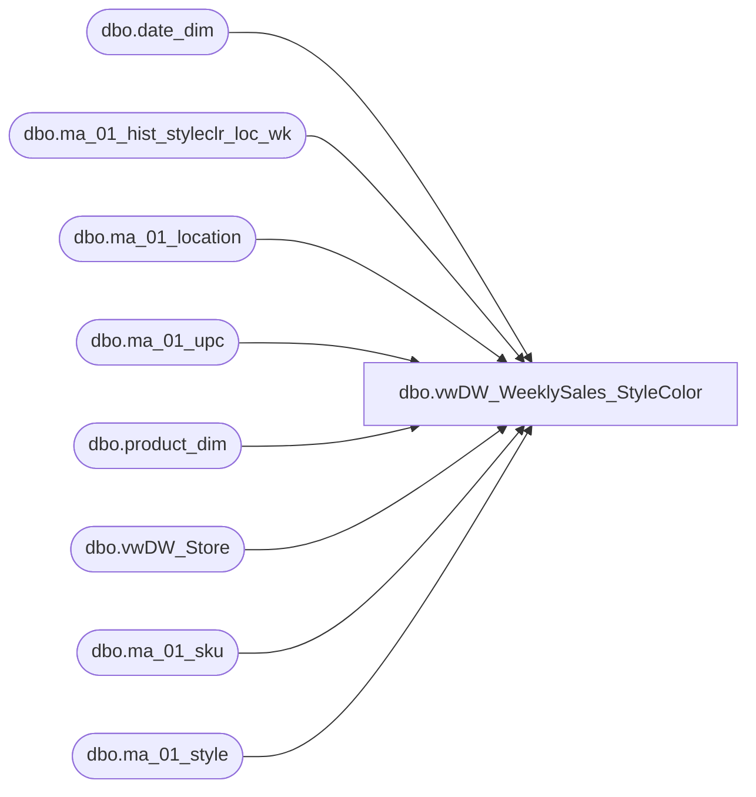

# dbo.vwDW_WeeklySales_StyleColor

**Database:** LH_Reporting  
**Server:** 4db76rlxaxcuvmuh5kw37wbnqq-oxjjwecel5tehm2dtna3lt5qia.datawarehouse.fabric.microsoft.com  

## Architecture Diagram



## Table Dependencies

| Referenced Table |
|---|
| dbo.date_dim |
| dbo.ma_01_hist_styleclr_loc_wk |
| dbo.ma_01_location |
| dbo.ma_01_upc |
| dbo.product_dim |
| dbo.vwDW_Store |
| dbo.ma_01_sku |
| dbo.ma_01_style |

## View Code

```sql
CREATE VIEW [dbo].[vwDW_WeeklySales_StyleColor]
AS
SELECT
		CAST(p.product_key AS varchar) AS product_key
		,s.store_key
		,d.date_key
		,sales.merch_year_wk
		,sales.perm_md_retail
		,sales.perm_mu_retail
		,sales.perm_mdc_retail
		,sales.perm_muc_retail
		,sales.promo_pc_total_retail
		,sales.received_units
		,sales.received_retail
		,sales.return_to_vendor_units
		,sales.return_to_vendor_retail
		,sales.distributions_units
		,sales.distributions_retail
		,sales.transfer_in_units
		,sales.transfer_in_retail
		,sales.transfer_out_units
		,sales.transfer_out_retail
		,sales.sales_total_units
		,sales.sales_total_sellcurr_retail_te as sales_total_retail
			, sales.sales_total_retail_te as sales_total_retail_us_te
			, sales.sales_total_sellcurr_retail_te as sales_total_retail_native_te
		,sales.sales_total_cost
		,sales.return_units
		,sales.return_sellcurr_retail_te as return_retail
			, sales.return_retail_te as return_retail_us_te
			, sales.return_sellcurr_retail_te as return_retail_native_te
		,sales.return_cost
		,sales.shrink_actual_units
		,sales.shrink_actual_retail
		,sales.adjustments_total_units
		,sales.adjustments_total_retail
	FROM dbo.ma_01_hist_styleclr_loc_wk sales 
	INNER JOIN dbo.ma_01_style  style ON style.style_id = sales.style_id
	INNER JOIN dbo.ma_01_sku sku ON sku.style_id = sales.style_id AND sku.color_id = sales.color_id
	LEFT JOIN dbo.ma_01_upc upc   ON upc_id =
		(SELECT TOP 1 u2.upc_id
		FROM dbo.ma_01_upc u2 
		WHERE u2.sku_id = sku.sku_id
			AND u2.upc_number < '000001000000')
	INNER JOIN LH_Source.dbo.ma_01_location l  ON l.location_id = sales.location_id
	INNER JOIN dbo.vwDW_Store s  ON s.store_id = CAST(CAST(l.location_code AS int) AS varchar)
	LEFT JOIN LH_Mart.dbo.product_dim p  ON p.style_id = sales.style_id
		AND p.color_id = sales.color_id
		AND ((upc.upc_number IS NULL AND p.sku IS NULL) OR (p.sku = CAST(upc.upc_number AS int)))
	LEFT JOIN LH_Mart.dbo.date_dim d  ON d.fiscal_year = CAST(SUBSTRING(CAST(sales.merch_year_wk AS varchar), 1, 4) AS int)
		AND fiscal_week = CAST(SUBSTRING(CAST(sales.merch_year_wk AS varchar), 5, 2) AS int)
		AND day_of_week = 7
```

