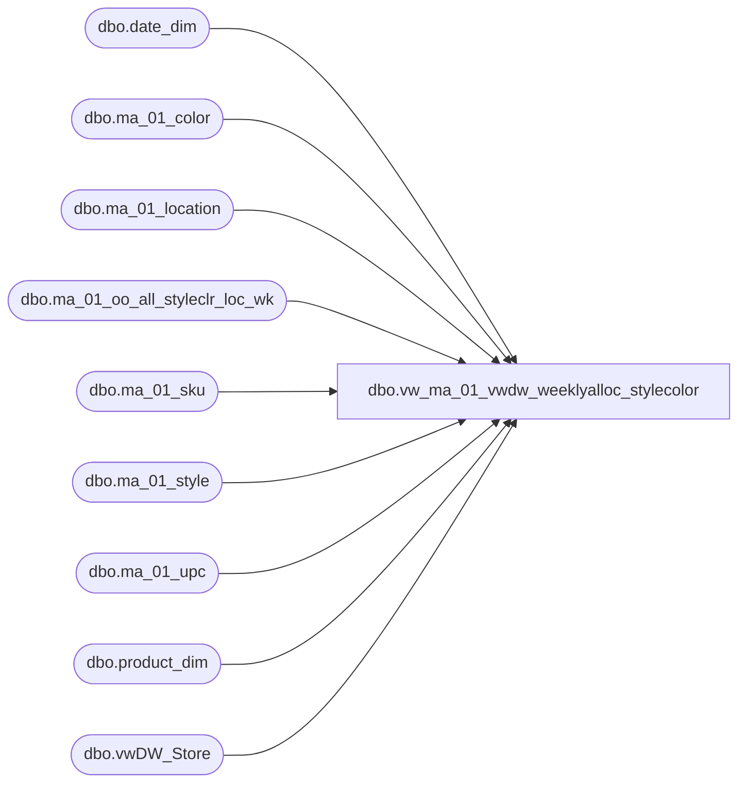

# dbo.vw_ma_01_vwdw_weeklyalloc_stylecolor

**Database:** LH_Reporting  
**Server:** 4db76rlxaxcuvmuh5kw37wbnqq-oxjjwecel5tehm2dtna3lt5qia.datawarehouse.fabric.microsoft.com  

## Architecture Diagram



## Table Dependencies

| Referenced Table |
|---|
| dbo.date_dim |
| dbo.ma_01_color |
| dbo.ma_01_location |
| dbo.ma_01_oo_all_styleclr_loc_wk |
| dbo.ma_01_sku |
| dbo.ma_01_style |
| dbo.ma_01_upc |
| dbo.product_dim |
| dbo.vwDW_Store |

## View Code

```sql
CREATE VIEW [dbo].[vw_ma_01_vwdw_weeklyalloc_stylecolor]
AS
select 
	style.style_code, c.color_code, location_code,
 	(CAST(p.product_key AS varchar)) AS product_key
		,s.store_key
		,d.date_key
		 ,oaslw.merch_year_wk
        , oaslw.allocation_units
from  dbo.ma_01_oo_all_styleclr_loc_wk oaslw  
INNER JOIN LH_Source.dbo.ma_01_location l   ON l.location_id = oaslw.location_id
INNER JOIN dbo.vwDW_Store s  
		ON s.store_id = CAST(CAST(l.location_code AS int) AS varchar)
INNER JOIN dbo.ma_01_style style   ON style.style_id = oaslw.style_id
INNER JOIN dbo.ma_01_sku sku
		ON sku.style_id = oaslw.style_id
			and sku.color_id = oaslw.color_id
	LEFT JOIN dbo.ma_01_upc upc  ON upc_id = (SELECT TOP 1 u2.upc_id
											FROM dbo.ma_01_upc u2 
											WHERE u2.sku_id = sku.sku_id
												AND u2.upc_number < '000001000000')
LEFT JOIN dbo.ma_01_color c   on c.color_id = oaslw.color_id
LEFT JOIN LH_Mart.dbo.product_dim p 
		ON p.style_id =  oaslw.style_id
		AND p.color_id =  oaslw.color_id
LEFT JOIN LH_Mart.dbo.date_dim d 
		ON d.fiscal_year = CAST(SUBSTRING(CAST(oaslw.merch_year_wk AS varchar), 1, 4) AS int)
		AND fiscal_week = CAST(SUBSTRING(CAST(oaslw.merch_year_wk AS varchar), 5, 2) AS int)
		AND day_of_week = 7
```

