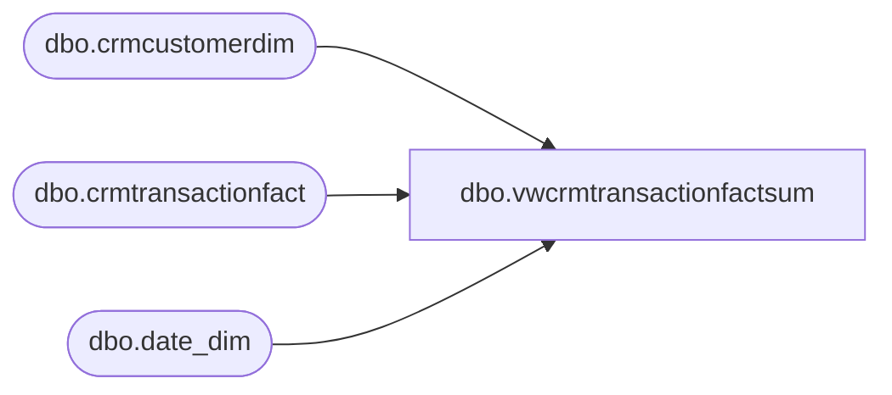

# dbo.vwcrmtransactionfactsum

**Database:** LH_Reporting  
**Server:** 4db76rlxaxcuvmuh5kw37wbnqq-oxjjwecel5tehm2dtna3lt5qia.datawarehouse.fabric.microsoft.com  

## Architecture Diagram



## Table Dependencies

| Referenced Table |
|---|
| dbo.crmcustomerdim |
| dbo.crmtransactionfact |
| dbo.date_dim |

## View Code

```sql
CREATE VIEW vwcrmtransactionfactsum  
 AS   
 /***********************************************************************************************  
 -- vwCRMTransactionFactSum  
 -- Dan Tweedie 2018-10-08 -  Created view to replace vwDW_CRM_TRN_SUM_FACT  
 **********************************************************************************************/  
 SELECT     top 1
      tran_date.actual_date transaction_date  -- to be deleted  
      ,g.MembershipDate as crm_mbrshp_dt  
      ,CASE WHEN g.MembershipDate < '2008-06-01' THEN NULL   
             ELSE  g.MembershipDate END AS valid_crm_mbrshp_dt  
      ,CASE WHEN g.MembershipDate IS NULL THEN NULL    
       WHEN g.MembershipDate < '2008-06-01' THEN NULL    
       WHEN g.MembershipDate > '2008-05-31' AND g.MembershipDate = tran_date.actual_date THEN 'N'   
       ELSE 'R' END AS sfs_gstvisittype  
   
      ,CASE WHEN g.MembershipDate is NULL THEN NULL    
       WHEN g.MembershipDate < '2008-06-01' THEN NULL    
       WHEN g.MembershipDate > '2008-05-31'      
       and g.MembershipDate = tran_date.actual_date then g.CustomerID --c.CLNSD_GST_ID  
       else null end as new_sfsgstid  
   
      ,CASE WHEN g.MembershipDate is NULL THEN NULL    
       when g.MembershipDate < '2008-06-01' then null    
       when g.MembershipDate > '2008-05-31'      
       and g.MembershipDate < tran_date.actual_date then g.CustomerID  
       else null end as repeat_sfsgstid  
        
      ,g.SubscriberKey as EMAIL_ADDR_ID  
      ,ISNULL(g.Emailable,0) as sfsvalidemail  --  SFS_ValidEmail  
   
      ,case when ISNULL(g.Emailable,0) > 0 then g.CustomerID  
       else null END as sfsvalidemail_gstid  -- ValidEmail_SFSGstID    
   
      ,case when g.MembershipDate is null then null    
       when g.MembershipDate < '2008-06-01' then null    
       when g.MembershipDate > '2008-05-31'      
       and g.MembershipDate = tran_date.actual_date   
       and ISNULL(g.Emailable,0) > 0 then g.CustomerID  
       else null end as newsfsvalidemail_gstid -- ValidEmail_NewSFSGstID   
   
      ,case when g.MembershipDate is null then null    
       when g.MembershipDate < '2008-06-01' then null    
       when g.MembershipDate > '2008-05-31'      
       and g.MembershipDate < tran_date.actual_date   
       and ISNULL(g.Emailable,0) > 0 then g.CustomerID  
       else null end as repeatsfsvalidemail_gstid -- ValidEmail_RepeatSFSGstID   
 , g.CustomerID AS customerid,   
 tran_date.date_key as dt_id
 , c.StoreKey as str_id
 , c.TransactionID as tdf_trn_id
 , g.CustomerID AS clnsd_gst_id
 , c.*   
 from LH_Mart.dbo.crmtransactionfact AS c 
 left join LH_Mart.dbo.crmcustomerdim AS g
     ON  c.CustomerNumber = g.CustomerNumber   
 left join LH_Mart.dbo.date_dim as tran_date 
 on cast(c.TransactionDate as date) = cast(tran_date.actual_date as date)   
 left join LH_Mart.dbo.date_dim as mbrshp_date 
 on cast(g.MembershipDate as date) = cast(mbrshp_date.actual_date as date)
```

