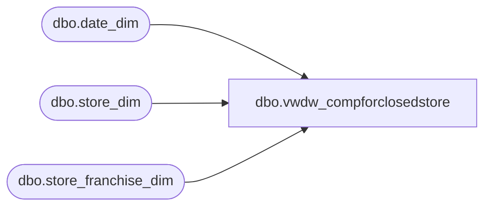

# dbo.vwdw_compforclosedstore

**Database:** LH_Reporting  
**Server:** 4db76rlxaxcuvmuh5kw37wbnqq-oxjjwecel5tehm2dtna3lt5qia.datawarehouse.fabric.microsoft.com  

## Architecture Diagram



## Table Dependencies

| Referenced Table |
|---|
| dbo.date_dim |
| dbo.store_dim |
| dbo.store_franchise_dim |

## View Code

```sql
CREATE VIEW vwdw_compforclosedstore
 AS
 SELECT  top 1
     cd3.store_key  
    ,cd3.store_id  
    ,cd3.store_name  
    ,cd3.bearritory  
    ,cd3.isclosed  
    ,cd3.closing_date_key  
    ,cd3.closing_date  
    ,cd3.closing_max_comp_date_key  
    ,cd3.closing_max_comp_date  
    ,cd3.closing_max_ly_comp_fiscal_year    
 --,cd3.closing_max_comp_fiscal_period  
    ,cd3.closing_max_comp_fiscal_week  
    ,max(d.actual_date) closing_max_ly_comp_date  
    ,max(d.date_key) closing_max_ly_comp_date_key  
 FROM  
     LH_Mart.dbo.date_dim  AS d
 RIGHT JOIN (  
             /* ***** Level 3 starts - determine max_ly_comp_fiscal_year for closed stores *************/  
             SELECT  
                 cd2.store_key  
                ,cd2.store_id  
                ,cd2.store_name  
                ,cd2.bearritory  
                ,cd2.isclosed  
                ,cd2.closing_date_key  
                ,cd2.closing_date  
                ,cd2.closing_max_comp_date_key  
                ,cd2.closing_max_comp_date  
                ,d.fiscal_year - 1  AS closing_max_ly_comp_fiscal_year    
                --,d.fiscal_period  closing_max_comp_fiscal_period  
                ,d.fiscal_week closing_max_comp_fiscal_week  
   
             /*  
 ,d.date_key closing_max_ly_comp_date_key  
 ,d.actual_date closing_max_ly_comp_date  
 ,d.fiscal_year closing_max_ly_comp_fiscal_year  
 ,d.fiscal_period closing_max_ly_comp_fiscal_period  
 */  
             FROM  
                 LH_Mart.dbo.date_dim AS d
             RIGHT JOIN (  
                         /* ***** Level 2 starts - determine max_comp_date for closed stores *************  
 ******** should be last day of most recent full fiscal period,           *********************/  
                         /******* therefore, if store closes mid-month, use last day of previous fiscal period  *********************/  
                         SELECT  
                             cd1.store_key  
                            ,cd1.store_id  
                            ,cd1.store_name  
                            ,cd1.bearritory  
                            ,cd1.isclosed AS isclosed  
                            ,cd1.closing_date_key  
                            ,cd1.closing_date  
                            ,CASE  
                                  WHEN cd1.closing_date_key = max(d.date_key) THEN cd1.closing_date_key  
                                  ELSE (min(d.date_key) - 1)  
                             END AS closing_max_comp_date_key --closing_max_ly_comp_date_key  
                            ,CASE  
                                  WHEN cd1.closing_date_key = max(d.date_key) THEN cd1.closing_date  
                                  ELSE DATEADD(DAY,-1,min(d.actual_date)) 
                             END AS closing_max_comp_date  --closing_max_ly_comp_date    
   
   
   
                         /*  
 ---- Other fields helpful for determining max_comp_date to use  
   
  ,cd1.closing_fiscal_year ,cd1.closing_fiscal_period  
  ,convert(varchar(10),cd1.closing_date,101) formatted_closing_date  
  ,convert(varchar(10),max(d.actual_date),101) formatted_FPMaxDate  
  ,convert(varchar(10),min(d.actual_date),101) formatted_FPMinDate  
  ,case when cd1.closing_date < max(d.actual_date) then 'Y' else 'N' end as UsePreviousFPforClosingComp  
  ,min(d.actual_date) FPMinDate  
  , max(d.actual_date) FPMaxDate  
  ,CASE WHEN cd1.closing_date_key = max(d.date_key) THEN cd1.closing_date  
   ELSE dateadd(d, -1,min(d.actual_date)) END AS closing_max_comp_date   
  ,CASE WHEN cd1.closing_date_key = max(d.date_key) THEN convert(varchar(10),cd1.closing_date,101)    
   ELSE convert(varchar(10),dateadd(d, -1,min(d.actual_date)),101) END AS closing_max_comp_date    
  ,CASE WHEN cd1.closing_date_key = max(d.date_key) THEN cd1.closing_date_key   
    ELSE (min(d.date_key) - 1) END AS closing_max_comp_date_key --closing_max_ly_comp_date_key  
   
  ,CASE WHEN cd1.closing_date_key = max(d.date_
```

