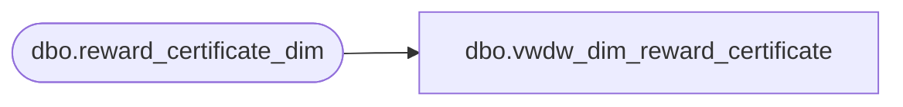

# dbo.vwdw_dim_reward_certificate

**Database:** LH_Reporting  
**Server:** 4db76rlxaxcuvmuh5kw37wbnqq-oxjjwecel5tehm2dtna3lt5qia.datawarehouse.fabric.microsoft.com  

## Architecture Diagram



## Table Dependencies

| Referenced Table |
|---|
| dbo.reward_certificate_dim |

## View Code

```sql
CREATE VIEW vwdw_dim_reward_certificate
 AS  
  SELECT  top 1
    reward_certificate_key
   ,reward_certificate_code
   ,first_earned_date_key
   ,cert_value
  FROM LH_Mart.dbo.reward_certificate_dim
```

