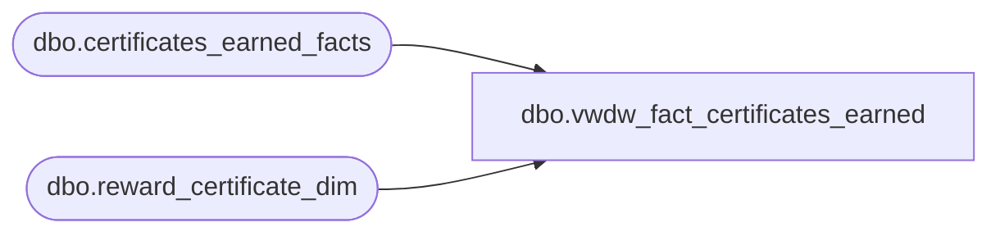

# dbo.vwdw_fact_certificates_earned

**Database:** LH_Reporting  
**Server:** 4db76rlxaxcuvmuh5kw37wbnqq-oxjjwecel5tehm2dtna3lt5qia.datawarehouse.fabric.microsoft.com  

## Architecture Diagram



## Table Dependencies

| Referenced Table |
|---|
| dbo.certificates_earned_facts |
| dbo.reward_certificate_dim |

## View Code

```sql
CREATE VIEW vwdw_fact_certificates_earned
 AS  
  SELECT  TOP 1
    e.reward_certificate_key  
   ,e.customer_key  
   ,e.customer_demographics_key  
   ,e.customer_geography_key  
   ,e.visit_count_key_12months  
   ,e.visit_count_key_24months  
   ,e.visit_count_key_36months  
   ,e.sfs_transaction_type_key  
   ,e.reference_no  
   ,e.reward_transaction_id  
   ,e.date_key  
   ,d.communication_date_key  
   ,e.communication_channel_key  
  FROM LH_Mart.dbo.certificates_earned_facts AS e  
  inner join LH_Mart.dbo.reward_certificate_dim c   
  on c.reward_certificate_key = e.reward_certificate_key  
  inner join 
  (
     select e.reward_certificate_key  
      , e.communication_channel_key  
      , min(ISNULL(e.communication_date_key,c.first_earned_date_key)) as communication_date_key  
      from LH_Mart.dbo.certificates_earned_facts AS e     
      inner join LH_Mart.dbo.reward_certificate_dim c 
         on c.reward_certificate_key = e.reward_certificate_key  
      group by e.reward_certificate_key  
       , e.communication_channel_key
 ) d  
 on d.reward_certificate_key = e.reward_certificate_key  
 and d.communication_channel_key = e.communication_channel_key
```

