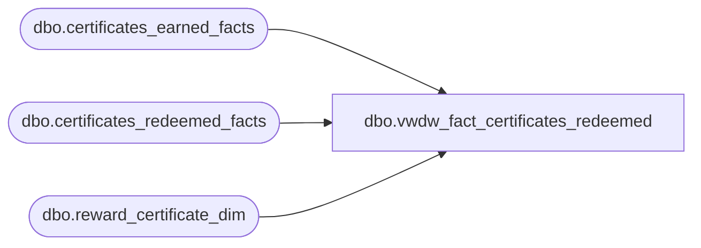

# dbo.vwdw_fact_certificates_redeemed

**Database:** LH_Reporting  
**Server:** 4db76rlxaxcuvmuh5kw37wbnqq-oxjjwecel5tehm2dtna3lt5qia.datawarehouse.fabric.microsoft.com  

## Architecture Diagram



## Table Dependencies

| Referenced Table |
|---|
| dbo.certificates_earned_facts |
| dbo.certificates_redeemed_facts |
| dbo.reward_certificate_dim |

## View Code

```sql
CREATE VIEW vwdw_fact_certificates_redeemed  
 AS  
  SELECT   TOP 1
   r.date_key  
   ,r.store_key  
   ,r.reward_certificate_key  
   ,r.customer_key  
   ,r.customer_geography_key  
   ,r.customer_demographics_key  
   ,r.visit_count_key_12months  
   ,r.visit_count_key_24months  
   ,r.visit_count_key_36months  
   ,r.sfs_transaction_type_key  
   ,r.transaction_id  
   ,r.transaction_no  
   ,r.reference_no  
   ,r.redeemed_value  
   ,d.communication_date_key  
   ,r.communication_channel_key  
  FROM LH_Mart.dbo.certificates_redeemed_facts r  
  inner join LH_Mart.dbo.reward_certificate_dim c   
  on c.reward_certificate_key = r.reward_certificate_key  
  inner join (
     select e.reward_certificate_key  
      , e.communication_channel_key  
      , min(ISNULL(e.communication_date_key,c.first_earned_date_key)) as communication_date_key  
      from LH_Mart.dbo.certificates_earned_facts e      
      inner join LH_Mart.dbo.reward_certificate_dim c       
      on c.reward_certificate_key = e.reward_certificate_key  
      group by e.reward_certificate_key  
       , e.communication_channel_key) d  
   on d.reward_certificate_key = r.reward_certificate_key  
    and d.communication_channel_key = r.communication_channel_key
```

