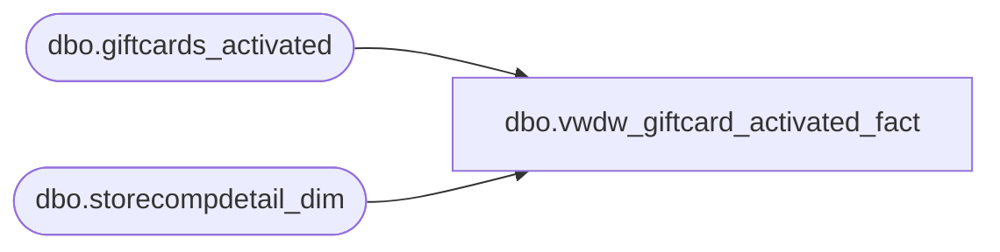

# dbo.vwdw_giftcard_activated_fact

**Database:** LH_Reporting  
**Server:** 4db76rlxaxcuvmuh5kw37wbnqq-oxjjwecel5tehm2dtna3lt5qia.datawarehouse.fabric.microsoft.com  

## Architecture Diagram



## Table Dependencies

| Referenced Table |
|---|
| dbo.giftcards_activated |
| dbo.storecompdetail_dim |

## View Code

```sql
CREATE VIEW vwdw_giftcard_activated_fact
 AS  
 -- =============================================================================================================  
 -- Name: dbo.vwDW_Giftcard_Activated_Fact  
 --  
 -- Description: Selects the Giftcards that were activated  
 --  
 -- Dependencies:   
 --  
 -- Revision History  
   
 --  Name:   Date:   Comments:  
 --  Gary Murrish 9/18/2013  Initial  
 -- =============================================================================================================  
 SELECT  TOP 1
  CASE  
   WHEN ga.store_key < 1 THEN -4  
   ELSE ga.store_key  
  END AS store_key,  
  ga.date_key,  
  ga.activated_amount,  
  ga.discount_amount,  
  ga.currency_key,  
  CASE  
   WHEN ga.discount_amount = 0 THEN 'Regular'  
   WHEN ga.discount_amount % 5 = 0 THEN 'Upsell'  
   ELSE 'Regular'  
  END AS giftcardtype,  
  1 AS calc,  
  CAST(ISNULL(cmp.isCompTY, 0) AS INT) AS iscomp,  
  CAST(ISNULL(cmp.isCompNY, 0) AS INT) AS iscompnextyear  
 FROM  
  LH_Mart.dbo.giftcards_activated ga 
  LEFT JOIN LH_Mart.dbo.storecompdetail_dim cmp 
   ON cmp.store_key = ga.store_key  
   AND cmp.date_key = ga.date_key
```

