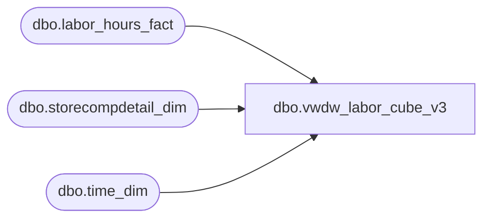

# dbo.vwdw_labor_cube_v3

**Database:** LH_Reporting  
**Server:** 4db76rlxaxcuvmuh5kw37wbnqq-oxjjwecel5tehm2dtna3lt5qia.datawarehouse.fabric.microsoft.com  

## Architecture Diagram



## Table Dependencies

| Referenced Table |
|---|
| dbo.labor_hours_fact |
| dbo.storecompdetail_dim |
| dbo.time_dim |

## View Code

```sql
CREATE VIEW vwdw_labor_cube_v3  
 AS  
 -- =============================================================================================================  
 -- Name: [dbo].[vwDW_Labor_Cube_V2]  
 --  
 -- Description: View underlying the SSAS Labor Cube used on the dashboard.     
 -- Aggregates Labor metrics by store and date  
 --  
 -- NOTE NOTE NOTE NOTE  
 --  This is a long join  
 --  
 -- Dependencies:   
 --  
 -- Revision History  
 --  Name:    Date:   Comments:  
 --  Gary Murrish  5/24/2012  Flagged transactions using ShopperTrak  
 --  Gary Murrish  5/7/2012  Initial deployment  
 --  Dan Tweedie   06/29/2016  --  Dan Tweedie   06/29/2016  Removed 'AND td.hour BETWEEN cmp.ShopperTrakStartHour AND cmp.ShopperTrakEndHour'  so no longer filtering by this  
 --  Dan Tweedie   2020-08-25  Trying to make view return results faster, turned view into CTE, left original view commented out  
 -- =============================================================================================================  
   
   
   
 With  
 TimeOne as  
  (  
   SELECT  
    time_key,  
    CAST(CAST([hour] AS varchar) + ':' + CAST([minute] AS varchar) AS datetime) AS minTime,  
    CAST(CAST([hour] AS varchar) + ':' + CAST([minute] + 29 AS varchar) + ':59' AS datetime) AS maxTime,  
    0 AS offsetDate  
   FROM  
    LH_Mart.dbo.time_dim AS td   
   WHERE  
    [minute] IN (0, 30)  
   UNION ALL  
   SELECT  
    time_key,  
    DATEADD(D, 1, CAST(CAST([hour] AS varchar) + ':' + CAST([minute] AS varchar) AS datetime)) AS minTime,  
    DATEADD(D, 1, CAST(CAST([hour] AS varchar) + ':' + CAST([minute] + 29 AS varchar) + ':59' AS datetime)) AS maxTime,  
    1 AS offsetDate  
   FROM  
    LH_Mart.dbo.time_dim AS td   
   WHERE  
    [minute] IN (0, 30)  
  ),  
 TimeTwo as  
  (  
   SELECT  
    time_key,  
    CAST(CAST([hour] AS varchar) + ':' + CAST([minute] AS varchar) AS datetime) AS minTime,  
    CAST(CAST([hour] AS varchar) + ':' + CAST([minute] + 29 AS varchar) + ':59' AS datetime) AS maxTime,  
    0 AS offsetDate  
   FROM  
    LH_Mart.dbo.time_dim AS td   
   WHERE  
    ([minute] IN (0, 30))  
   UNION ALL  
   SELECT  
    time_key,  
    DATEADD(D, 1, CAST(CAST([hour] AS varchar) + ':' + CAST([minute] AS varchar) AS datetime)) AS minTime,  
    DATEADD(D, 1, CAST(CAST([hour] AS varchar) + ':' + CAST([minute] + 29 AS varchar) + ':59' AS datetime)) AS maxTime,  
    1 AS offsetDate  
   FROM  
    LH_Mart.dbo.time_dim AS td   
   WHERE  
    [minute] IN (0, 30)  
  ),  
 LaborOne as  
  (  
   SELECT  
    lhf.recID,  
    lhf.store_key,  
    lhf.date_key,  
    lhf.emp_key,  
    lhf.job_key,  
    lhf.HOURTYPE_KEY,  
    lhf.timecode_key,  
    lhf.start_Time,  
    lhf.end_Time,  
    lhf.wrkd_minutes,  
    lhf.source_system,  
    lhf.INS_DT,  
    lhf.ETL_LOG_ID,  
    lhf.ETL_EVNT_ID  
   FROM  
    LH_Mart.dbo.labor_hours_fact lhf   
    WHERE lhf.start_Time<> lhf.end_Time  
  ),  
 LaborTwo as  
  (  
   SELECT  
    lhf.recID,  
    lhf.store_key,  
    lhf.date_key,  
    lhf.emp_key,  
    lhf.job_key,  
    lhf.HOURTYPE_KEY,  
    lhf.timecode_key,  
    lhf.start_Time,  
    lhf.end_Time,  
    lhf.wrkd_minutes,  
    lhf.source_system,  
    lhf.INS_DT,  
    lhf.ETL_LOG_ID,  
    lhf.ETL_EVNT_ID  
   FROM  
    LH_Mart.dbo.labor_hours_fact lhf   
   WHERE  
    start_Time = lhf.end_Time  
  )  
 SELECT  top 1
  l1.store_key,  
  l1.date_key + t1.offsetDate AS date_key,  
  t1.time_key,  
  CASE  
   WHEN t1.minTime <= l1.start_Time AND  
   t1.maxTime <= l1.end_Time THEN DATEDIFF(MINUTE, l1.start_Time, t1.maxTime) + 1  
   WHEN t1.minTime <= l1.start_Time AND  
   t1.maxTime > l1.end_Time THEN DATEDIFF(MINUTE, l1.start_Time, l1.end_Time)  
   WHEN t1.minTime > l1.start_Time AND  
   t1.maxTime >= l1.end_Time THEN DATEDIFF(MINUTE, t1.minTime, l1.end_Time)  
   WHEN t1.minTime > l1.start_Time AND  
   t1.maxTime < l1.end_Time THEN DATEDIFF(MINUTE, t1.minTime, t1.maxTime) + 1  
   ELSE -99  
  END AS minsWorke
```

