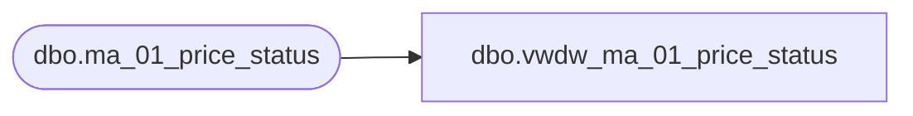

# dbo.vwdw_ma_01_price_status

**Database:** LH_Reporting  
**Server:** 4db76rlxaxcuvmuh5kw37wbnqq-oxjjwecel5tehm2dtna3lt5qia.datawarehouse.fabric.microsoft.com  

## Architecture Diagram



## Table Dependencies

| Referenced Table |
|---|
| dbo.ma_01_price_status |

## View Code

```sql
create view dbo.vwdw_ma_01_price_status
AS
select * from LH_Source.dbo.ma_01_price_status
```

