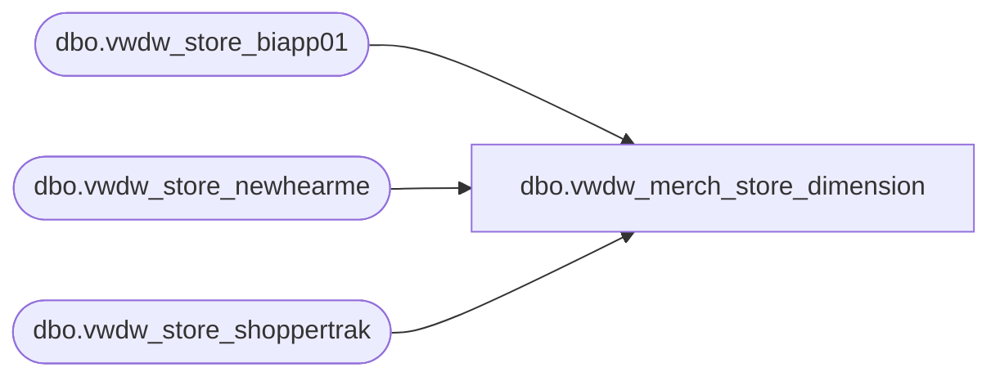

# dbo.vwdw_merch_store_dimension

**Database:** LH_Reporting  
**Server:** 4db76rlxaxcuvmuh5kw37wbnqq-oxjjwecel5tehm2dtna3lt5qia.datawarehouse.fabric.microsoft.com  

## Architecture Diagram



## Table Dependencies

| Referenced Table |
|---|
| dbo.vwdw_store_biapp01 |
| dbo.vwdw_store_newhearme |
| dbo.vwdw_store_shoppertrak |

## View Code

```sql
CREATE   VIEW dbo.vwdw_merch_store_dimension
AS
SELECT      base.store_key, base.store_id, base.StoreRanking, base.store_name, base.storeNameNum, base.bearea, base.bearritory, base.region, base.GeographyRegion, base.ParentCountry, base.ChildCountry, 
                         base.country, base.country_name, base.country_display, base.state_province, base.state_province_key, base.city, base.postal_code, base.latitude, base.longitude, base.dma_name, base.opening_date, 
                         base.opening_date_id, base.comp_week_id, base.open_fp_id, base.open_week_id, base.comp_date_key, base.ReportFlag, base.ClubMaxFlag, base.BearRange, base.CompanyLevel, base.IsClosed, 
                         base.closing_date_key, base.closing_date, base.closing_max_comp_date_key, base.closing_max_comp_date, base.closing_max_ly_comp_date_key, base.closing_max_ly_comp_date, 
                         base.MerchCompanyLevel, base.MerchBearRange, base.MerchCountry, base.MerchRegion, base.Merchbearritory, base.isHispanicStore, base.HispanicStoreGroup, base.MerchBearRangeKey, 
                         base.MerchCountryKey, base.MerchRegionKey, base.MerchBearitoryKey, base.CountryKey, base.RankedCompanyLevelKey, base.RankedBearRangeKey, base.RankedRegionKey, base.RankedBearitoryKey, 
                         base.BearRangeKey, base.RegionKey, base.BearitoryKey, base.city_key, base.city_display, base.postal_code_key, base.postal_code_display, base.GeographyParentCountryKey, base.GeographyRegionKey, 
                         base.LocationType, base.JurisdictionCode, CASE WHEN StoreRanking LIKE 'Top%' THEN 'Top Focus' WHEN HispanicStoreGroup LIKE 'Hispan%' THEN 'Hisp Focus' ELSE 'Not Focus Store' END AS isFocusStore
                         , CASE WHEN dsnhm.store_key IS NOT NULL THEN 'New Sound' ELSE 'Not New Sound' END AS isNewSoundStore
                         , CASE WHEN st.store_key IS NOT NULL THEN 'ShopperTrak' ELSE 'Not ShopperTrak' END AS isShopperTrakStore, base.country AS plainCountry, base.isWebStore, base.Area
FROM            [dbo].[vwdw_store_biapp01] AS base  LEFT OUTER JOIN
                         [dbo].[vwdw_store_newhearme] AS dsnhm  ON dsnhm.store_key = base.store_key AND dsnhm.startingDate <= GETDATE() LEFT OUTER JOIN
                         [dbo].[vwdw_store_shoppertrak] AS st  ON st.store_key = base.store_key
```

