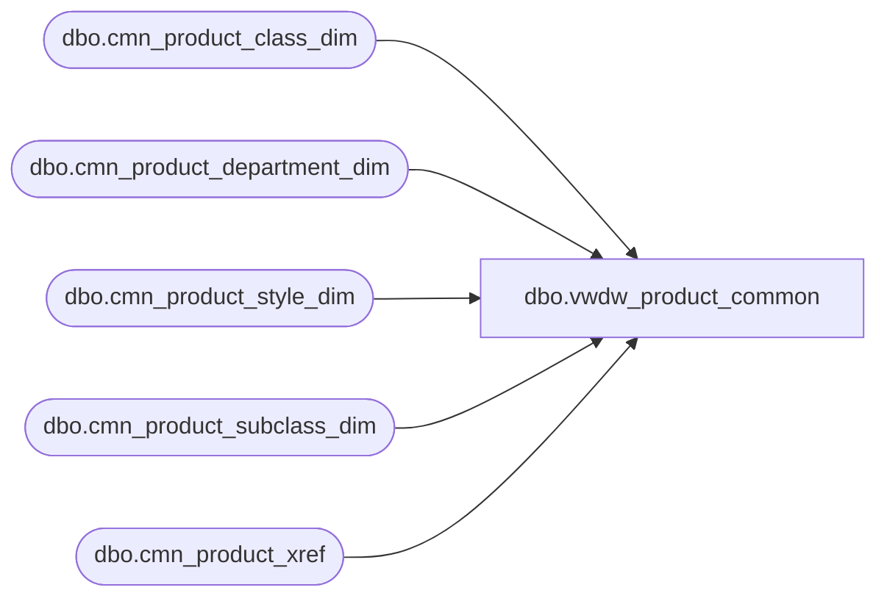

# dbo.vwdw_product_common

**Database:** LH_Reporting  
**Server:** 4db76rlxaxcuvmuh5kw37wbnqq-oxjjwecel5tehm2dtna3lt5qia.datawarehouse.fabric.microsoft.com  

## Architecture Diagram



## Table Dependencies

| Referenced Table |
|---|
| dbo.cmn_product_class_dim |
| dbo.cmn_product_department_dim |
| dbo.cmn_product_style_dim |
| dbo.cmn_product_subclass_dim |
| dbo.cmn_product_xref |

## View Code

```sql
CREATE VIEW vwdw_product_common
 AS 
 SELECT 
     dept.cmn_department_code  
   , CONCAT(dept.cmn_department_code,' ' ,dept.cmn_department) AS cmn_department  
   , cls.cmn_class_code  
   , CONCAT(cls.cmn_class_code,' ',cls.cmn_class) AS cmn_class  
   , subcls.cmn_subclass_code  
   , CONCAT(subcls.cmn_subclass_code,' ',subcls.cmn_subclass) AS cmn_subclass  
   , sty.cmn_style_code
   , CONCAT(sty.cmn_style_code,' ',sty.description) AS cmn_style  
   , xref.product_key
   FROM  LH_Mart.dbo.cmn_product_department_dim AS dept
   INNER JOIN LH_Mart.dbo.cmn_product_class_dim AS cls
      ON dept.cmn_department_code = cls.cmn_department_code
   INNER JOIN LH_Mart.dbo.cmn_product_subclass_dim AS subcls
      ON cls.cmn_class_code = subcls.cmn_class_code  
   INNER JOIN LH_Mart.dbo.cmn_product_style_dim AS sty
      ON subcls.cmn_subclass_code = sty.cmn_subclass_code  
   INNER JOIN LH_Mart.dbo.cmn_product_xref AS xref
      ON sty.cmn_style_code = xref.cmn_style_code;
```

