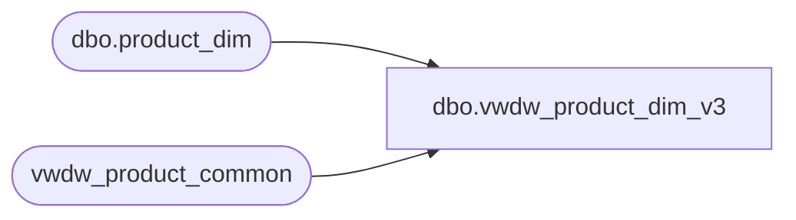

# dbo.vwdw_product_dim_v3

**Database:** LH_Reporting  
**Server:** 4db76rlxaxcuvmuh5kw37wbnqq-oxjjwecel5tehm2dtna3lt5qia.datawarehouse.fabric.microsoft.com  

## Architecture Diagram



## Table Dependencies

| Referenced Table |
|---|
| dbo.product_dim |
| vwdw_product_common |

## View Code

```sql
CREATE VIEW vwdw_product_dim_v3 
 AS
 SELECT  cast(prd.product_key AS VARCHAR(50)) AS product_key  
   , sku  
   , activation_date  
   , style_code  
   , CONCAT(style_code, ' - ' , style_desc) AS style_desc  
   , CONCAT(subclass_code , '-' , style_code , '-' , color_code) AS color_code  
   , color_desc  
   , product_desc  
   , CONCAT(subclass_code , ' - ' , subclass) AS subclass  
   , CONCAT(substring(subclass_code, 1, len(subclass_code) - 3) , ' - ' , class) AS class  
   , CONCAT(department_code , ' - ' , replace(replace(replace(LOWER(department), 'can ', ''), 'uk-', ''), 'uk ', '')) AS department  
   , department_code  
   , CONCAT(substring(subclass_code, 1, 5) , ' - ' , division) AS division  
   , chain  
   , concept  
   , priceline_code  
   , subclass_code  
   , class_code  
   , substring(subclass_code, 1, len(subclass_code) - 3) AS classcodekey  
   , substring(subclass_code, 1, 5) AS divisioncodekey  
   , CONCAT(subclass_code , '-' , style_code) AS stylecodekey  
   , primary_vendor_code  
   , primary_vendor_name  
   , alt_primary_vendor_code  
   , current_retail  
   , price_with_vat  
   , euro_value  
   , merch_status  
   , ISNULL(wss_reportable, 'N') AS wss_reportable  
   , ISNULL(reorder_flag, 0) AS reorder_flag  
   , current_selling_retail_home AS usdollarcurrentretail  
   , cdn_value AS cadollarcurrentretail  
   --Fields for R-B-Z division.  New addition starts (FA - 3/31/2010)  
   , cast(CONCAT(department_code , '-' , jurisdiction_code) AS VARCHAR(500)) AS jurisdictioncodekey  
   , cast(CONCAT(jurisdiction_code , ' ' , replace(replace(replace(lower(department), 'can ', ''), 'uk-', ''), 'uk ', '')) AS VARCHAR(500)) AS jurisdiction  
   --  ,jurisdiction_code , ' ' , department AS Jurisdiction  
   , CASE  
      WHEN UPPER(department_code) LIKE 'R-B-Z%' THEN  
       cast(CONCAT(substring(subclass_code, 1, len(subclass_code) - 3) , '-' , jurisdiction_code) AS VARCHAR(500))  
      ELSE  
       cast(substring(subclass_code, 1, len(subclass_code) - 3) AS VARCHAR(500))  
     END AS merchclasscodekey  
   , CASE  
      WHEN UPPER(department_code) LIKE 'R-B-Z%' THEN  
       cast(CONCAT(subclass_code , '-' , jurisdiction_code) AS VARCHAR(500))  
      ELSE  
       cast(subclass_code AS VARCHAR(500))  
     END AS merchsubclasscodekey  
   , CASE  
      WHEN UPPER(department_code) LIKE 'R-B-Z%' THEN  
       cast(CONCAT(subclass_code , '-' , jurisdiction_code , '-' , style_code) AS VARCHAR(500))  
      ELSE  
       cast(CONCAT(subclass_code , '-' , style_code) AS VARCHAR(500))  
     END AS merchstylecodekey  
   --Fields for R-B-Z division.  New addition ends (FA - 3/31/2010)  
   , jurisdiction_code AS plain_jurisdiction  
   , CASE  
      WHEN substring(department_code,7,2) IN ( /* Excluded Products */  '65','70','51','60','45','46','47','50','75','80' ) 
      THEN 1  
      ELSE 0  
     END AS exclude_from_wss  
   , CASE  
      WHEN substring(department_code,7,2) IN ( /* Omitted Departments */ '65', '70', '51', '60', '60', '70', '60') 
         THEN 'Y'  
      ELSE  'N'  
     END AS omit_from_wss  
   , cmn.cmn_department_code  
   , cmn.cmn_department  
   , cmn.cmn_class_code  
   , cmn.cmn_class  
   , cmn.cmn_subclass_code  
   , cmn.cmn_subclass  
   , cmn.cmn_style_code  
   , cmn.cmn_style  
   , ISNULL(prd.GENDER,'Unknown') AS gender   
   , ISNULL(prd.CORE_FASH_CD, 'Unknown') AS corefashion  
   , ISNULL(prd.INLINE_CD, 'Unknown') AS inline  
 FROM  
  LH_Mart.dbo.product_dim prd
  INNER JOIN vwdw_product_common cmn 
   ON cmn.product_key = prd.product_key  
 WHERE  
  subclass_code IS NOT NULL  
 UNION ALL  
 SELECT cast(-1 AS VARCHAR(500)) AS product_key  
   , -1 AS sku  
   , cast('1900-01-01' AS datetime2(7)) AS activation_date  
   , 'Unknown' AS style_code  
   , 'Unknown' AS style_desc  
   , 'Unknown' AS color_code  
   , 'Unknown' AS color_desc  
   , 'Unknown' AS product_desc  
   , 'Unknown' AS subclass  
   , 'Unknown' AS class  
   , 'Unknown' AS depar
```

