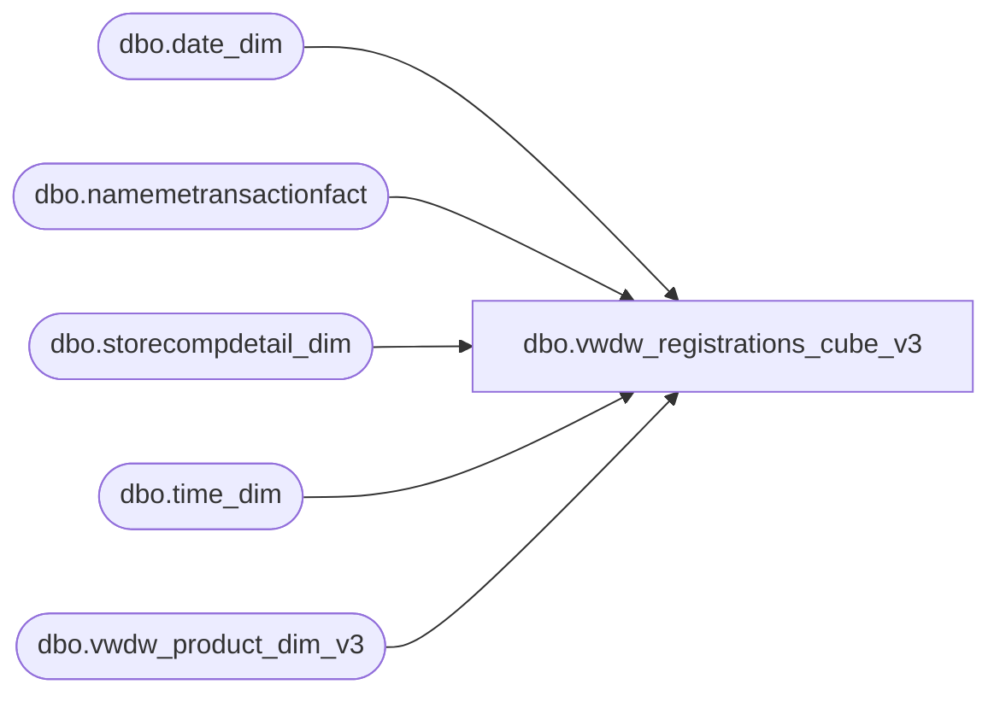

# dbo.vwdw_registrations_cube_v3

**Database:** LH_Reporting  
**Server:** 4db76rlxaxcuvmuh5kw37wbnqq-oxjjwecel5tehm2dtna3lt5qia.datawarehouse.fabric.microsoft.com  

## Architecture Diagram



## Table Dependencies

| Referenced Table |
|---|
| dbo.date_dim |
| dbo.namemetransactionfact |
| dbo.storecompdetail_dim |
| dbo.time_dim |
| dbo.vwdw_product_dim_v3 |

## View Code

```sql
CREATE VIEW dbo.vwdw_registrations_cube_v3 (
  RecepientAgeID,
  RecepientID,
  AddressID,
  store_key,
  date_key,
  time_key,
  product_key,
  GST_VST_RECUR_CD,
  ADDR_VST_RECUR_CD,
  GIFT_IND,
  GNDR_CD,
  ReceipientAge,
  hasRecipientAge,
  PurchaserAge,
  hasPurchaserAge,
  DistanceToStore,
  hasDistanceToStore,
  isForeign,
  TourismBand,
  [5to25_MileBand],
  isComp,
  isCompNextYear,
  calc,
  isNearBirthday,
  isTourist,
  GuestID,
  isSOTF,
  isShopperTrak,
  isShopperTrakCompTY,
  isShopperTrakCompNY,
  TKF_ID)
AS SELECT CASE  WHEN CAST(wrk.hasRecipientAge AS INT) = 0 OR CAST(wrk.ReceipientAge AS INT) < 0 THEN  CAST(-1 AS int) -- Unspecified  
      WHEN CAST(wrk.ReceipientAge AS INT) > 101 THEN  CAST(101 AS int)  
      ELSE CAST(wrk.ReceipientAge  AS INT)
     END AS RecepientAgeID  
   , wrk.RecepientID  
   , wrk.AddressID  
   , wrk.store_key  
   , wrk.date_key  
   , wrk.time_key  
   , isnull(pd.product_key, -1) AS product_key  
   , wrk.GST_VST_RECUR_CD  
   , wrk.ADDR_VST_RECUR_CD  
   , wrk.GIFT_IND  
   , wrk.GNDR_CD  
   , wrk.ReceipientAge  
   , wrk.hasRecipientAge  
   , wrk.PurchaserAge  
   , wrk.hasPurchaserAge  
   , wrk.DistanceToStore  
   , wrk.hasDistanceToStore  
   , wrk.isForeign  
   , wrk.TourismBand  
   , wrk.[5to25_MileBand]
   , wrk.isComp  
   , wrk.isCompNextYear  
   , wrk.calc  
   , CASE  
      WHEN wrk.daysFromGstBirthDay < 0 AND wrk.daysFromReceipBirthDay < 0 THEN  -1  
      WHEN wrk.daysFromGstBirthDay BETWEEN 0 AND 15 OR wrk.daysFromGstBirthDay >= 300 OR wrk.daysFromReceipBirthDay BETWEEN 0 AND 15 OR wrk.daysFromReceipBirthDay >= 300 THEN  1  
      ELSE 0  
     END AS isNearBirthday  
   , wrk.isTourist  
   , wrk.GuestID  
   , wrk.isSOTF  
   , wrk.isShopperTrak  
   , wrk.isShopperTrakCompTY  
   , wrk.isShopperTrakCompNY  
   , wrk.TKF_ID  
 FROM  
  (
  SELECT NTF.NameMeTransactionKey as TKF_ID  
     , -1 AS RecepientID  
     , -1 AS AddressID  
     , NTF.StoreKey AS store_key  
     , dd.date_key AS date_key  
     , CASE WHEN NTF.ProductKey <= 0 THEN  -1  ELSE NTF.ProductKey  END AS product_key  
     , td.time_key AS time_key  
     , 'N' as GST_VST_RECUR_CD  
     , 'N' as ADDR_VST_RECUR_CD  
     , 'N' as GIFT_IND  
     , 'U' AS GNDR_CD  
     , 0.0 AS ReceipientAge  
     , 0 AS hasRecipientAge  
     , 0.0 AS PurchaserAge  
     , 0 AS hasPurchaserAge  
     , 0 AS DistanceToStore  
     , 0 AS hasDistanceToStore  
     , 0 AS isForeign  
     , -1 AS TourismBand  
     , -1 AS [5to25_MileBand]  
     , cast(isnull(cmp.isCompTY, 0) AS INT) AS isComp  
     , cast(isnull(cmp.isCompNY, 0) AS INT) AS isCompNextYear  
     , 1 AS calc  
     , 0 AS daysFromGstBirthDay  
     , 0 AS daysFromReceipBirthDay  
     , 0 AS isTourist  
     , -1 AS GuestID  
     , -1 AS Tourist_Addr_ID  
     , cast(isnull(cmp.isSOTF, 0) AS INT) AS isSOTF  
     , cast(CASE  
     WHEN cmp.isShopperTrak IS NULL THEN  0  
     WHEN cmp.isShopperTrak = 1 AND td.[hour] BETWEEN cmp.ShopperTrakStartHour AND cmp.ShopperTrakEndHour 
     THEN  1  
     ELSE  0 END AS INT) AS isShopperTrak  
     , cast(CASE  
     WHEN cmp.isShopperTrakCompTY IS NULL THEN  0  
     WHEN cmp.isShopperTrakCompTY = 1 AND td.[hour] BETWEEN cmp.ShopperTrakStartHour AND cmp.ShopperTrakEndHour THEN 1  
     ELSE 0  
    END AS INT) AS isShopperTrakCompTY  
     , cast(CASE  
     WHEN cmp.isShopperTrakCompNY IS NULL THEN 0  
     WHEN cmp.isShopperTrakCompNY = 1 AND td.[hour] BETWEEN cmp.ShopperTrakStartHour AND cmp.ShopperTrakEndHour THEN 1  
     ELSE 0  
    END AS INT) AS isShopperTrakCompNY  
   FROM  
    LH_Mart.dbo.namemetransactionfact AS NTF
    LEFT JOIN LH_Mart.dbo.date_dim AS dd  
    ON CAST(NTF.TransactionStartDate as Date) = dd.actual_date  
    LEFT JOIN LH_Mart.dbo.storecompdetail_dim AS cmp 
     ON cmp.store_key = NTF.StoreKey   
     AND cmp.date_key = dd.date_key
```

