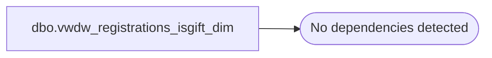

# dbo.vwdw_registrations_isgift_dim

**Database:** LH_Reporting  
**Server:** 4db76rlxaxcuvmuh5kw37wbnqq-oxjjwecel5tehm2dtna3lt5qia.datawarehouse.fabric.microsoft.com  

## Architecture Diagram



## Table Dependencies

_No table dependencies detected._

## View Code

```sql
CREATE VIEW vwdw_registrations_isgift_dim
AS  
-- =============================================================================================================  
-- Name: [dbo].[vwDW_Registrations_isGift_Dim]  
--  
-- Description: View underlying the SSAS Registrations Cube used on the dashboard.     
-- Used to indicate whether or not the registration was a gift.  
--  
--  
-- Dependencies:   
--  
-- Revision History  
--  Name:    Date:   Comments:  
--  Gary Murrish  4/13/2012  Initial deployment  
-- =============================================================================================================  
SELECT 'Y' AS gift_ind  
  , 'Gift' AS descr  
  , 10 AS seq  
UNION ALL  
SELECT 'N' AS gift_ind  
  , 'Self' AS descr  
  , 20 AS seq
```

