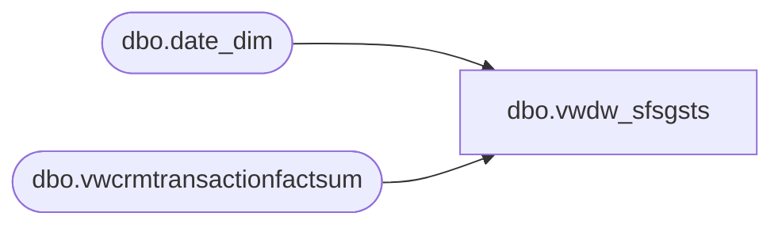

# dbo.vwdw_sfsgsts

**Database:** LH_Reporting  
**Server:** 4db76rlxaxcuvmuh5kw37wbnqq-oxjjwecel5tehm2dtna3lt5qia.datawarehouse.fabric.microsoft.com  

## Architecture Diagram



## Table Dependencies

| Referenced Table |
|---|
| dbo.date_dim |
| dbo.vwcrmtransactionfactsum |

## View Code

```sql
CREATE VIEW vwdw_sfsgsts
 AS
 /***********************************  
 vwDW_Transactions_original  
 ************************************/
 SELECT TOp 1 TEMP.*
 FROM (
  SELECT tdf.date_key
   ,trans_date_dim.fiscal_year
   ,trans_date_dim.fiscal_quarter
   ,trans_date_dim.fiscal_period
   ,trans_date_dim.fiscal_week
   ,tdf.store_key
   ,tdf.transaction_id
   ,1 AS all_trans_cnt -- (FA 7/21/2009)  
   ,tdf.sfs_trans_cnt -- (FA 7/21/2009)  
   ,tdf.SFSGstID
   ,tdf.crm_mbrshp_dt
   ,tdf.valid_crm_mbrshp_dt
   ,tdf.sfs_gstvisittype
   ,tdf.new_sfsgstid
   ,tdf.sfsvalidemail
   ,tdf.sfsvalidemail_gstid
   ,tdf.newsfsvalidemail_gstid
  FROM (
   SELECT cts.date_key
    ,cts.store_key
    ,cts.transaction_id
    ,max(cts.sfs_trans_cnt) sfs_trans_cnt -- (FA 7/21/2009)  
    ,cts.SFSGstID
    ,cts.crm_mbrshp_dt
    ,cts.valid_crm_mbrshp_dt
    ,cts.sfs_gstvisittype
    ,cts.new_sfsgstid
    ,lower(cts.sfsvalidemail) AS sfsvalidemail
    ,cts.sfsvalidemail_gstid
    ,cts.newsfsvalidemail_gstid
   FROM (
    SELECT TOP 100 PERCENT tdf_trn_id AS transaction_id
     ,str_id AS store_key
     ,[dt_id] AS date_key
     ,1 AS sfs_trans_cnt -- (FA 7/21/2009)  
     ,clnsd_gst_id AS SFSGstID
     ,crm_mbrshp_dt
     ,valid_crm_mbrshp_dt
     ,sfs_gstvisittype
     ,new_sfsgstid
     ,lower(sfsvalidemail) AS sfsvalidemail
     ,sfsvalidemail_gstid
     ,newsfsvalidemail_gstid
    --from dw.dbo.[vwDW_CRM_TRN_SUM_FACT] WITH (NOLOCK)  
    FROM LH_Reporting.dbo.vwcrmtransactionfactsum
    GROUP BY tdf_trn_id
     ,str_id
     ,dt_id
     ,clnsd_gst_id
     ,crm_mbrshp_dt
     ,valid_crm_mbrshp_dt
     ,sfs_gstvisittype
     ,new_sfsgstid
     ,lower(sfsvalidemail)
     ,sfsvalidemail_gstid
     ,newsfsvalidemail_gstid
    ORDER BY dt_id
    ) cts
   WHERE cts.date_key <= (
     SELECT date_key
     FROM LH_Mart.dbo.date_dim
     WHERE actual_date = dateadd(D, - 1, cast(convert(VARCHAR(10), GETDATE(), 101) AS SMALLDATETIME))
     )
   GROUP BY cts.date_key
    ,cts.store_key
    ,cts.transaction_id
    ,cts.SFSGstID
    ,cts.crm_mbrshp_dt
    ,cts.valid_crm_mbrshp_dt
    ,cts.sfs_gstvisittype
    ,cts.new_sfsgstid
    ,lower(cts.sfsvalidemail)
    ,cts.sfsvalidemail_gstid
    ,cts.newsfsvalidemail_gstid
   ) tdf
  INNER JOIN LH_Mart.dbo.date_dim trans_date_dim ON trans_date_dim.date_key = tdf.date_key
  ) TEMP
 WHERE (date_key > 2555) -- ( date_key > 3280 and date_key < 4621 ) --FY 2007 - FP 07 2009
```

