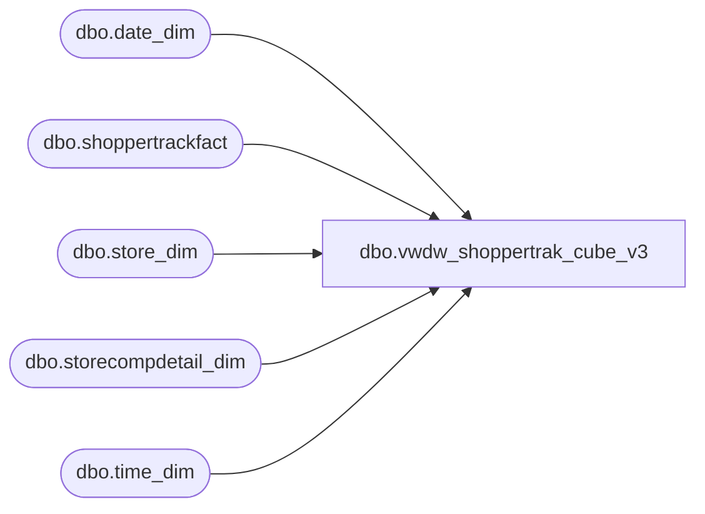

# dbo.vwdw_shoppertrak_cube_v3

**Database:** LH_Reporting  
**Server:** 4db76rlxaxcuvmuh5kw37wbnqq-oxjjwecel5tehm2dtna3lt5qia.datawarehouse.fabric.microsoft.com  

## Architecture Diagram



## Table Dependencies

| Referenced Table |
|---|
| dbo.date_dim |
| dbo.shoppertrackfact |
| dbo.store_dim |
| dbo.storecompdetail_dim |
| dbo.time_dim |

## View Code

```sql
CREATE VIEW [dbo].[vwdw_shoppertrak_cube_v3] --WITH SCHEMABINDING  
 AS  
 -- =============================================================================================================  
 -- Name: [dbo].[vwDW_ShopperTrak_Cube_V3]  
 --  
 -- Description: View underlying the SSAS ShopperTrak Cube used on the dashboard.     
 -- Aggregates ShopperTrak metrics by store and date  
 --  
 --  
 -- Dependencies:   
 --  
 -- Revision History  
 --  Name:    Date:   Comments:  
 --  Gary Murrish  9/12/2012  Changed source for ShopperTrak Comp information  
 --  Gary Murrish  6/8/2012  Added ShopperTrak Comp and isShopperTrakHours  
 --  Gary Murrish  5/24/2012  Added Calc Attribute  
 --  Gary Murrish  5/7/2012  Initial deployment  
 --  Dan Tweedie   06/21/2016  Added hasTraffic column  
 --  Dan Tweedie   06/29/2016  Removed 'AND td.hour BETWEEN cmp.ShopperTrakStartHour AND cmp.ShopperTrakEndHour'  so no longer filtering by this  
 --  Tim Callahan  06/03/2020  Updated tables and fields referenced  
 --  Dan Tweedie   2022-08-08  Updated isSTCompNextYear to be equal to the isSTCompThisYear for the date that is 2 years in the future.. Meaning if current date is isSTCompNextYear, then the record from 2 years ago needs to have the NY value set to true...not a great construct  
 --  Dan Tweedi   2023-04-24  Updated isSTCompNextYear to use isShopperTrakCompTY after testing with Finance  
 -- =============================================================================================================  
   
 WITH hasTraf as  
  (  
   select   
    StoreKey AS store_key,  
    DateKey AS date_key,  
    case when sum(Exits) = 0   
      then 0  
     else 1  
    end as hasTraffic  
   FROM  
    LH_Mart.dbo.shoppertrackfact AS sttf 
   group by   
    StoreKey,  
    DateKey  
  )  
   
 SELECT  TOP 1
 StoreKey AS store_key  
   , DateKey AS date_key  
   , TimeKey AS time_key  
   , Enters  
   , Exits  
   , 1 AS calc  
   , cast(CASE  
      WHEN cmp.isShopperTrak IS NULL THEN  
       0  
      WHEN cmp.isShopperTrak = 1   
      --AND td.hour BETWEEN cmp.ShopperTrakStartHour AND cmp.ShopperTrakEndHour   
       THEN  
        1  
      ELSE  
       0  
     END AS SMALLINT) AS isShopperTrakHours  
   , cast(CASE  
      WHEN cmp.isShopperTrakCompTY IS NULL THEN  
       0  
      WHEN cmp.isShopperTrakCompTY = 1   
      --AND td.hour BETWEEN cmp.ShopperTrakStartHour AND cmp.ShopperTrakEndHour   
       THEN  
        1  
      ELSE  
       0  
     END AS INTEGER) AS isSTComp,  
   
   -- , cast(isnull(cmpFuture.isShopperTrakCompTY,0) as Integer) as isSTCompNextYear --ADDED 2022-08-08  
   --case   
   --when sd.store_id in (1,11,18,145,153,154,176,452,459,620,468)  
   -- then   
   --  cast(CASE  
   --     WHEN cmp.isShopperTrakCompTY IS NULL THEN  
   --      0  
   --     WHEN cmp.isShopperTrakCompTY = 1   
   --     --AND td.hour BETWEEN cmp.ShopperTrakStartHour AND cmp.ShopperTrakEndHour   
   --      THEN  
   --       1  
   --     ELSE  
   --      0  
   --    END AS INTEGER)   
   --else cast(isnull(cmpFuture.isShopperTrakCompTY,0) as Integer)  
   -- end as isSTCompNextYear   
    --cast(isnull(cmpFuture.isShopperTrakCompTY,0) as Integer) as isSTCompNextYear  
    cast(isnull(cmp.isShopperTrakCompTY,0) as Integer) as isSTCompNextYear  
   , cast(isnull(cmp.isCompTY, 0) AS INTEGER) AS isCompThisYear  
   , cast(isnull(cmp.isCompNY, 0) AS INTEGER) AS isCompNextYear  
   , cast(isnull(cmp.isSOTF, 0) AS INTEGER) AS isSOTF  
   , hasTraffic  
 FROM  
  LH_Mart.dbo.shoppertrackfact sttf 
  INNER JOIN LH_Mart.dbo.date_dim dd 
   ON dd.date_key = sttf.DateKey  
  INNER JOIN LH_Mart.dbo.time_dim td 
   ON td.time_key = sttf.TimeKey  
  LEFT JOIN LH_Mart.dbo.storecompdetail_dim cmp
   ON cmp.store_key = sttf.StoreKey AND cmp.date_key = sttf.DateKey  
  INNER JOIN hasTraf ht on sttf.StoreKey = ht.store_key  
   and dd.date_key = ht.date_key  
 --NEW 20220808  
 left join LH_Mart.dbo.date_dim AS ddFuture
  on dd.week_id+(52
```

