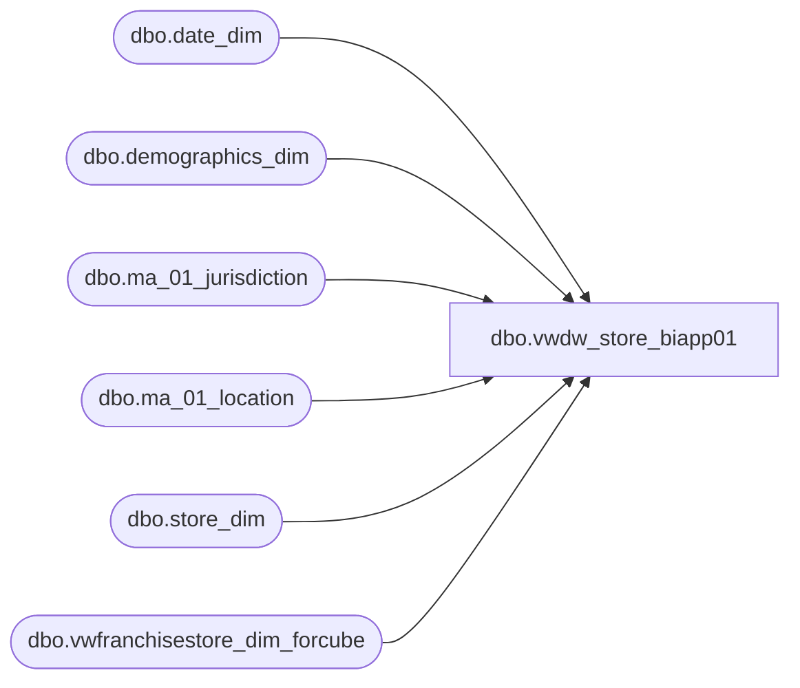

# dbo.vwdw_store_biapp01

**Database:** LH_Reporting  
**Server:** 4db76rlxaxcuvmuh5kw37wbnqq-oxjjwecel5tehm2dtna3lt5qia.datawarehouse.fabric.microsoft.com  

## Architecture Diagram



## Table Dependencies

| Referenced Table |
|---|
| dbo.date_dim |
| dbo.demographics_dim |
| dbo.ma_01_jurisdiction |
| dbo.ma_01_location |
| dbo.store_dim |
| dbo.vwfranchisestore_dim_forcube |

## View Code

```sql
CREATE VIEW dbo.vwdw_store_biapp01
AS
WITH CompDate_CTE
(	fiscal_year,
	fiscal_period,
	priorPerioddate_key,
	priorPeriod_Actual_Date,
	thisPerioddate_key,
	thisPeriod_Actual_date,
	ly_priorPerioddate_key,
	ly_priorPeriod_Actual_Date,
	ly_thisPerioddate_key,
	ly_thisPeriodActual_Date)
AS (SELECT
		ty.fiscal_year,
		ty.fiscal_period,
		ty.priorPerioddate_key,
		pd.actual_date AS priorPeriod_Actual_Date,
		ty.thisPerioddate_key,
		ty.thisPeriod_Actual_date,
		ly.priorPerioddate_key AS ly_priorPerioddate_key,
		lypd.actual_date AS ly_priorPeriod_Actual_Date,
		ly.thisPerioddate_key AS ly_thisPerioddate_key,
		ly.thisPeriod_Actual_date AS ly_thisPeriodActual_Date
	FROM
		(SELECT
				fiscal_year,
				fiscal_period,
				MIN(date_key) - 1 AS priorPerioddate_key,
				MAX(dd.date_key) AS thisPerioddate_key,
				MAX(dd.actual_date) AS thisPeriod_Actual_date
			FROM
				LH_Mart.dbo.date_dim dd 

			GROUP BY	dd.fiscal_year,
						dd.fiscal_period)
		ty
		LEFT JOIN LH_Mart.dbo.date_dim pd 
			ON pd.date_key = ty.priorPerioddate_key

		LEFT JOIN (SELECT
				fiscal_year,
				fiscal_period,
				MIN(date_key) - 1 AS priorPerioddate_key,
				MAX(dd.date_key) AS thisPerioddate_key,
				MAX(dd.actual_date) AS thisPeriod_Actual_date
			FROM
				LH_Mart.dbo.date_dim dd 
			GROUP BY	dd.fiscal_year,
						dd.fiscal_period)
		ly
			ON ly.fiscal_year = ty.fiscal_year - 1
			AND ly.fiscal_period = ty.fiscal_period

		LEFT JOIN LH_Mart.dbo.date_dim lypd 
			ON lypd.date_key = ly.priorPerioddate_key)
SELECT
	store_key,
	store_id,
	StoreRanking,
	store_name,
	storeNameNum,
	Case 
		when bearea = 'n/a' then bearritory else bearea end as Area,
	bearea,
	bearritory,
	region,
	GeographyRegion,
	ParentCountry,
	ChildCountry,
	country,
	country_name,
	country_display,
	state_province,
	state_province_key,
	city,
	postal_code,
	latitude,
	longitude,
	dma_name,
	opening_date,
	opening_date_id,
	comp_week_id,
	open_fp_id,
	open_week_id,
	comp_date_key,
	ReportFlag,
	ClubMaxFlag,
	BearRange,
	CompanyLevel,
	IsClosed,
	closing_date_key,
	closing_date,
	closing_max_comp_date_key,
	closing_max_comp_date,
	closing_max_ly_comp_date_key,
	closing_max_ly_comp_date,
	MerchCompanyLevel,
	MerchBearRange,
	MerchCountry,
	MerchRegion,
	Merchbearritory,
	isHispanicStore,
	HispanicStoreGroup,
	LocationType,
	JurisdictionCode,
	LTRIM(RTRIM(MerchCompanyLevel)) + '-' + LTRIM(RTRIM(MerchBearRange)) AS MerchBearRangeKey,
	LTRIM(RTRIM(MerchCompanyLevel)) + '-' + LTRIM(RTRIM(MerchBearRange)) + '-' + LTRIM(RTRIM(MerchCountry)) AS MerchCountryKey,
	LTRIM(RTRIM(MerchCompanyLevel)) + '-' + LTRIM(RTRIM(MerchBearRange)) + '-' + LTRIM(RTRIM(MerchCountry)) + '-' + LTRIM(RTRIM(MerchRegion)) AS MerchRegionKey,
	LTRIM(RTRIM(MerchCompanyLevel)) + '-' + LTRIM(RTRIM(MerchBearRange)) + '-' + LTRIM(RTRIM(MerchCountry)) + '-' + LTRIM(RTRIM(MerchRegion)) + '-' + LTRIM(RTRIM(Merchbearritory)) AS MerchBearitoryKey,
	LTRIM(RTRIM(CompanyLevel)) + '-' + LTRIM(RTRIM(country)) AS CountryKey,
	LTRIM(RTRIM(StoreRanking)) + '-' + LTRIM(RTRIM(CompanyLevel)) AS RankedCompanyLevelKey,
	LTRIM(RTRIM(StoreRanking)) + '-' + LTRIM(RTRIM(CompanyLevel)) + '-' + LTRIM(RTRIM(BearRange)) AS RankedBearRangeKey,
	LTRIM(RTRIM(StoreRanking)) + '-' + LTRIM(RTRIM(CompanyLevel)) + '-' + LTRIM(RTRIM(BearRange)) + '-' + LTRIM(RTRIM(region)) AS RankedRegionKey,
	LTRIM(RTRIM(StoreRanking)) + '-' + LTRIM(RTRIM(CompanyLevel)) + '-' + LTRIM(RTRIM(BearRange)) + '-' + LTRIM(RTRIM(region)) + '-' + LTRIM(RTRIM(bearritory)) AS RankedBearitoryKey,
	LTRIM(RTRIM(CompanyLevel)) + '-' + LTRIM(RTRIM(BearRange)) AS BearRangeKey,
	LTRIM(RTRIM(CompanyLevel)) + '-' + LTRIM(RTRIM(BearRange)) + '-' + LTRIM(RTRIM(region)) AS RegionKey,
	LTRIM(RTRIM(CompanyLevel)) + '-' + LTRIM(RTRIM(BearRange)) + '-' + LTRIM(RTRIM(region)) + '-' + LTRIM(RTRIM(bearritory)) AS BearitoryKey,
	state_province_key + '-' + ISNULL(city, '') AS city_key,
	CASE
		WHE
```

