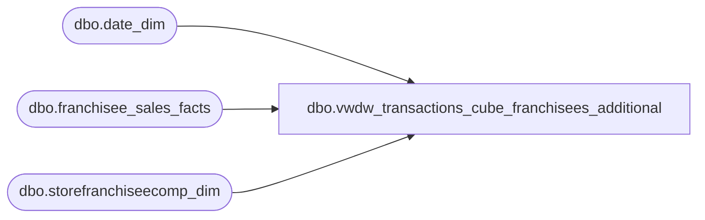

# dbo.vwdw_transactions_cube_franchisees_additional

**Database:** LH_Reporting  
**Server:** 4db76rlxaxcuvmuh5kw37wbnqq-oxjjwecel5tehm2dtna3lt5qia.datawarehouse.fabric.microsoft.com  

## Architecture Diagram



## Table Dependencies

| Referenced Table |
|---|
| dbo.date_dim |
| dbo.franchisee_sales_facts |
| dbo.storefranchiseecomp_dim |

## View Code

```sql
CREATE VIEW vwdw_transactions_cube_franchisees_additional
 AS
 -- =============================================================================================================  
 -- Name: dbo.vwDW_Transactions_Cube_Franchisees_Additional  
 --  
 -- Description: View underlying the SSAS Papa Mart Cube used on the dashboard   
 -- for Franchisee Additional information.     
 --  
 --  
 -- Dependencies:   
 --  
 -- Revision History  
 --  Name:    Date:   Comments:  
 --  Kevin Shyr   1/8/2015  Change LY calculation to 52 weeks  
 --  Gary Murrish  2/14/2012  Complete remodel  
 -- =============================================================================================================  
 SELECT top 1  0 as transaction_id  
  , tf.franchisee_store_key as store_key  
  , tf.week_ending_date_key as date_key  
  , 0 as time_key  
  , currency_key  
  , CASE  WHEN tyCmp.recID IS NULL THEN 0   ELSE 1  END AS iscomp  
  , CASE  WHEN nyCmp.recID IS NULL THEN 0   ELSE 1  END AS iscompnextyear  
  , 1 as calc  
  , tf.party_count AS Party_Count  
  , tf.party_sales AS Party_Sales  
  , tf.transaction_count - 1 AS Transaction_Count -- There is already one for the record in Transactions  
  , tf.coupons_and_discounts AS Coupons_And_Discounts  
  , tf.returns AS Returns   
 FROM  
  LH_Mart.dbo.franchisee_sales_facts AS  tf
  INNER JOIN LH_Mart.dbo.date_dim AS tday 
   ON tday.date_key = tf.week_ending_date_key  
  INNER JOIN LH_Mart.dbo.date_dim AS nYR
   ON tday.week_id + 52 = nYR.week_id  
    AND tday.day_of_week = nYR.day_of_week  
  LEFT JOIN LH_Mart.dbo.storefranchiseecomp_dim AS tyCmp
   ON tyCmp.store_key = tf.franchisee_store_key   
    AND tf.week_ending_date_key BETWEEN tyCmp.date_key_from AND tyCmp.date_key_thru  
  LEFT JOIN LH_Mart.dbo.storefranchiseecomp_dim AS nyCmp
   ON nyCmp.store_key = tf.franchisee_store_key   
    AND nYR.date_key BETWEEN nyCmp.date_key_from AND nyCmp.date_key_thru
```

