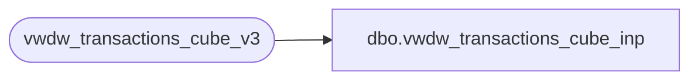

# dbo.vwdw_transactions_cube_inp

**Database:** LH_Reporting  
**Server:** 4db76rlxaxcuvmuh5kw37wbnqq-oxjjwecel5tehm2dtna3lt5qia.datawarehouse.fabric.microsoft.com  

## Architecture Diagram



## Table Dependencies

| Referenced Table |
|---|
| vwdw_transactions_cube_v3 |

## View Code

```sql
CREATE VIEW vwdw_transactions_cube_inp 
AS
SELECT 
transaction_id
,store_key
,date_key
,time_key
,transaction_type_key
,currency_key
,party_flag
,GAAP_transaction_flag
,isComp
,isCompNextYear
,line_count
,unit_net_amount
,unit_gross_amount
,unit_discount_amount
,animal_UGA
,animal_units
,non_animal_UGA
,non_animal_units
,footwear_UGA
,footwear_units
,accessories_UGA
,accessories_units
,sounds_UGA
,sounds_units
,Scents_UGA
,Scents_units
,clothing_UGA
,clothing_units
,other_UGA
,other_units
,GAAP_sales_amount
,net_sales_amount
,giftcard_discount_amount
,giftcard_UGA
,merchandise_UGA
,merchandise_units
,donations_UGA
,donations_units
,stuffing_supplies_UGA
,shipping_UGA
,shipping_units
,other_fees_UGA
,other_fees_units
,cub_cash_UGA
,party_deposit_UGA
,party_deposit_units
,reward_certificate_amount
,buy_stuff_amount
,tax_amount
,redemption_amount
,coupon_discount_amount
,total_discount_amount
,sports_UGA
,sports_units
,prestuffed_UGA
,prestuffed_units
,SFS_TRN_TYP_CD
,MNTH_01_12_VST_CNT
,MNTH_01_24_VST_CNT
,MNTH_01_36_VST_CNT
,calc
,isSoundTrans
,giftcard_units
,giftcards_redeemed
,franchisee_exchange_rate
,franchisee_withholding_tax_rate
,returns_UGA
,isShopperTrak
,numGAAPTransWithDiscount
,isSTComp
,isSTCompNextYear
,Financial_GAAP_Sales_Amount
,Upsell_Discount_Amount
,isSOTF
,Store_transaction_flag
,Store_Sales_Amount
,Store_Units
,numStoreTransWithDiscount
,Financial_Store_Sales_Amount
,hasTraffic
,Enterprise_Selling_Only_Units
,Enterprise_Selling_Only_Amount
,Enterprise_Selling_Only_Transaction_Count
,Gaap_Units
,Enterprise_Selling_Units
,Enterprise_Selling_Amount
,Enterprise_Selling_Transaction_Count
,GiftCard_Only_Flag
,TransactionEligibleForLoyaltyCapture
,party_master
,DM_Transactions
,HasPhoneNumber
,isShipFromStore
,isPickUpFromStore
,ShipFromStoreAmount
,ShipFromStoreUnits
,FinancialShipFromStoreAmount
,PickupFromStoreAmount
,PickupFromStoreUnits
,FinancialPickupFromStoreAmount
,numShipFromStoreTransWithDiscount
,numPickupFromStoreTransWithDiscount
,isCurbside
,isSameDayShipt
,CurbsideAmount
,CurbsideUnits
,FinancialCurbsideAmount
,SameDayShiptAmount
,SameDayShiptUnits
,FinancialSameDayShiptAmount
,numCurbsideTransWithDiscount
,numSameDayShiptTransWithDiscount
FROM vwdw_transactions_cube_v3
```

